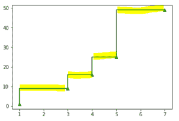
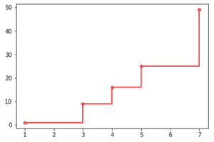
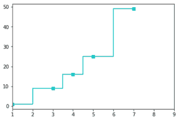
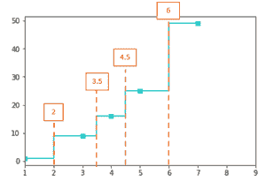
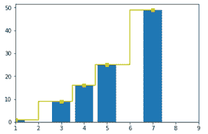

# Python 中的 matplotlib.pyplot.step()函数

> 原文:[https://www . geeksforgeeks . org/matplotlib-pyplot-step-function-in-python/](https://www.geeksforgeeks.org/matplotlib-pyplot-step-function-in-python/)

**step()** 函数设计该图，使其具有水平基线，数据点将通过垂直线连接到该基线。这种图用于分析相对于 X 轴，在哪些点上发生了 Y 轴值的变化。这在离散分析中非常有用。步进绘图可以与任何其他绘图相结合。也可以通过提供适当的参数值来格式化步骤的出现。该功能的参数如下表所示。

<figure class="table">

| **参数** | **描述**

 |
| **x** | 值的一维数组。 |
| **y** | 值的一维数组。 |
| **fmt** | 格式化指定线条颜色、标记类型等的字符串。 |
| **数据** | 两个包含标签数据的标签名的表。 |
| **其中** | 决定垂直线的位置。(值:**前&#124;后&#124;中**) |

</figure>

**注意:**参数**‘fmt’‘data’‘其中’**为可选。

#### “where”参数

where 参数用于表示垂直线将数据点连接到水平基线的位置。它像可视化一样决定步骤的位置。更清楚地说，这个参数决定了 Y 值应该在哪里不断地画一条水平线。它可以采用下面举例说明的三个值中的任何一个。

首先，考虑将要绘制的两个数组:

```
x = [1,3,4,5,7]
y = [1,9,16,25,49]
```

数组 **x** 包含一些整数，数组 **y** 包含 **x** 中相应索引中数字的平方。如果简单地绘制这些值而不使用任何阶跃函数，则可以在图表中绘制一条直线，如下所示。

## 蟒蛇 3

```
import matplotlib.pyplot as plt
import numpy as np

x = np.array([1, 3, 4, 5, 7])
y = np.array([1, 9, 16, 25, 49])

plt.plot(x, y)
plt.show()
```

**输出:**


没有步骤的情节

**pre:**Y 值在数据点左侧保持不变。例如，值 **y[i]** 在 **x[i-1]** 和 **x[i]** 之间保持不变。下面给出了上面绘制的同一个步骤的曲线图。在下面的代码中， **'g^'** 表示线条颜色为绿色，标记应为向上的三角形。

## 蟒蛇 3

```
import matplotlib.pyplot as plt
import numpy as np

x = np.array([1, 3, 4, 5, 7])
y = np.array([1, 9, 16, 25, 49])

plt.step(x, y, 'g^', where='pre')
plt.show()
```

**输出:**


其中='pre '

在上图中，您可以看到数据点左侧的水平线，由绿色小三角形标记。例如**x【0】**为 **1** ，其对应的 y 值为 **1** 。下一个值 **x[1]** 是 **3** ，y 值是 **9** 。现在可以从 **1** 看到 **9** 中有一条不变的线。一旦在 X 轴上到达数据点 **3** ，垂直线就会弹出。为了更清楚，请看下图中突出显示的部分。



x[i-1]和 x[i]范围内的水平线

*   **post:**Y 值在数据点右侧保持不变。例如，值 y[i]在 x[i]和 x[i+1]之间保持不变。下面给出了上面绘制的同一个步骤的曲线图。在下面的代码中，“r*”表示线条颜色为红色，标记应为星号(“ ***** ”)。

## 蟒蛇 3

```
import matplotlib.pyplot as plt
import numpy as np

x = np.array([1, 3, 4, 5, 7])
y = np.array([1, 9, 16, 25, 49])

plt.step(x, y, 'r*', where='post')
plt.show()
```

**输出:**



其中='post '

查看突出显示的部分，查看值“**前置**”和“**后置**之间的差异。


x[i]和 x[i+1]范围内的水平线

*   **中间:**垂直线在一个值(x[i-1]和 x[i+1])/2 处向上射出。下面给出了上面绘制的同一个步骤的曲线图。在下面的代码中，“cs”表示线条颜色为红色，标记应为正方形。

## 蟒蛇 3

```
import matplotlib.pyplot as plt
import numpy as np

x = np.array([1, 3, 4, 5, 7])
y = np.array([1, 9, 16, 25, 49])

plt.step(x, y, 'cs', where='mid')
plt.xlim(1, 9)
plt.show()
```

**输出:**



其中='mid '

为了更好的理解，请看下图。



数值中的水平线(x[i-1]和 x[i+1])/2

例如**x【0】**为 **1** ，**x【1】**为 **3** ，中间值为 **2** 。以类似的方式，对于其他值，也计算中间值，并且垂直线在那里上升。

step()也可以与其他图结合使用。查看下面的示例，了解上面使用的相同数据点。

## 蟒蛇 3

```
import matplotlib.pyplot as plt
import numpy as np

x = np.array([1, 3, 4, 5, 7])
y = np.array([1, 9, 16, 25, 49])

plt.step(x, y, 'ys', where='mid')
plt.xlim(1, 9)
plt.bar(x, y)
plt.show()
```

**输出:**



同样，任何绘图类型都可以与 step()函数结合使用。