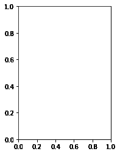
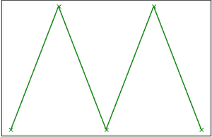
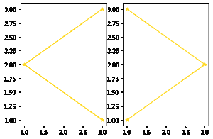

# Python 中的 Matplotlib.pyplot.subplot()函数

> 原文:[https://www . geeksforgeeks . org/matplotlib-pyplot-subplot-python 中的函数/](https://www.geeksforgeeks.org/matplotlib-pyplot-subplot-function-in-python/)

**先决条件:**T2【matplotlib】T3

**子图()**功能将子图添加到指定网格位置的当前图形中。它类似于子情节()函数，但是不同于子情节()，它一次添加一个子情节。因此，要创建多个图，您需要几行带有子图()函数的代码。支线剧情功能的另一个缺点是它删除了你身材上已经存在的剧情。请参考示例 1。

它是图. add_subplot 的包装器。

**语法:**

> 子图(nrows、ncols、index、**kwargs)
> 
> 子打印(pos、* . quartz)
> 
> 支线剧情(ax)
> 
> **参数:**
> 
> *   **参数:**描述子剧情位置的 3 位整数或三个独立的整数。
> *   **pos** 是一个三位数的整数，其中第一个、第二个和第三个整数是 nrows、ncols 和 index。
> *   **投影:** [{None，'aitoff'，' hammer '，' lambert '，' mollweide '，' polar '，' linear '，' str}，可选]。子图(轴)的投影类型。默认的“无”导致“直线”投影。
> *   **标签:**【str】返回轴的标签。
> *   ****kwargs:** 该方法还为返回的 axes 基类取关键字参数；
>     除了图形参数，例如 facecolor。
> 
> **返回:**一把斧头。轴的子类或轴的子类。返回的坐标轴基类取决于使用的投影。

该功能的实现如下:

**例 1:** 子剧情()将删除预先存在的剧情。

## 蟒蛇 3

```
# importing hte module
import matplotlib.pyplot as plt

# Data to display on plot
x = [1, 2, 3, 4, 5]
y = [1, 2, 1, 2, 1]

# plot() will create new figure and will add axes object (plot) of above data
plt.plot(x, y, marker="x", color="green")

# subplot() will add plot to current figure deleting existing plot
plt.subplot(121)
```

**输出:**我们可以看到第一个剧情被支线剧情()函数搁置了。



子剧情 _gfg

如果你想看到第一个情节注释掉 plt.subplot()行，你会看到下面的情节



plot_gfg

**例 2:**

## 蟒蛇 3

```
import matplotlib.pyplot as plt
# data to display on plots

x = [3, 1, 3]
y = [3, 2, 1]
z = [1, 3, 1]

# Creating figure object
plt.figure()

# addind first subplot
plt.subplot(121)
plt.plot(x, y, color="orange", marker="*")

# addding second subplot
plt.subplot(122)
plt.plot(z, y, color="yellow", marker="*")
```

**输出:**



多个子情节