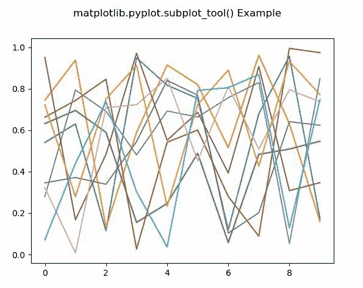
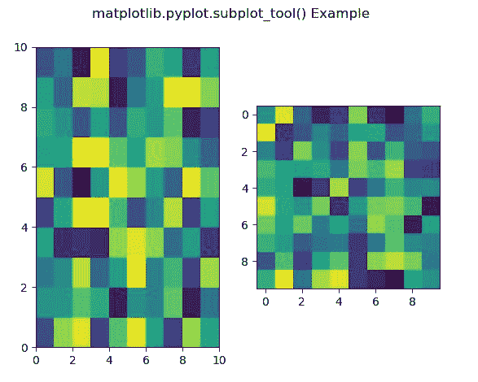
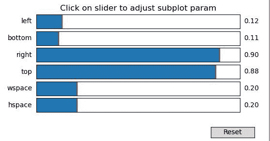

# Python 中的 Matplotlib.pyplot.subplot_tool()

> 原文:[https://www . geeksforgeeks . org/matplotlib-pyplot-subplot _ tool-in-python/](https://www.geeksforgeeks.org/matplotlib-pyplot-subplot_tool-in-python/)

**[Matplotlib](https://www.geeksforgeeks.org/python-introduction-matplotlib/)** 是 Python 中的一个库，是 NumPy 库的数值-数学扩展。 **[Pyplot](https://www.geeksforgeeks.org/pyplot-in-matplotlib/)** 是一个基于状态的接口到 **Matplotlib** 模块，它提供了一个类似于 MATLAB 的接口。

**样本代码**

```
# sample code
import matplotlib.pyplot as plt 

plt.plot([1, 2, 3, 4], [16, 4, 1, 8]) 
plt.show() 
```

**输出:**


## matplotlib.pyplot.subplot_tool()函数

matplotlib 库 pyplot 模块中的**子图 _tool()函数**用于启动一个图形的子图工具窗口。

> **语法:**
> 
> ```
> matplotlib.pyplot.subplot_tool(targetfig=None)
> 
> ```
> 
> **参数:**此方法不接受任何参数。
> 
> **返回:**该方法不返回值。

下面的例子说明了 matplotlib.pyplot.subplot_tool()函数在 matplotlib.pyplot 中的作用:

**示例#1:**

```
# Implementation of matplotlib function
import matplotlib.pyplot as plt
import numpy as np

fig, axs = plt.subplots()

axs.plot(np.random.random((10, 10)))

plt.subplot_tool()

fig.suptitle('matplotlib.pyplot.subplot_tool() Example')
plt.show()
```

**输出:**



**例 2:**

```
# Implementation of matplotlib function
import matplotlib.pyplot as plt
import numpy as np

fig, (axs, axs1) = plt.subplots(1, 2)

axs.pcolor(np.random.random((10, 10)))
axs1.imshow(np.random.random((10, 10)))

plt.subplot_tool()

fig.suptitle('matplotlib.pyplot.subplot_tool() Example')
plt.show()
```

**输出:**


