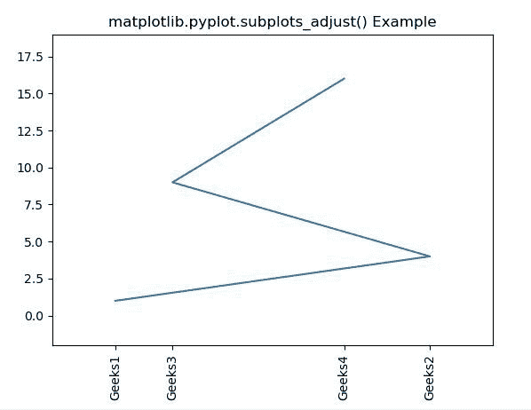
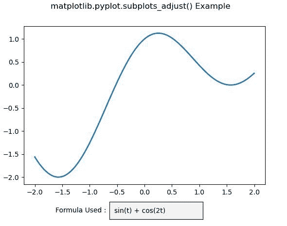

# Python 中的 matplotlib . pyplot . subplot _ adjust()

> 原文:[https://www . geeksforgeeks . org/matplotlib-pyplot-subplot _ adjust-in-python/](https://www.geeksforgeeks.org/matplotlib-pyplot-subplots_adjust-in-python/)

**[Matplotlib](https://www.geeksforgeeks.org/python-introduction-matplotlib/)** 是 Python 中的一个库，是 NumPy 库的数值-数学扩展。 **[Pyplot](https://www.geeksforgeeks.org/pyplot-in-matplotlib/)** 是一个基于状态的接口到 **Matplotlib** 模块，它提供了一个类似于 MATLAB 的接口。Pyplot 中可以使用的各种图有线图、等高线图、直方图、散点图、三维图等。

## matplotlib . pyplot . subplot _ adjust()函数

matplotlib 库 pyplot 模块中的**子图 _ 调整()功能**用于调整子图布局。

> **语法:**matplotlib . pyplot . subplots _ adjust(左=无，下=无，右=无，上=无，wspace =无，hspace =无)
> 
> **参数:**该方法接受以下描述的参数:
> 
> *   **左:**此参数为图中支线剧情的左侧。
> *   **右侧:**该参数为图中支线剧情的右侧。
> *   **底部:**这个参数是图中支线剧情的底部。
> *   **顶部:**该参数为图中支线剧情的顶部。
> *   **wspace :** 此参数是为子情节之间的空间保留的宽度量，表示为平均轴宽度的一部分。
> *   **hs space:**此参数是为支线剧情之间的空间保留的高度量，表示为平均轴高度的分数。

下面的例子说明了 matplotlib.pyplot . subplot _ adjust()函数在 matplotlib . pyplot 中的作用:

**例 1:**

```py
# Implementation of matplotlib function
import matplotlib.pyplot as plt

x = [1, 12, 3, 9]
y = [1, 4, 9, 16]
labels = ['Geeks1', 'Geeks2', 'Geeks3', 'Geeks4']

plt.plot(x, y)
plt.xticks(x, labels, rotation ='vertical')

plt.margins(0.2)
plt.subplots_adjust(bottom = 0.15)

plt.title('matplotlib.pyplot.subplots_adjust() Example')
plt.show()
```

**输出:**


**例 2:**

```py
# Implementation of matplotlib function
import numpy as np
import matplotlib.pyplot as plt
from matplotlib.widgets import TextBox

fig, ax = plt.subplots()
plt.subplots_adjust(bottom = 0.2)
t = np.arange(-2.0, 2.0, 0.001)
s = np.sin(t)+np.cos(2 * t)
initial_text = "sin(t) + cos(2t)"
l, = plt.plot(t, s, lw = 2)

def submit(text):

    ydata = eval(text)
    l.set_ydata(ydata)
    ax.set_ylim(np.min(ydata), np.max(ydata))
    plt.draw()

axbox = plt.axes([0.4, 0.05, 0.3, 0.075])
text_box = TextBox(axbox, 'Formula Used : ', 
                   initial = initial_text)

text_box.on_submit(submit)

fig.suptitle('matplotlib.pyplot.subplots_adjust() Example')
plt.show()
```

**输出:**
