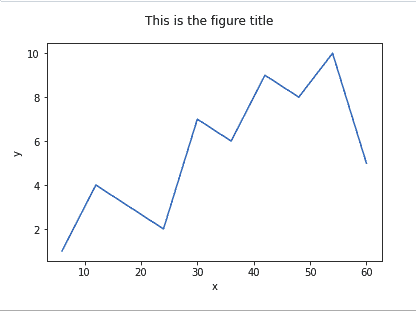
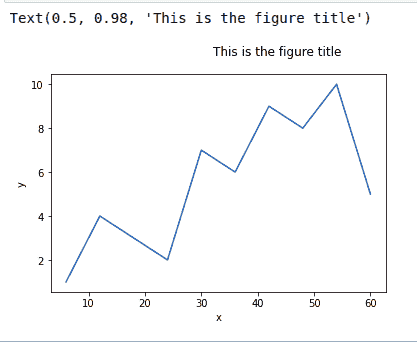
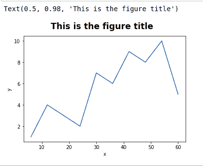

# Python 中的 Matplotlib.pyplot.suptitle()函数

> 原文:[https://www . geeksforgeeks . org/matplotlib-pyplot-sup title-python 中的函数/](https://www.geeksforgeeks.org/matplotlib-pyplot-suptitle-function-in-python/)

[**Matplotlib**](https://www.geeksforgeeks.org/python-introduction-matplotlib/) 是 Python 中的一个库，是 NumPy 库的数学扩展。 [**Pyplot**](https://www.geeksforgeeks.org/pyplot-in-matplotlib/) 是一个基于状态的接口到 **Matplotlib** 模块，它提供了一个类似于 MATLAB 的接口。

## matplotlib.pyplot.suptitle()函数

matplotlib 库 pyplot 模块中的 **suptitle()函数**用于给图形添加一个标题。

> **语法：** matplotlib.pyplot.suptitle（t， **kwargs）
> 
> **参数:**该功能将有以下参数:
> 
> *   **t :** 要添加到图形中的标题文本。
> *   **x :** 文字在图形坐标中的 x 位置。它的默认值是 0.5。
> *   **y :** 文字在图形坐标中的 y 位置。它的默认值是 0.98。
> *   **水平对齐(ha) :** { '居中'，'左'，'右' }，文本的水平对齐是相对于(x，y)的。它的默认值是“中心”。
> *   **垂直对齐(va) :** {“顶部”、“中心”、“底部”、“基线”}，文本的垂直对齐是相对于(x，y)的。它的默认值是“top”。
> *   **字体大小，大小:**{大小以磅为单位，' xx-小'，' x-小'，'小'，'中'，'大'，' x-大'，' xx-大' }，**T3】文字的字体大小。它的默认值是“大”。**
> *   **字体粗细，粗细:**{ 0-1000 范围内的数值，'超轻'，'轻'，'正常'，'常规'，'书本'，'中'，'罗马'，'半粗体'，'半粗体'，'中'，'粗体'，'重'，'加粗'，'黑色' }，文本的字体粗细。它的默认值是“正常”。
> *   **字体属性:**无或字典，**T3】字体属性字典。如果给定字体属性，字体大小和粗细的默认值取自字体属性默认值。在这种情况下，rcParams[" figure . title size "]= ' large '和 rcParams[" figure . title weight "]= ' normal '被忽略。**
> *   ****kwargs :** 其他 kwargs 是 matplotlib.text.Text 属性。
> 
> **返回:**标题的文本实例。

下面的例子说明了 matplotlib.pyplot.suptitle()函数在 matplotlib.pyplot 中的作用:

**示例 1:** 为字体大小为 12 的图形添加标题。

## 蟒蛇 3

```py
# importing matplotlib.pyplot module
import matplotlib.pyplot as plt

# values of x and y axes
x = [6, 12, 18,
     24, 30, 36,
     42, 48, 54,
     60]
y = [1, 4, 3,
     2, 7, 6,
     9, 8, 10,
     5]

# plotting the graph 
plt.plot(x, y)

# labelling axes
plt.xlabel('x')
plt.ylabel('y')

# adding title to the graph
# with font size 12
plt.suptitle('This is the figure title', 
             fontsize = 12)

# show the plot
plt.show()
```

**输出:**



**示例 2:** 在图中添加标题，左侧水平对齐，字体大小为 12。

## 蟒蛇 3

```py
# importing matplotlib.pyplot module
import matplotlib.pyplot as plt

# values of x and y axes
x = [6, 12, 18,
     24, 30, 36,
     42, 48, 54,
     60]

y = [1, 4, 3,
     2, 7, 6,
     9, 8, 10,
     5]

# plotting the graph 
plt.plot(x, y)

# labelling axes
plt.xlabel('x')
plt.ylabel('y')

# Adding title to the graph 
# with left horizontal alignment
# and font size 12.
plt.suptitle('This is the figure title', 
             ha = 'left',
             fontsize = 12)
```

**输出:**



**例 3:** 在图中添加加粗字体粗细和大字体大小的标题。

## 蟒蛇 3

```py
# importing matplotlib.pyplot module
import matplotlib.pyplot as plt

# values of x and y axes
x = [6, 12, 18,
     24, 30, 36,
     42, 48, 54,
     60]

y = [1, 4, 3,
     2, 7, 6,
     9, 8, 10,
     5]

# plotting the graph 
plt.plot(x, y)

# labelling axes
plt.xlabel('x')
plt.ylabel('y')

# Adding title to the graph 
# with extra bold font weight
# and large font size.
plt.suptitle('This is the figure title', 
             fontsize = 'xx-large',
             weight = 'extra bold')
```

**输出:**

