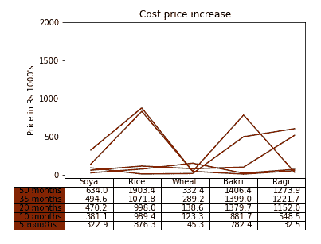
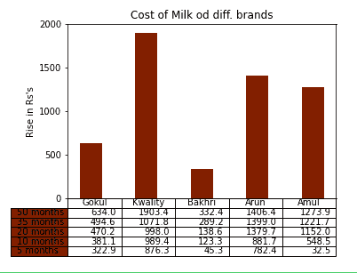

# Python 中的 Matplotlib.pyplot.table()函数

> 原文:[https://www . geeksforgeeks . org/matplotlib-pyplot-table-function-in-python/](https://www.geeksforgeeks.org/matplotlib-pyplot-table-function-in-python/)

**Matplotlib . pyplot . table()**是 matplotlib 库的一个子部分，其中使用绘制的图形生成一个表格用于分析。这种方法使分析变得更容易和更有效，因为表格给出了比图表更精确的细节。matplotlib.pyplot.table 创建的表格通常悬挂在堆叠条形图下方，以便让读者深入了解上图生成的数据。

> **语法:**matplotlib . pyplot . table(cell text =无，cellColours =无，cellLoc= '右'，colWidths =无，rowLabels =无，rowloars =无，rowLoc= '左'，colLabels =无，colColours =无，colLoc = '中'，Loc= '下'，bbox =无，边= '闭'，**kwargs)

**例 1:** 考虑一个分析作物价格在几个月内上涨的图表。下面的代码是针对非线性图形的。

## 蟒蛇 3

```py
# importing necessary packagess
import numpy as np
import matplotlib.pyplot as plt

# input data values
data = [[322862, 876296, 45261, 782372,  32451],
        [58230, 113139,  78045,  99308, 516044],
        [89135,  8552, 15258, 497981, 603535],
        [24415,  73858, 150656, 19323,  69638],
        [139361, 831509, 43164, 7380,  52269]]

# preparing values for graph
columns = ('Soya', 'Rice', 'Wheat', 'Bakri', 'Ragi')
rows = ['%d months' % x for x in (50, 35, 20, 10, 5)]
values = np.arange(0, 2500, 500)
value_increment = 1000

# Adding pastel shades to graph
colors = plt.cm.Oranges(np.linspace(22, 3, 12))
n_rows = len(data)
index = np.arange(len(columns)) + 0.3
bar_width = 0.4

# Initialing vertical-offset for the graph.
y_offset = np.zeros(len(columns))

# Plot bars and create text labels for the table
cell_text = []

for row in range(n_rows):
    plt.plot(index, data[row], bar_width, color=colors[row])
    y_offset = y_offset + data[row]
    cell_text.append(['%1.1f' % (x / 1000.0) for x in y_offset])

# Reverse colors and text labels to display table contents with
# color.
colors = colors[::-1]
cell_text.reverse()

# Add a table at the bottom
the_table = plt.table(cellText=cell_text,
                      rowLabels=rows,
                      rowColours=colors,
                      colLabels=columns,
                      loc='bottom')

# make space for the table:
plt.subplots_adjust(left=0.2, bottom=0.2)
plt.ylabel("Price in Rs.{0}'s".format(value_increment))
plt.yticks(values * value_increment, ['%d' % val for val in values])
plt.xticks([])
plt.title('Cost price increase')

# plt.show()-display graph
# Create image. plt.savefig ignores figure edge and face color.
fig = plt.gcf()
plt.savefig('pyplot-table-original.png',
            bbox_inches='tight',
            dpi=150)
```

**输出:**



**例 2:** 我们来考虑一下过去几年不同品牌的牛奶价格上涨情况

## 蟒蛇 3

```py
# importing necessary packagess
import numpy as np
import matplotlib.pyplot as plt

# input data values
data = [[322862, 876296, 45261, 782372,  32451],
        [58230, 113139,  78045,  99308, 516044],
        [89135,  8552, 15258, 497981, 603535],
        [24415,  73858, 150656, 19323,  69638],
        [139361, 831509, 43164, 7380,  52269]]

# preparing values for graph
columns = ('Gokul', 'Kwality', 'Bakhri', 'Arun', 'Amul')
rows = ['%d months' % x for x in (50, 35, 20, 10, 5)]
values = np.arange(0, 2500, 500)
value_increment = 1000

# Adding pastel shades to graph
colors = plt.cm.Oranges(np.linspace(22, 3, 12))
n_rows = len(data)
index = np.arange(len(columns)) + 0.3
bar_width = 0.4

# Initialing vertical-offset for the graph.
y_offset = np.zeros(len(columns))

# Plot bars and create text labels for the table
cell_text = []
for row in range(n_rows):
    plt.bar(index, data[row], bar_width, bottom=y_offset, color=colors[row])
    y_offset = y_offset + data[row]
    cell_text.append(['%1.1f' % (x / 1000.0) for x in y_offset])

# Reverse colors and text labels to display table contents with
# color.
colors = colors[::-1]
cell_text.reverse()

# Add a table at the bottom
the_table = plt.table(cellText=cell_text,
                      rowLabels=rows,
                      rowColours=colors,
                      colLabels=columns,
                      loc='bottom')

# make space for the table:
plt.subplots_adjust(left=0.2, bottom=0.2)
plt.ylabel("Rise in Rs's".format(value_increment))
plt.yticks(values * value_increment, ['%d' % val for val in values])
plt.xticks([])
plt.title('Cost of Milk od diff. brands')

# plt.show()-display graph
# Create image. plt.savefig ignores figure edge and face color.
fig = plt.gcf()
plt.savefig('pyplot-table-original.png',
            bbox_inches='tight',
            dpi=150)
```

**输出:**

