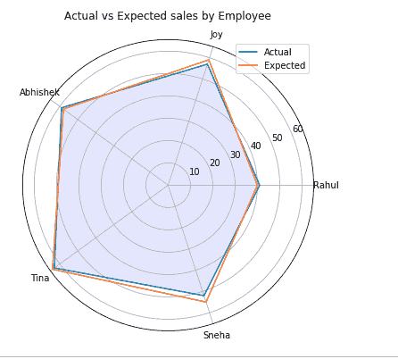

# Python 中的 Matplotlib.pyplot.thetagrids()

> 原文:[https://www . geeksforgeeks . org/matplotlib-pyplot-thetagrids-in-python/](https://www.geeksforgeeks.org/matplotlib-pyplot-thetagrids-in-python/)

**Matplotlib** 是 Python 编程语言的绘图库，其数值数学模块为 NumPy。 **matplotlib.pyplot** 是一组命令风格的函数，使 matplotlib 像 MATLAB 工具一样工作。每个 pyplot 函数都会对图形进行某些更改:例如，创建图形、在图形中创建绘图区域、在绘图区域中绘制一些线条或用标签装饰绘图等。
**注:**更多信息请参考 Matplotlib
中的 [Pyplot](http://geeksforgeeks.org/pyplot-in-matplotlib/)

## Matplotlib.pyplot.thetagrids()

设置极坐标图中网格线的θ位置。如果没有传递参数，它将返回一个元组(行、标签)，其中行是径向网格线的数组(行 2D 实例)，标签是刻度标签的数组(文本实例):

> **语法:**行，标签= thetagrids(角度，标签=None，fmt='%d '，frac = 1.5)
> T3】参数:
> 
> *   **角度:**
> 
> 将角度设置为θ网格的位置(这些网格线沿θ维度相等)
> 
> *   **标签:**
> 
> 如果不是“无”，那么它是在每个角度使用标签串的透镜(角度)或列表。如果标签为“无”，标签将为 fmt %角度。
> 
> *   **frac:** It is the fraction of the polar axes radius at the place of label (1 is the edge). e.g., 1.25 is outside the axes and 0.75 is inside the axes. 
>      
>     
>     **返回类型:**返回值是元组列表(行、标签)
>     **注意:**行是 Line2D 实例，标签是 Text 实例。

**例:**

## 蟒蛇 3

```
import matplotlib.pyplot as plt
import numpy as np

employee = ["Rahul", "Joy", "Abhishek",
            "Tina", "Sneha"]

actual = [41, 57, 59, 63, 52, 41]
expected = [40, 59, 58, 64, 55, 40]

# Initialing the spiderplot by 
# setting figure size and polar
# projection
plt.figure(figsize =(10, 6))
plt.subplot(polar = True)

theta = np.linspace(0, 2 * np.pi, len(actual))

# Arranging the grid into number 
# of sales into equal parts in
# degrees
lines, labels = plt.thetagrids(range(0, 360, int(360/len(employee))),
                                                         (employee))

# Plot actual sales graph
plt.plot(theta, actual)
plt.fill(theta, actual, 'b', alpha = 0.1)

# Plot expected sales graph
plt.plot(theta, expected)

# Add legend and title for the plot
plt.legend(labels =('Actual', 'Expected'),
           loc = 1)
plt.title("Actual vs Expected sales by Employee")

# Display the plot on the screen
plt.show()
```

**输出:**

