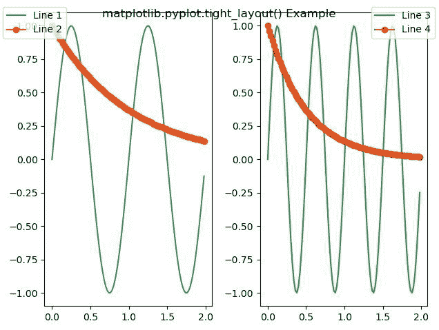
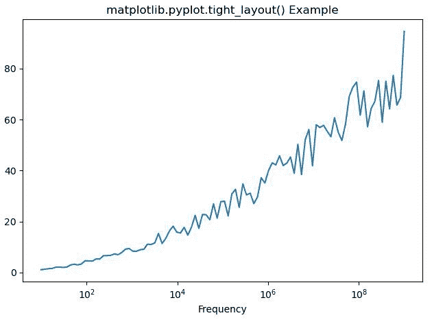

# Python 中的 Matplotlib.pyplot .紧绷 _layout()

> 原文:[https://www . geeksforgeeks . org/matplotlib-pyplot-紧身 _ python 中的布局/](https://www.geeksforgeeks.org/matplotlib-pyplot-tight_layout-in-python/)

**[Matplotlib](https://www.geeksforgeeks.org/python-introduction-matplotlib/)** 是 Python 中的一个库，是 NumPy 库的数值-数学扩展。 **[Pyplot](https://www.geeksforgeeks.org/pyplot-in-matplotlib/)** 是一个基于状态的接口到 **Matplotlib** 模块，它提供了一个类似于 MATLAB 的接口。Pyplot 中可以使用的各种图有线图、等高线图、直方图、散点图、三维图等。

**样本代码**

```py
# sample code
import matplotlib.pyplot as plt 

plt.plot([1, 2, 3, 4], [16, 4, 1, 8]) 
plt.show() 
```

**输出:**


## matplotlib.pyplot .紧绷 _layout()函数

matplotlib 库 pyplot 模块中的**紧 _layout()函数**用于自动调整子图参数，给出指定的填充。

> **语法:** matplotlib.pyplot .紧身 _ 布局(pad=1.08，h _ pad =无，w _ pad =无，rect =无)
> 
> **参数:**该方法接受以下描述的参数:
> 
> *   **填充:**该参数用于图形边缘和子情节边缘之间的填充，作为字体大小的一部分。
> *   **h_pad，w_pad:** 这些参数用于相邻子情节边缘之间的填充(高度/宽度)，作为字体大小的一部分。
> *   **rect:** 此参数为归一化图形坐标中的矩形，整个支线剧情区域将适合该矩形。
> 
> **返回:**该方法不返回值。

下面的例子说明了 matplotlib.pyplot 中的`matplotlib.pyplot.tight_layout()`函数:

**示例-1:**

```py
import numpy as np
import matplotlib.pyplot as plt

fig, axs = plt.subplots(1, 2)

x = np.arange(0.0, 2.0, 0.02)
y1 = np.sin(2 * np.pi * x)
y2 = np.exp(-x)
l1, = axs[0].plot(x, y1)
l2, = axs[0].plot(x, y2, marker ='o')

y3 = np.sin(4 * np.pi * x)
y4 = np.exp(-2 * x)
l3, = axs[1].plot(x, y3, color ='tab:green')
l4, = axs[1].plot(x, y4, color ='tab:red', marker ='o')

fig.legend((l1, l2), ('Line 1', 'Line 2'), 'upper left')
fig.legend((l3, l4), ('Line 3', 'Line 4'), 'upper right')

fig.suptitle('matplotlib.pyplot.tight_layout() Example')
plt.tight_layout()
plt.show()
```

**输出:**


**示例-2:**

```py
import matplotlib.pyplot as plt
import numpy as np
from matplotlib.ticker import EngFormatter

prng = np.random.RandomState(19680801)

xs = np.logspace(1, 9, 100)
ys = (0.8 + 0.4 * prng.uniform(size = 100)) * np.log10(xs)**2

plt.xscale('log')

formatter0 = EngFormatter(unit ='Hz')
plt.plot(xs, ys)
plt.xlabel('Frequency')

plt.title('matplotlib.pyplot.tight_layout() Example')
plt.tight_layout()
plt.show()
```

**输出:**
