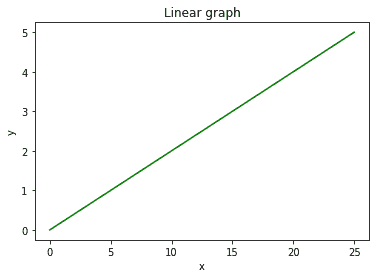
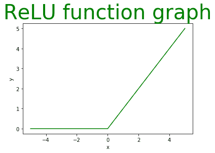
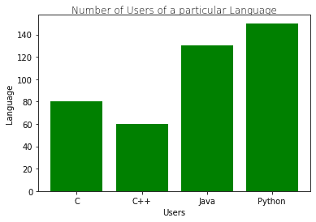
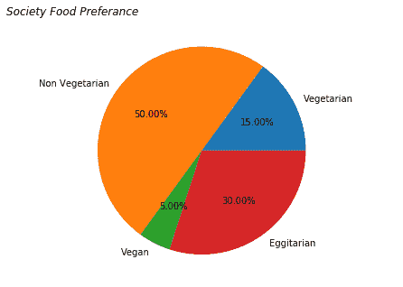
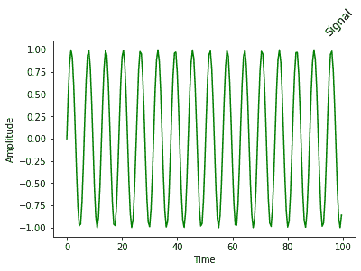

# Matplotlib.pyplot.title()用 Python

表示

> 原文:[https://www . geeksforgeeks . org/matplotlib-pyplot-title-in-python/](https://www.geeksforgeeks.org/matplotlib-pyplot-title-in-python/)

**Matplotlib** 是 Python 中一个惊人的可视化库，用于数组的 2D 图。Matplotlib 是一个多平台数据可视化库，构建在 NumPy 数组上，旨在与更广泛的 SciPy 堆栈一起工作。

## Matplotlib.pyplot.title（）

matplotlib 模块中的 title()方法用于指定所描绘的可视化的标题，并使用各种属性显示标题。

> **语法:** matplotlib.pyplot.title(标签，fontdict=None，loc='center '，pad=None，**kwargs)
> **参数:**
> 
> *   **标签** (str):该参数是指所描绘的可视化的实际标题文本字符串。
>     
> *   **fontdict** (dict):此参数控制文本的外观，如文本大小、文本对齐方式等。使用字典。下面是默认的 font dict:
>     font dict = { ' font size ':rcParams[' axes . title size ']，
>     ' font weight ':rcParams[' axes . title weight ']，
>     'verticalalignment ':'基线'，
>     '水平对齐':loc}
>     
> *   **loc** (str):这个参数指的是标题的位置，取“中”、“左”、“右”等字符串值。
>     
> *   **pad** (float):这个参数指的是标题相对于坐标轴顶部的偏移量，以磅为单位。其默认值为“无”。
>     
> *   ****kwargs:** 该参数是指使用其他关键字参数作为文本属性，如颜色、fonstyle、行间距、backgroundcolor、旋转等。
> 
> **返回类型:**title()方法返回一个表示标题文本本身的字符串。

**下面是一些示例来说明 title()方法的使用:**
**示例 1:** 使用 matplotlib.pyplot 描绘一个线性图，并使用 matplotlib.pyplot.title()显示其标题。

## 蟒蛇 3

```
# importing module
import matplotlib.pyplot as plt

# assigning x and y coordinates
y = [0,1,2,3,4,5]
x= [0,5,10,15,20,25]

# depicting the visualization
plt.plot(x, y, color='green')
plt.xlabel('x')
plt.ylabel('y')

# displaying the title
plt.title("Linear graph")

plt.show()
```

**输出:**



在上面的示例中，只有标签参数在 title()方法中被指定为“线性图”，其他参数被指定为它们的默认值。标签参数的赋值是显示可视化标题的最低要求。
**示例 2:** 使用 matplotlib.pyplot 描绘一个 ReLU 函数图，并使用 matplotlib.pyplot.title()显示其标题。

## 蟒蛇 3

```
# importing module
import matplotlib.pyplot as plt

# assigning x and y coordinates
x = [-5,-4,-3,-2,-1,0,1,2, 3, 4, 5]
y = []

for i in range(len(x)):
    y.append(max(0,x[i]))

# depicting the visualization
plt.plot(x, y, color='green')
plt.xlabel('x')
plt.ylabel('y')

# displaying the title
plt.title(label="ReLU function graph",
          fontsize=40,
          color="green")
```

**输出:**



上面的程序说明了 label 参数、fontdict 参数的 fontsize 键和 color 参数的使用，color 参数是一个改变文本颜色的额外参数(由于**kwargs)。
**示例 3:** 使用 matplotlib.pyplot 描绘条形图，并使用 matplotlib.pyplot.title()显示其标题。

## 蟒蛇 3

```
# importing modules
import matplotlib.pyplot as plt
import numpy as np

# assigning x and y coordinates
language = ['C','C++','Java','Python']
users = [80,60,130,150]

# depicting the visualization
index = np.arange(len(language))
plt.bar(index, users, color='green')
plt.xlabel('Users')
plt.ylabel('Language')
plt.xticks(index, language)

# displaying the title
plt.title(label='Number of Users of a particular Language',
          fontweight=10,
          pad='2.0')
```

**输出:**



这里，fontdict 参数和 pad 参数的 fontweight 键与 label 参数一起用在 title()方法中。
**示例 4:** 使用 matplotlib.pyplot 描绘饼图，并使用 matplotlib.pyplot.title()显示其标题。

## 蟒蛇 3

```
# importing modules
from matplotlib import pyplot as plt

# assigning x and y coordinates
foodPreference = ['Vegetarian', 'Non Vegetarian',
                  'Vegan', 'Eggitarian']

consumers = [30,100,10,60]

# depicting the visualization
fig = plt.figure()
ax = fig.add_axes([0,0,1,1])
ax.axis('equal')
ax.pie(consumers, labels = foodPreference,
       autopct='%1.2f%%')

# displaying the title
plt.title(label="Society Food Preference",
          loc="left",
          fontstyle='italic')
```

**输出:**



在上面饼图的数据可视化中，标签、fontweight
关键字来自 fontdict 和 fontstyle(**kwargs)参数(取字符串值，如“斜体”、“粗体”和“倾斜”)用于 title()方法，以显示饼图的标题。
**示例 5:** 使用 matplotlib.pyplot 可视化图形中的信号，并使用 matplotlib.pyplot.title()显示其标题。

## 蟒蛇 3

```
# importing modules
from matplotlib import pyplot 
import numpy

# assigning time values of the signal
# initial time period, final time period
# and phase angle 
signalTime = numpy.arange(0, 100, 0.5);

# getting the amplitude of the signal
signalAmplitude = numpy.sin(signalTime)

# depicting the visualization
pyplot.plot(signalTime, signalAmplitude, color ='green')

pyplot.xlabel('Time')
pyplot.ylabel('Amplitude')

# displaying the title
pyplot.title("Signal",
             loc='right',
             rotation=45)
```

**输出:**



这里，label 参数被分配给“signal”，loc 参数被分配给“right”，而旋转参数(**kwargs)以度数为单位取角度值，被分配给 45 度。
**示例 6:** 使用 matplotlib.pyplot 显示图像，并使用 matplotlib.pyplot.title()显示其标题。

## 蟒蛇 3

```
# importing modules
from PIL import ImageTk, Image 
from matplotlib import pyplot as plt

# depicting the visualization
testImage = Image.open('g4g.png')

# displaying the title
plt.title("Geeks 4 Geeks",
          fontsize='20',
          backgroundcolor='green',
          color='white')
plt.imshow(testImage)
```

**输出:**


在上面的示例中，使用 title()方法显示图像的标题，该方法的参数标签为“Geeks 4 Geeks”，来自 fontdict 的 fontsize 键为“20”，backgroundcolor 和 color 是分别具有字符串值“绿色”和“白色”的额外参数。