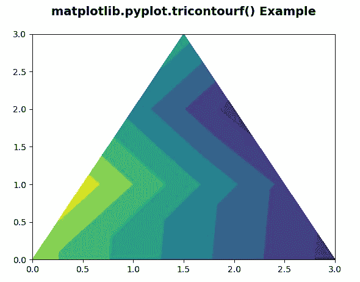
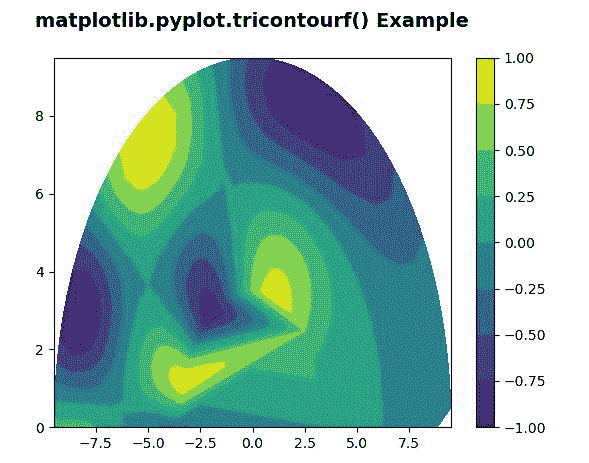

# matplotlib . pyplot . tricontosurf()中的 Python

> 哎哎哎:# t0]https://www . geeksforgeeks . org/matplot lib-pyplot-tricontosurf-in-python/

[**Matplotlib**](https://www.geeksforgeeks.org/python-introduction-matplotlib/) 是 Python 中的一个库，是 NumPy 库的数值-数学扩展。 [**Pyplot**](https://www.geeksforgeeks.org/pyplot-in-matplotlib/) 是一个基于状态的接口到 **Matplotlib** 模块，它提供了一个类似于 MATLAB 的接口。

## matplotlib . pyplot . tricontourf()

matplotlib 库中 pyplot 模块中的 **tricontourf()函数**用于在非结构化的三角形网格上绘制等高线。

> **语法:**matplotlib . pyplot . tricontosurf(\ * args、\*\*kwargs)
> 
> **参数:**该方法接受以下描述的参数:
> 
> *   **x，y:** 这些参数是要绘制的数据的 x 和 y 坐标。
> *   **三角测量:**该参数是一个 matplotlib.tri.Triangulation 对象。
> *   **Z:** 此参数是要进行轮廓的值的数组，三角测量中每个点一个。
> *   ****kwargs:** 此参数是文本属性，用于控制标签的外观。
> 
> 所有剩余的参数和 kwargs 与 matplotlib.pyplot.plot()相同。
> 
> **返回:**这将返回包含以下内容的 **2 行 2D** 列表:
> 
> *   为三角形边缘绘制的线。
> *   为三角形节点绘制的标记

**注意:**仅 tricontourf 的关键字参数是**抗锯齿**，这是一种用于非结构化三角形网格上的轮廓的 bool 使能抗锯齿。

下面的例子说明了 matplotlib . pyplot . tricantorf()函数在 matplotlib.pyplot:
**例子 1:**

## 蟒蛇 3

```
#Implementation of matplotlib function
import matplotlib.pyplot as plt 
import matplotlib.tri as mtri 
import numpy as np 

# Create triangulation. 
x = np.asarray([0, 1, 0, 3, 0.5, 1.5,
                2.5, 1, 2, 1.5]) 
y = np.asarray([0, 0, 0, 0, 1.0, 1.0, 
                1.0, 2, 2, 3.0]) 

triangles = [[0, 1, 4], [1, 5, 4], [2, 6, 5], 
             [4, 5, 7], [5, 6, 8], [5, 8, 7], 
             [7, 8, 9], [1, 2, 5], [2, 3, 6]] 

triang = mtri.Triangulation(x, y, triangles) 
z = np.cos(2.5 * x*x) + np.sin(2.5 * x*x) 

t = plt.tricontourf(triang, z)

plt.title('matplotlib.pyplot.tricontourf() Example\n',
          fontsize=14, fontweight='bold')

plt.show()
```

**输出:**



**例 2:**

## 蟒蛇 3

```
#Implementation of matplotlib function
import matplotlib.pyplot as plt 
import matplotlib.tri as tri 
import numpy as np 

n_angles = 60
n_radii = 10
min_radius = 0.35
radii = np.linspace(min_radius, 0.95, n_radii) 

angles = np.linspace(0, np.pi, n_angles, endpoint = False) 
angles = np.repeat(angles[..., np.newaxis], n_radii, axis = 1) 
angles[:, 1::2] += np.pi / n_angles 

x = (10 * radii * np.cos(angles)).flatten() 
y = (10 * radii * np.sin(angles)).flatten() 
z = (np.cos(4*(radii)**2) * np.sin((angles)**2)).flatten() 

triang = tri.Triangulation(x, y) 

triang.set_mask(np.hypot(x[triang.triangles].mean(axis = 1), 
                         y[triang.triangles].mean(axis = 1)) 
                < min_radius) 

tcf = plt.tricontourf(triang, z)

plt.colorbar(tcf) 
plt.title('matplotlib.pyplot.tricontourf() Example\n',
          fontsize=14, fontweight='bold')

plt.show()
```

**输出:**

