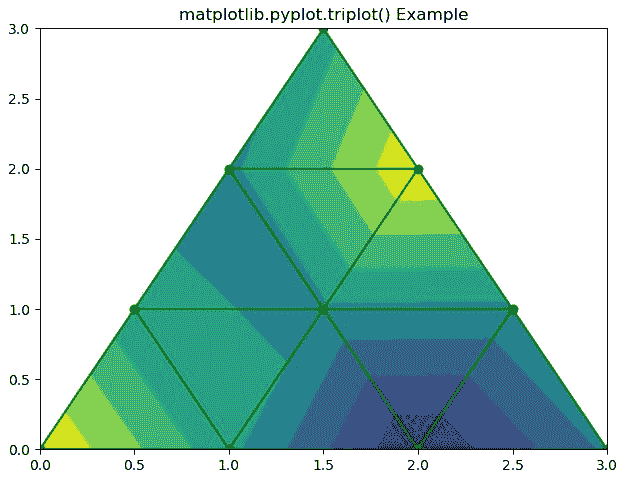
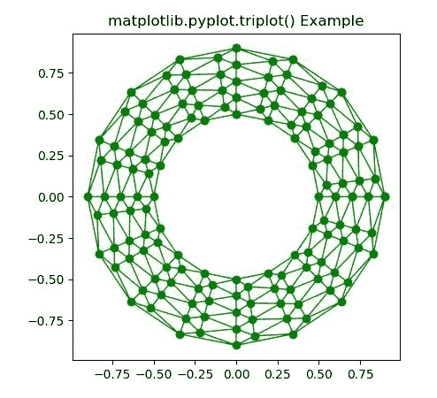

# Matplotlib.pyplot.triplot()用 python

表示

> 哎哎哎:# t0]https://www . geeksforgeeks . org/matplot lib-pyplot-triplot-in-python/

**[Matplotlib](https://www.geeksforgeeks.org/python-introduction-matplotlib/)** 是 Python 中的一个库，是 NumPy 库的数值-数学扩展。 **[Pyplot](https://www.geeksforgeeks.org/pyplot-in-matplotlib/)** 是一个基于状态的接口到 **Matplotlib** 模块，它提供了一个类似于 MATLAB 的接口。Pyplot 中可以使用的各种图有线图、等高线图、直方图、散点图、三维图等。

**matplotlib.pyplot.triplot() Function:**

matplotlib 库 pyplot 模块中的 **triplot()函数**用于绘制一个非结构化的三角形网格作为线条和/或标记。

> **语法:**matplotlib . pyplot . triplot(* args、**kwargs)
> 
> **参数:**该方法接受以下描述的参数:
> 
> *   **x，y:** 这些参数是要绘制的数据的 x 和 y 坐标。
> *   **三角测量:**该参数是一个**三角测量**对象。
> *   ****kwargs:** This parameter is *Text* properties that is used to control the appearance of the labels.
>     
>     所有剩余的参数和 kwargs 与 matplotlib.pyplot.plot()相同。
>     
>     
> 
> **返回:**返回包含以下内容的 2 **行 2D** 列表:
> 
> *   为三角形边缘绘制的线。
> *   为三角形节点绘制的标记

下面的例子说明了 matplotlib.pyplot.triplot()函数在 matplotlib.pyplot 中的作用:

**例 1:**

```py
# Implementation of matplotlib function
import matplotlib.pyplot as plt
import matplotlib.tri as mtri
import numpy as np

# Create triangulation.
x = np.asarray([0, 1, 2, 3, 0.5, 1.5,
                2.5, 1, 2, 1.5])

y = np.asarray([0, 0, 0, 0, 1.0,
                1.0, 1.0, 2, 2, 3.0])

triangles = [[0, 1, 4], [1, 2, 5], 
             [2, 3, 6], [1, 5, 4], 
             [2, 6, 5], [4, 5, 7],
             [5, 6, 8], [5, 8, 7],
             [7, 8, 9]]

triang = mtri.Triangulation(x, y, triangles)
z = np.cos(1.5 * x) * np.cos(1.5 * y)

plt.tricontourf(triang, z)
plt.triplot(triang, 'go-')

plt.title('matplotlib.pyplot.triplot() Example')
plt.show()
```

**输出:**


**例 2:**

```py
# Implementation of matplotlib function
import matplotlib.pyplot as plt
import matplotlib.tri as tri
import numpy as np

n_angles = 24
n_radii = 9
min_radius = 0.5
radii = np.linspace(min_radius, 0.9,
                    n_radii)

angles = np.linspace(0, 3 * np.pi, n_angles, 
                     endpoint = False)

angles = np.repeat(angles[..., np.newaxis], 
                   n_radii, axis = 1)

angles[:, 1::2] += np.pi / n_angles

x = (radii * np.cos(angles)).flatten()
y = (radii * np.sin(angles)).flatten()
triang = tri.Triangulation(x, y)

triang.set_mask(np.hypot(x[triang.triangles].mean(axis = 1),
                         y[triang.triangles].mean(axis = 1))
                < min_radius)

plt.triplot(triang, 'go-', lw = 1)
plt.title('matplotlib.pyplot.triplot() Example')
plt.show()
```

**输出:**
