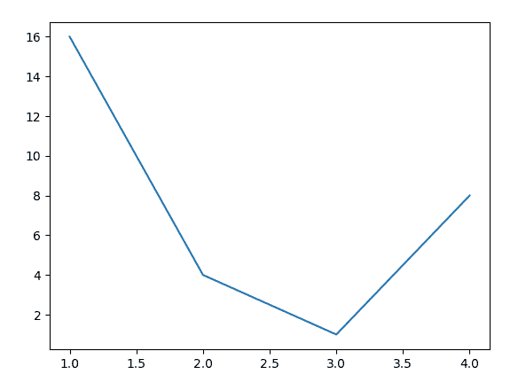
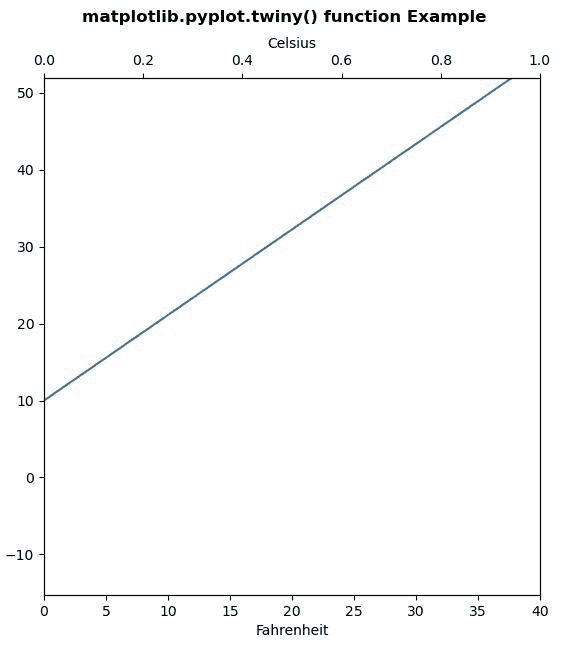
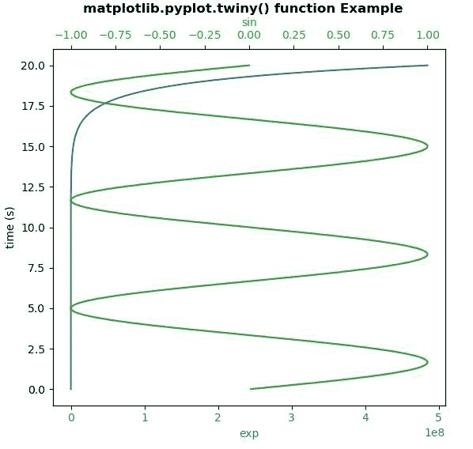

# Matplotlib.pyplot.twiny()在 Python

中

> 哎哎哎:# t0]https://www . geeksforgeeks . org/matplot lib-pyplot-twiny-in-python/

**[Matplotlib](https://www.geeksforgeeks.org/python-introduction-matplotlib/)** 是 Python 中的一个库，是 NumPy 库的数值-数学扩展。 **[Pyplot](https://www.geeksforgeeks.org/pyplot-in-matplotlib/)** 是一个基于状态的接口到 **Matplotlib** 模块，它提供了一个类似于 MATLAB 的接口。

**样本代码**

```
# sample code
import matplotlib.pyplot as plt 

plt.plot([1, 2, 3, 4], [16, 4, 1, 8]) 
plt.show() 
```

**输出:**


## matplotlib.pyplot.twiny()函数

matplotlib 库 pyplot 模块中的 **twinx()函数**用于制作和返回共享 y 轴的第二个轴。

> **语法:**
> 
> ```
> matplotlib.pyplot.twiny(ax=None)
> ```
> 
> **参数:**该方法不接受任何参数。
> 
> **返回:**返回共享 x 轴的第二个轴

下面的例子说明了 matplotlib.pyplot.twiny()函数在 matplotlib.pyplot 中的作用:

**示例#1:**

```
# Implementation of matplotlib function
import matplotlib.pyplot as plt
import numpy as np

def GFG1(temp):
    return (5\. / 9.) * (temp - 32)

def GFG2(ax1):
    y1, y2 = ax1.get_ylim()
    ax_twin .set_ylim(GFG1(y1), GFG1(y2))
    ax_twin .figure.canvas.draw()

fig, ax1 = plt.subplots()
ax_twin = ax1.twiny()

ax1.callbacks.connect("ylim_changed", GFG2)
ax1.plot(np.linspace(10, 120, 100))
ax1.set_xlim(0, 40)

ax1.set_xlabel('Fahrenheit')
ax_twin .set_xlabel('Celsius')

fig.suptitle('matplotlib.pyplot.twiny() function\
 Example\n\n', fontweight ="bold")
plt.show()
```

**输出:**


**例 2:**

```
# Implementation of matplotlib function
import numpy as np
import matplotlib.pyplot as plt

# Create some mock data
t = np.arange(0.01, 20.0, 0.001)
data1 = np.exp(t)
data2 = np.sin(0.3 * np.pi * t)

fig, ax1 = plt.subplots()

color = 'tab:blue'
ax1.set_ylabel('time (s)')
ax1.set_xlabel('exp', color = color)
ax1.plot(data1, t, color = color)
ax1.tick_params(axis ='x', labelcolor = color)

ax2 = ax1.twiny()

color = 'tab:green'
ax2.set_xlabel('sin', color = color)
ax2.plot(data2, t, color = color)
ax2.tick_params(axis ='x', labelcolor = color)

fig.suptitle('matplotlib.pyplot.twiny() function\
 Example\n\n', fontweight ="bold")
plt.show()
```

**输出:**
