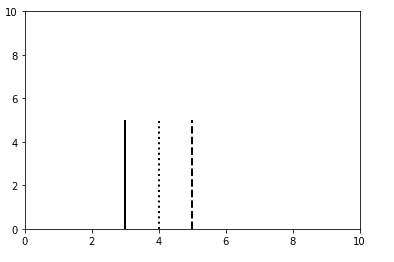
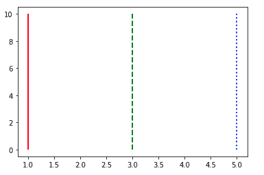

# Matplotlib.pyplot.vlines()用 Python

表示

> 哎哎哎:# t0]https://www . geeksforgeeks . org/matplot lib-pyplot-vlines-in-python/

**Matplotlib** 是一个绘图库，用于在 Python 中创建静态、动画和交互式可视化。

## Matplotlib.pyplot.vlines()

matplotlib.pyplot.vlines()是用于绘制数据集的函数。在 matplotlib.pyplot.vlines()中， **vlines** 是垂直线的缩写，这个函数的作用从扩展形式中非常清楚，它说这个函数处理垂直线穿过轴的绘制。

```py
Syntax: vlines(x, ymin, ymax, colors, linestyles)
```

**例 1:**

## 蟒蛇 3

```py
import numpy as np
import matplotlib.pyplot as plt

plt.vlines(4, 0, 5, linestyles ="dotted", colors ="k")
plt.vlines(3, 0, 5, linestyles ="solid", colors ="k")
plt.vlines(5, 0, 5, linestyles ="dashed", colors ="k")

plt.xlim(0, 10)
plt.ylim(0, 10)

plt.show()
```

**输出:**



在上面的示例中，vlines()函数开头的第一个参数显示了要生成垂直线的轴点，下一个参数指的是垂直线总长度的下限，而第三个参数指的是垂直线总长度的上限。在这三个基本参数之后，我们可以使用的下一个参数是**线型**，它决定了要绘制的线的类型(例如虚线、实线、虚线、虚线等)。)，最后一个使用的参数是**颜色**，可选，基本上是数组状的颜色。
**例 2:**

## 蟒蛇 3

```py
import matplotlib.pyplot as plt

plt.vlines((1, 3, 5,), 0, 10, colors = ("r", "g", "b"),
         linestyles = ("solid", "dashed", "dotted"))

plt.show()
```

**输出:**

