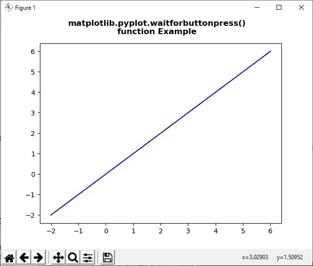
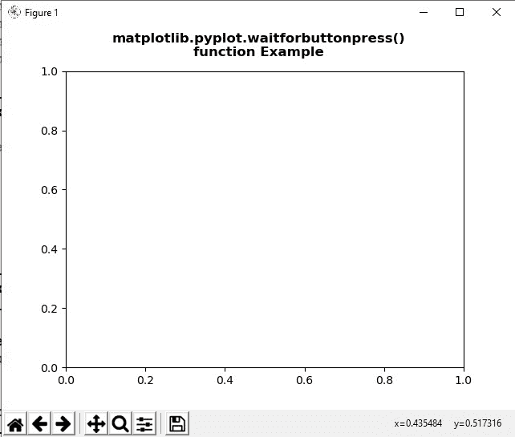
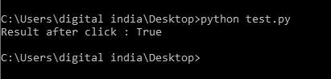

# matplotlib . pyplot . wait forbuttonpress()用 Python

表示

> 哎哎哎:# t0]https://www . geeksforgeeks . org/matplot lib-pyplot-waituttonpress-in-python/

**[Matplotlib](https://www.geeksforgeeks.org/python-introduction-matplotlib/)** 是 Python 中的一个库，是 NumPy 库的数值-数学扩展。 **[Pyplot](https://www.geeksforgeeks.org/pyplot-in-matplotlib/)** 是一个基于状态的 Matplotlib 模块接口，它提供了一个类似 MATLAB 的接口。Pyplot 中可以使用的各种图有线图、等高线图、直方图、散点图、三维图等。

## matplot lib . pyplot . wait forbuttonpress()方法

matplotlib 库 pyplot 模块中的 **waitforbuttonpress()方法**用于阻止调用与图形交互。

> **语法:**matplotlib . pyplot . wait forbuttonpress(time out =-1)
> 
> **参数:**该方法接受下面讨论的以下参数:
> 
> *   **超时:**该参数为超时值。
> 
> **返回:**此方法不返回任何值。

下面的例子说明了 matplotlib.pyplot 中的 matplotlib . py plot . waitforbuttonpress()函数:

**例 1:**

```py
# Implementation of matplotlib function 
import numpy as np 
import matplotlib.pyplot as plt 

for ite in range(2): 
    x = np.linspace(-2, 6, 100) 
    y = (ite + 1)*x 

    fig = plt.figure() 

    ax = fig.subplots() 
    ax.plot(x, y, '-b') 

    fig.suptitle("""matplotlib.pyplot.waitforbuttonpress()
function Example\n\n""", fontweight ="bold") 

    w = plt.waitforbuttonpress() 
    print("Result after", ite, "click", w) 

    plt.show() 
```

**输出:**



**例 2:**

```py
# Implementation of matplotlib function 
import numpy as np 
import matplotlib.cm as cm 
import matplotlib.mlab as mlab 
import matplotlib.pyplot as plt 

fig = plt.figure() 
ax = fig.subplots() 

def tellme(s): 

    fig.suptitle(s, fontweight ="bold") 
    fig.canvas.draw() 
    renderer = fig.canvas.renderer 
    fig.draw(renderer) 

plt.clf() 
ax.axis([-1., 1., -1., 1.]) 

plt.setp(plt.gca(), autoscale_on = False) 

tellme("""matplotlib.pyplot.waitforbuttonpress()
function Example\n\n""") 

w = plt.waitforbuttonpress() 
print("Result after click :", w) 

plt.show() 
```

**输出:**


