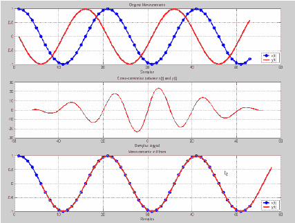
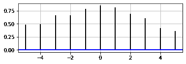
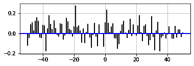

# Matplotlib.pyplot.xcorr()用 Python

表示

> 哎哎哎:# t0]https://www . geeksforgeeks . org/matplot lib-pyplot-xcorr-in-python/

Matplotlib 是建立在 NumPy 和 sideby 框架上的，这就是它快速高效的原因。它是开源的，拥有巨大的社区支持。它能够很好地与许多操作系统和图形后端一起工作。为了得到 matplotlib.pyplot.xcorr()做什么，我们需要了解互相关。

## 互相关

相关系数是两个变量相对运动之间关系强度的统计度量。
**例如:**让我们取两个实值函数 f 和 g，g 在 x 处，是沿 x 轴的差。现在用互相关来计算。



## matplotlib.pyplot.xcorr()

matplotlib.pyplot.xcorr()函数绘制两个数组列表之间的互相关。
**参数:**

<figure class="table">

| 参数 | 输入类型 | 描述 |
| --- | --- | --- |
| x | 实数或复数浮点数的向量。 | 互相关的第一个变量。 |
| y | 实数或复数浮点数的向量。默认值为 x。 | 互相关的第二个变量。 |
| 扣动扳机 | 请求即付的 | x 和 y 被去趋势可调用。这必须是一个接受并返回 numpy.array 的函数 x = detrend(x)。它是可选参数，默认为无规范化。 |
| 赋范的 | 弯曲件 | 如果为真，则输入向量被归一化为单位长度。 |
| usevlines | 弯曲件 | 如果为真，则使用轴从 0 到 xcorr 值绘制垂直线。这是一个可选参数 |
| maxlabs | （同 Internationalorganizations）国际组织 | 要显示的滞后数。如果无，将返回所有 2 * len(x)–1 个滞后。可选参数，默认值为 10。 |

</figure>

**返回:**

<figure class="table">

| 参数 | 类型 | 描述 |
| --- | --- | --- |
| 落后 | 数组(长度 2*maxlags+1) | 滞后向量。 |
| c | 数组(长度 2*maxlags+1) | 自相关向量。 |
| 线条 | 行集合或行 2D | 艺术家添加到相关轴:
1。如果“使用行”为“真”，则为“行集合”。
2。如果“使用线条”为“假”，则为“线条 2D”。 |
| b | 线路 2D 或无 | 如果“使用线条”为“真”，“不使用线条”为“假”，则水平线为 0。 |

</figure>

**例 1:**

## 蟒蛇 3

```
# import matplotlib library
import matplotlib.pyplot as plt
import numpy as np

# float lists for cross
# correlation
x=[11.37, 14.23, 16.3, 12.36,
   6.54, 4.23, 19.11, 12.13,
   19.91, 11.00]

y=[15.21, 12.23, 4.76, 9.89,
   8.96, 19.26, 12.24, 11.54,
   13.39, 18.96]

# Plot graph
fig = plt.figure()
ax1 = fig.add_subplot(211)

# cross correlation using
# xcorr() function
ax1.xcorr(x, y, usevlines=True,
          maxlags=5, normed=True,
          lw=2)
# adding grid to the graph
ax1.grid(True)
ax1.axhline(0, color='blue', lw=2)

# show final plotted graph
plt.show()
```

**输出:**



**例 2:**

## 蟒蛇 3

```
# import matplotlib library
import matplotlib.pyplot as plt
import numpy as np

# float lists for cross
# correlation
x, y = np.random.randn(2, 100)

# Plot graph
fig = plt.figure()
ax1 = fig.add_subplot(211)

# cross correlation using xcorr()
# function
ax1.xcorr(x, y, usevlines=True,
          maxlags=50, normed=True,
          lw=2)

# adding grid to the graph
ax1.grid(True)
ax1.axhline(0, color='blue', lw=2)

# show final plotted graph
plt.show()
```

**输出:**

