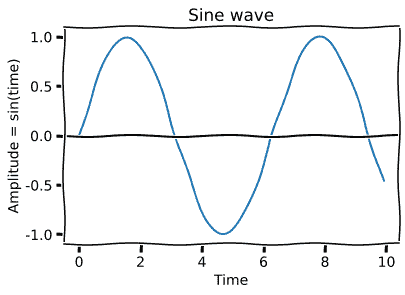
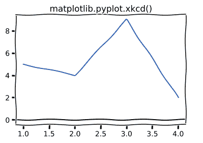

# matplotlib . pyplot . xcd()用 Python

表示

> 哎哎哎:# t0]https://www . geeksforgeeks . org/matplot lib-pyplot-xcd-in-python/

数据科学的主要过程之一是数据可视化。数据可视化是指以图形和图片的形式呈现数据集。我们可以通过观察这些图表来识别即将到来的趋势。

Python 在其中为我们提供了一个惊人的数据可视化库，这就是约翰·亨特(1968-2012)开发的 [Matplotlib](http://geeksforgeeks.org/python-matplotlib-an-overview/) 。Matplotlib 是建立在 numpy 和 sideby 框架上的，这就是它快速高效的原因。它是开源的，拥有巨大的社区支持。它能够很好地与许多操作系统和图形后端一起工作。

## matplotlib.pyplot.xcorr（）

matplotlib 生成的剧情一般都很完美，也很单调。观察这些图表没什么意思。Matplotlib 提供了一个库，可以使这些图形有点意思，并以漫画风格绘制图形。这些图表很有趣，每个人都想通过这些图表来学习。

**例如:**


**参数:**
xkcd()中的三个参数都是可选的。

<figure class="table">

| 参数 | 数据类型 | 描述 |
| --- | --- | --- |
| 规模 | 漂浮物 | 垂直于源线的摆动幅度。 |
| 长度 | 漂浮物 | 沿线摆动的长度。 |
| 随机性 | 漂浮物 | 长度缩小或扩大的比例因子。 |

</figure>

**例 1:**

让我们生成 xkcd()样式的正弦波

## 蟒蛇 3

```
import numpy as np
import matplotlib.pyplot as plt

time = np.arange(0, 10, 0.1);
amplitude = np.sin(time)

with plt.xkcd():
    plt.plot(time, amplitude)
    plt.title('Sine wave')
    plt.xlabel('Time')
    plt.ylabel('Amplitude = sin(time)')
    plt.axhline(y = 0, color ='k')

    plt.show()
```

**输出:**



**例 2:**

## 蟒蛇 3

```
import numpy as np
import matplotlib.pyplot as plt

with plt.xkcd():
    plt.plot([1, 2, 3, 4], [5, 4, 9, 2])
    plt.title('matplotlib.pyplot.xkcd()')
    plt.axhline(y = 0, color ='k')

    plt.show()
```

**输出:**

