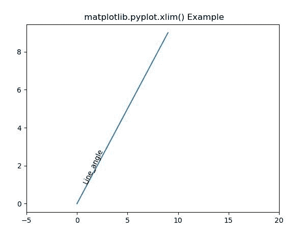
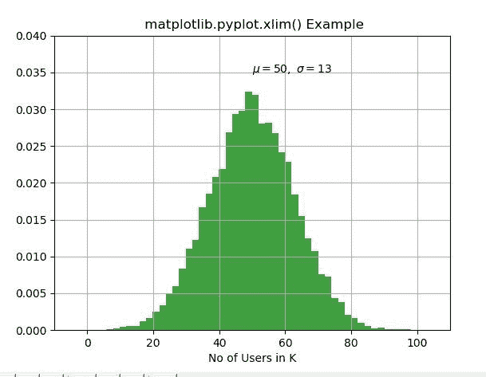

# Matplotlib.pyplot.xlim()用 Python

表示

> 哎哎哎:# t0]https://www . geeksforgeeks . org/matplot lib-pyplot-xlim-in-python/

**[Matplotlib](https://www.geeksforgeeks.org/python-introduction-matplotlib/)** 是 Python 中的一个库，是 NumPy 库的数值-数学扩展。 **[Pyplot](https://www.geeksforgeeks.org/pyplot-in-matplotlib/)** 是一个基于状态的接口到 **Matplotlib** 模块，它提供了一个类似于 MATLAB 的接口。Pyplot 中可以使用的各种图有线图、等高线图、直方图、散点图、三维图等。
**#样本代码**

```py
# sample code
import matplotlib.pyplot as plt 

plt.plot([1, 2, 3, 4], [16, 4, 1, 8]) 
plt.show() 
```

**输出:**


## matplotlib.pyplot.xlim()函数

matplotlib 库 pyplot 模块中的 **xlim()函数**用于获取或设置当前轴的 x 轴极限。
**语法:**

```py
matplotlib.pyplot.xlim(*args, **kwargs)
```

**参数:**该方法接受以下描述的参数:

*   **左侧:**此参数用于将 xlim 设置为左侧。
*   **右:**此参数用于将 xlim 设置为右。
*   ****kwargs:** 该参数是*文本*属性，用于控制标签的外观。

**返回:**这将返回以下内容:

*   **左，右:**这将返回新 x 轴限制的元组。

下面的例子说明了 matplotlib.pyplot.ylim()函数在 matplotlib.pyplot 中的作用:

**示例-1:**

```py
# Implementation of matplotlib function
import matplotlib.pyplot as plt
import numpy as np

h = plt.plot(np.arange(0, 10), np.arange(0, 10))
plt.xlim([-5, 20])
l1 = np.array((1, 1))
angle = 65

th1 = plt.text(l1[0], l1[1], 'Line_angle',
               fontsize = 10, rotation = angle,
               rotation_mode ='anchor')

plt.title(" matplotlib.pyplot.xlim() Example")
plt.show()
```

**输出:**


**示例-2:**

```py
# Implementation of matplotlib function
import matplotlib.pyplot as plt
import numpy as np

np.random.seed(9680801)

mu, sigma = 50, 13
x = mu + sigma * np.random.randn(10000)

# the histogram of the data
n, bins, patches = plt.hist(x, 50,
                            density = True, 
                            facecolor ='g', 
                            alpha = 0.75)

plt.xlabel('No of Users in K')
plt.title('Histogram of IQ')
plt.text(50, .035, r'$\mu = 50, \
         \ \sigma = 13{content}apos;)

plt.xlim(-10, 110)
plt.ylim(0, 0.04)

plt.grid(True)
plt.title(" matplotlib.pyplot.xlim() Example")
plt.show()
```

**输出:**
