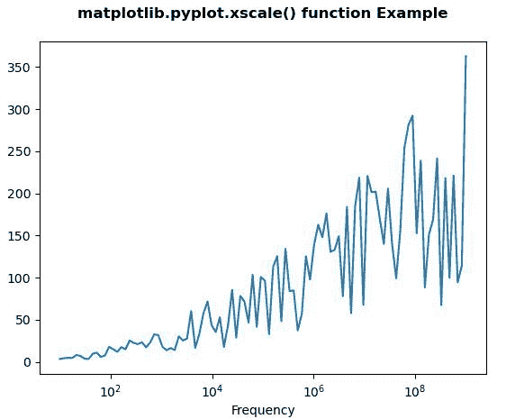
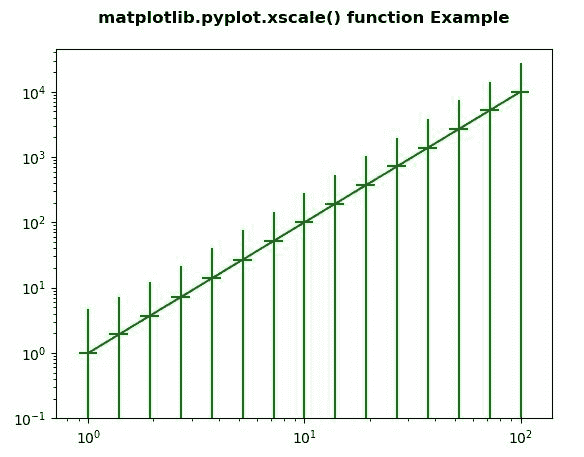

# Python 中的 Matplotlib.pyplot.xscale()函数

> 原文:[https://www . geeksforgeeks . org/matplotlib-pyplot-xscale-python 中的函数/](https://www.geeksforgeeks.org/matplotlib-pyplot-xscale-function-in-python/)

[**Matplotlib**](https://www.geeksforgeeks.org/python-introduction-matplotlib/) 是 Python 中的一个库，是 NumPy 库的数值-数学扩展。 [**Pyplot**](https://www.geeksforgeeks.org/pyplot-in-matplotlib/) 是一个基于状态的接口到 **Matplotlib** 模块，它提供了一个类似于 MATLAB 的接口。Pyplot 中可以使用的各种图有线图、等高线图、直方图、散点图、三维图等。

## matplotlib.pyplot.xscale()函数

matplotlib 库 pyplot 模块中的 **xscale()函数**用于设置 x 轴比例。

> **语法：** matplotlib.pyplot.xscale（value， \*\*kwargs）
> 
> **参数:**该方法接受以下描述的参数:
> 
> *   **值:**此参数是要应用的轴比例类型。
> *   ****kwargs:** 有不同的关键字参数被接受，其取决于规模。
> 
> **返回:**此方法不返回任何值。

下面的例子说明了 matplotlib.pyplot.xscale()函数在 matplotlib.pyplot 中的作用:

**例 1:**

## 蟒蛇 3

```py
# Implementation of matplotlib function 
import matplotlib.pyplot as plt 
import numpy as np 
from matplotlib.ticker import EngFormatter 

val = np.random.RandomState(19680801) 
xs = np.logspace(1, 9, 100) 
ys = (0.8 + 4 * val.uniform(size = 100)) * np.log10(xs)**2

plt.xscale('log') 
plt.plot(xs, ys) 
plt.xlabel('Frequency') 

plt.title('matplotlib.pyplot.xscale() \
function Example\n', fontweight ="bold") 

plt.show() 
```

**输出:**



**例 2:**

## 蟒蛇 3

```py
# Implementation of matplotlib function 
import numpy as np 
import matplotlib.pyplot as plt 

fig, ax4 = plt.subplots() 

x = 10.0**np.linspace(0.0, 2.0, 15) 
y = x**2.0
plt.xscale("log", nonposx ='clip') 
plt.yscale("log", nonposy ='clip') 

plt.errorbar(x, y, xerr = 0.1 * x, 
             yerr = 2.0 + 1.75 * y,  
             color ="green") 

plt.ylim(bottom = 0.1) 

plt.title('matplotlib.pyplot.xscale() \
function Example\n', fontweight ="bold") 

plt.show() 
```

**输出:**

