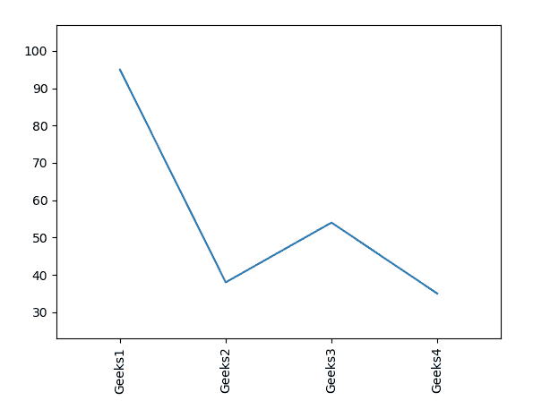
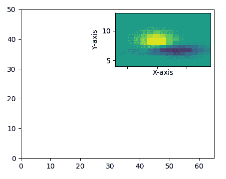

# matplotlib . pyplot . xts()用 Python

表示

> 哎哎哎:# t0]https://www . geeksforgeeks . org/matplot lib-pyplot-xts in python/

**[Matplotlib](https://www.geeksforgeeks.org/python-introduction-matplotlib/)** 是 Python 中的一个库，是 NumPy 库的数值-数学扩展。 **[Pyplot](https://www.geeksforgeeks.org/pyplot-in-matplotlib/)** 是一个基于状态的接口到 **Matplotlib** 模块，它提供了一个类似于 MATLAB 的接口。

## matplotlib . pyplot . xtpicks()函数

matplotlib 库 pyplot 模块中的**批注()功能**用于获取和设置 x 轴的当前刻度位置和标签。

> **语法:**
> 
> ```
> matplotlib.pyplot.xticks(ticks=None, labels=None, **kwargs)
> ```
> 
> **参数:**该方法接受以下描述的参数:
> 
> *   **刻度:**此参数是 xtick 位置的列表。和可选参数。如果一个空列表作为参数传递，那么它将移除所有的 XT 信号
> *   **标签:**该参数包含放置在给定刻度位置的标签。它是一个可选参数。
> *   ****kwargs:** 该参数是*文本*属性，用于控制标签的外观。
> 
> **返回:**这将返回以下内容:
> 
> *   **locas:**返回 ytick 位置列表。
> *   **标签:**返回依拉贝尔文本对象列表。

结果是**(位置，标签)**

下面的例子说明了 matplotlib.pyplot . XT picks()函数在 matplotlib . py plot 中的作用:

**示例#1:**

```
# Implementation of matplotlib.pyplot.xticks()
# function

import numpy as np
import matplotlib.pyplot as plt

x = [1, 2, 3, 4]
y = [95, 38, 54, 35]
labels = ['Geeks1', 'Geeks2', 'Geeks3', 'Geeks4']

plt.plot(x, y)

# You can specify a rotation for the tick
# labels in degrees or with keywords.
plt.xticks(x, labels, rotation ='vertical')

# Pad margins so that markers don't get 
# clipped by the axes
plt.margins(0.2)

# Tweak spacing to prevent clipping of tick-labels
plt.subplots_adjust(bottom = 0.15)
plt.show()
```

**输出:**


**例 2:**

```
# Implementation of matplotlib.pyplot.xticks()
# function

import matplotlib.pyplot as plt

from mpl_toolkits.axes_grid1.inset_locator import inset_axes, zoomed_inset_axes

def get_demo_image():
    from matplotlib.cbook import get_sample_data
    import numpy as np
    f = get_sample_data("axes_grid / bivariate_normal.npy", 
                        asfileobj = False)
    z = np.load(f)

    # z is a numpy array of 15x15
    return z, (3, 19, 4, 13)

fig, ax = plt.subplots(figsize =[5, 4])

Z, extent = get_demo_image()

ax.set(aspect = 1,
       xlim =(0, 65),
       ylim =(0, 50))

axins = zoomed_inset_axes(ax, zoom = 2, 
                          loc ='upper right')

im = axins.imshow(Z, extent = extent, 
                  interpolation ="nearest",
                  origin ="upper")

plt.xlabel('X-axis') 
plt.ylabel('Y-axis')

plt.xticks(visible = False)
plt.show() 
```

**输出:**
