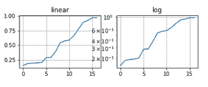
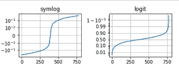

# Matplotlib.pyplot.yscale()用 Python

表示

> 哎哎哎:# t0]https://www . geeksforgeeks . org/matplot lib-pyplot-y scale-in-python/

[Matplotlib](https://www.geeksforgeeks.org/python-introduction-matplotlib/) 是 Python 中的一个库，是 NumPy 库的数字-数学扩展。 [Pyplot](https://www.geeksforgeeks.org/pyplot-in-matplotlib/) 是一个基于状态的 Matplotlib 模块接口，提供类似于 MATLAB 的接口。

#### matplotlib.pyplot.yscale()用 Python 表示

matplotlib 库中 pyplot 模块中的 matplotlib.pyplot.yscale() **功能** 用于设置 y 轴比例。

> **语法：** matplotlib.pyplot.yscale（value， **kwargs）
> 
> **参数:**
> 
> **值** = {“线性”、“对数”、“符号对数”、“对数”… }
> 
> 这些是各种适用的轴比例。
> 
> ****kwargs =** 根据规模(matplotlib.scale.LinearScale、LogScale、SymmetricalLogScale、LogitScale)不同，接受不同的关键字参数

**例 1:**

## 蟒蛇 3

```
import numpy as np
import pandas as pd
import matplotlib.pyplot as plt
import time
%matplotlib inline

# Example 1
y = np.random.randn(50)
y = y[(y > 0) & (y < 1)]
y.sort()
x = np.arange(len(y))

# plot with various axes scales
plt.figure()

# linear
plt.subplot(221)
plt.plot(x, y)
plt.yscale('linear')
plt.title('linear')
plt.grid(True)

# log
plt.subplot(222)
plt.plot(x, y)
plt.yscale('log')
plt.title('log')
plt.grid(True)

plt.show()
```

**输出:**



线性和对数的 y 标度图

**例 2:**

## 蟒蛇 3

```
import numpy as np
import pandas as pd
import matplotlib.pyplot as plt
import time
%matplotlib inline

# Example 2
# useful for `logit` scale
from matplotlib.ticker import NullFormatter

# Fixing random state for reproducibility
np.random.seed(100)

# make up some data in the
# interval ]0, 1[
y = np.random.normal(loc=0.5, 
                     scale=0.4, size=1000)
y = y[(y > 0) & (y < 1)]
y.sort()
x = np.arange(len(y))

# plot with various axes scales
plt.figure()

# symmetric log
plt.subplot(221)
plt.plot(x, y - y.mean())
plt.yscale('symlog', linthreshy=0.01)
plt.title('symlog')
plt.grid(True)

# logit
plt.subplot(222)
plt.plot(x, y)
plt.yscale('logit')
plt.title('logit')
plt.grid(True)

plt.gca().yaxis.set_minor_formatter(NullFormatter())

# Adjust the subplot layout, because
# the logit one may take more space
# than usual, due to y-tick labels like "1 - 10^{-3}"
plt.subplots_adjust(top=0.80, bottom=0.03, 
                    left=0.15, right=0.92,
                    hspace=0.34,wspace=0.45)

plt.show()
```

**输出:**



symlog 和 logit 的 yscale 图