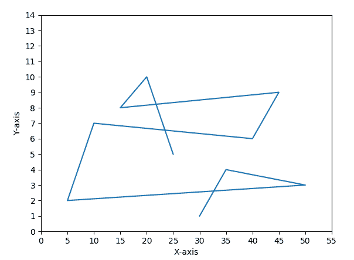
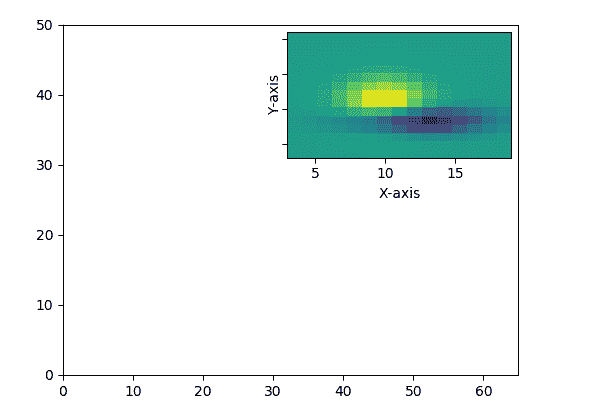

# matplotlib . pyplot . yt 氮()用 Python

表示

> 哎哎哎:# t0]https://www . geeksforgeeks . org/matplotlib-pyplot-y plot-in-python/中

**[Matplotlib](https://www.geeksforgeeks.org/python-introduction-matplotlib/)** 是 Python 中的一个库，是 NumPy 库的数值-数学扩展。 **[Pyplot](https://www.geeksforgeeks.org/pyplot-in-matplotlib/)** 是一个基于状态的接口到 **Matplotlib** 模块，它提供了一个类似于 MATLAB 的接口。

## Matplotlib.pyplot.yticks()函数

matplotlib 库 pyplot 模块中的**批注()功能**用于获取和设置 y 轴的当前刻度位置和标签。

> **语法:** matplotlib.pyplot.yticks(记号=无，标签=无，**kwargs)
> 
> **参数:**该方法接受以下描述的参数:
> 
> *   **刻度:**此参数是 xtick 位置的列表。和可选参数。如果一个空列表作为参数传递，那么它将移除所有的 XT 信号
> *   **标签:**该参数包含放置在给定刻度位置的标签。它是一个可选参数。
> *   ****kwargs:** 该参数是*文本*属性，用于控制标签的外观。
> 
> **返回:**这将返回以下内容:
> 
> *   **locas:**返回 ytick 位置列表。
> *   **标签:**返回依拉贝尔文本对象列表。
> 
> 结果是**(位置，标签)**

下面的例子说明了 matplotlib.pyplot.yticks()函数在 matplotlib.pyplot 中的作用:

**示例#1:**

```
# Implementation of matplotlib.pyplot.yticks()
# function

import numpy as np
import matplotlib.pyplot as plt

# values of x and y axes 
valx = [30, 35, 50, 5, 10, 40, 45, 15, 20, 25] 
valy = [1, 4, 3, 2, 7, 6, 9, 8, 10, 5] 

plt.plot(valx, valy) 
plt.xlabel('X-axis') 
plt.ylabel('Y-axis') 

plt.xticks(np.arange(0, 60, 5)) 
plt.yticks(np.arange(0, 15, 1)) 
plt.show() 
```

**输出:**


**例 2:**

```
#Implementation of matplotlib.pyplot.yticks() 
# function

import matplotlib.pyplot as plt

from mpl_toolkits.axes_grid1.inset_locator import inset_axes, zoomed_inset_axes

def get_demo_image():
    from matplotlib.cbook import get_sample_data
    import numpy as np
    f = get_sample_data("axes_grid/bivariate_normal.npy",
                        asfileobj=False)
    z = np.load(f)
    # z is a numpy array of 15x15
    return z, (3, 19, 4, 13)

fig, ax = plt.subplots(figsize=[5, 4])

Z, extent = get_demo_image()

ax.set(aspect=1,
       xlim=(0, 65),
       ylim=(0, 50))

axins = zoomed_inset_axes(ax, zoom=2, loc='upper right')
im = axins.imshow(Z, extent=extent, interpolation="nearest",
                  origin="upper")

plt.xlabel('X-axis') 
plt.ylabel('Y-axis')

plt.yticks(visible=False)

plt.show() 
```

**输出:**
