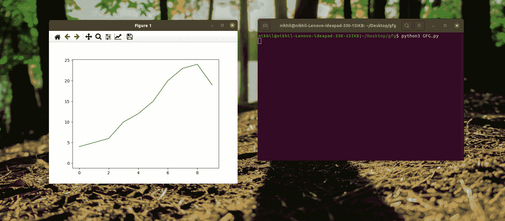

# matplotlib–矩形选择器

> 哎哎哎:# t0]https://www . geeksforgeeks . org/matplotlib-rectangle 选择器/

[Matplotlib](https://www.geeksforgeeks.org/python-introduction-matplotlib/) 是一个可视化的 python 库。它提供了各种小部件来简化数据的可视化。在某些情况下，需要选择图形的特定区域。对于这种交互性，Matplotlib 提供了矩形选择器小部件。这个小部件有助于选择给定轴的矩形区域。此外，它还提供了一种根据选择执行操作的方法。

**矩形选择器():**选择给定轴的矩形区域。

> **语法:**class matplotlib . widgets . rectangleselector(ax，onselect，drawtype='box '，minspanx=0，minspany=0，useblit=False，lineprops=None，rectprops = None，spancoords='data '，button=None，maxdist=10，marker_props=None，interactive=False，state_modifier_keys=None)

**参数:**

*   **ax:** 放置小部件的 matplotlib.axes.Axes 实例。
*   **onselect:** 连接到选择事件的功能。选择完成后，调用相应的函数。onselect 函数以鼠标点击和鼠标释放事件作为参数。
*   **drawtype:** 指定如何显示选择。如果是“方框”，则画出完整的矩形方框。如果是“线”，则画矩形线。如果“无”，则不绘制任何内容。默认值为“框”。
*   **按钮:**提供可以触发矩形选择的鼠标按钮列表。默认情况下，所有按钮都是允许的。
*   **maxdist:** 是交互工具手柄可以激活的像素距离。默认值为 10。
*   **交互:**是一个布尔值，指定是否绘制一组手柄与小部件交互。

**属性:**

*   **中心:**提供绘制矩形的中心
*   **角:**提供矩形的角，从左下角开始，顺时针移动。
*   **边缘 _ 中心:**提供从左开始顺时针移动的矩形边缘的中点。
*   **范围:**返回(xmin，xmax，ymin，ymax)。
*   **几何:**返回一个包含矩形四个角的 x 和 y 坐标的数组(从左上角开始和结束)。数组形状为(2，5)。所有 x 坐标都可以使用 RectangleSelector.geometry[1，]获得，y 坐标可以使用 RectangleSelector.geometry[0，]获得。

**方法:**

*   **draw_shape(self，extensions):**使用(xmin，xmax，ymin，ymax)值绘制矩形。

**例 1:**

下面的程序演示了一个简单的矩形选择器，用于选择一个区域和缩放选定的区域。

## 蟒蛇 3

```py
from matplotlib.widgets import RectangleSelector
import matplotlib.pyplot as plt

# Function to be executed after selection
def onselect_function(eclick, erelease):

    # Obtain (xmin, xmax, ymin, ymax) values
    # for rectangle selector box using extent attribute.
    extent = rect_selector.extents
    print("Extents: ", extent)

    # Zoom the selected part
    # Set xlim range for plot as xmin to xmax
    # of rectangle selector box.
    plt.xlim(extent[0], extent[1])

    # Set ylim range for plot as ymin to ymax
    # of rectangle selector box.
    plt.ylim(extent[2], extent[3])

# plot a line graph for data n
fig, ax = plt.subplots()
n = [4, 5, 6, 10, 12, 15, 20, 23, 24, 19]
ax.plot(n)

# Define a RectangleSelector at given axes ax.
# It calls a function named 'onselect_function'
# when the selection is completed.
# Rectangular box is drawn to show the selected region.
# Only left mouse button is allowed for doing selection.
rect_selector = RectangleSelector(
    ax, onselect_function, drawtype='box', button=[1])

# Display graph
plt.show()
```

**输出:**

