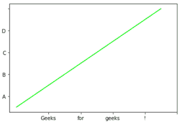
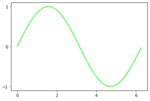
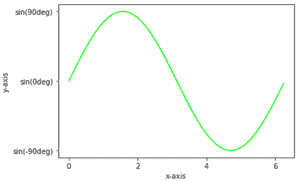

# Matplotlib–设置刻度和刻度标签

> 原文:[https://www . geeksforgeeks . org/matplotlib-setting-ticks-and-tick-labels/](https://www.geeksforgeeks.org/matplotlib-setting-ticks-and-tick-labels/)

在本文中，我们将讨论如何在图形中设置刻度和刻度标签。

刻度是表示轴上数据点的标记，刻度标签是刻度的名称。默认情况下 *matplotlib* 本身会在轴上标记数据点，但它也为我们提供了设置自己的轴，这些轴具有自己选择的刻度和刻度标签。

**使用的方法:**

*   **plt.axes(*args，emit=True，**kwargs):** 用于为我们的绘图设置轴，参数*直接为【左、底、宽、高】*用于设置轴位置。
*   **plt.axes()。set _ xtpicks()**和**PLT . axis()。set_yticks() :** 分别用于设置 x 轴和 y 轴上的刻度。将列表形式的数据设置为参数。
*   **plt.axes()。set_xlabels()** 和**PLT . axis()。set_ylabels() :** 用列表形式的参数设置我们的刻度的标签。

**以下是一些描述如何在图中添加记号和记号标签的示例:**

**例 1:**

## 蟒蛇 3

```
# import required module
import matplotlib.pyplot as plt

# assign coordinates
x = y = [i for i in range(0, 10)]
ax = plt.axes()

# depict illustration
plt.plot(x, y, color="lime")

# setting ticks for x-axis
ax.set_xticks([2, 4, 6, 8, 10])

# setting ticks for y-axis
ax.set_yticks([1, 3, 5, 7, 9])

plt.show()
```

**输出:**


**例 2:**

## 蟒蛇 3

```
# import required module
import matplotlib.pyplot as plt

# assign coordinates
x = y = [i for i in range(0, 10)]
ax = plt.axes()

# depict illustration
plt.plot(x, y, color="lime")

# setting ticks for x-axis
ax.set_xticks([2, 4, 6, 8, 10])

# setting label for x tick
ax.set_xticklabels(['Geeks', 'for', 'geeks', '!'])

# setting ticks for y-axis
ax.set_yticks([1, 3, 5, 7, 9])

# setting label for y tick
ax.set_yticklabels(['A', 'B', 'C', 'D'])

plt.show()
```

**输出:**



**例 3:**

## 蟒蛇 3

```
# import required modules
import matplotlib.pyplot as plt
import numpy as np
import math

# assign coordinates
x = np.arange(0, math.pi*2, 0.05)
y = np.sin(x)
ax = plt.axes()

# depict illustration
plt.plot(x, y, color="lime")

# setting ticks for x-axis
ax.set_xticks([0, 2, 4, 6])

# setting ticks for y-axis
ax.set_yticks([-1, 0, 1])

plt.show()
```

**输出:**



**例 4:**

## 蟒蛇 3

```
# import required modules
import matplotlib.pyplot as plt
import numpy as np
import math

# assign coordinates
x = np.arange(0, math.pi*2, 0.05)
y = np.sin(x)
ax = plt.axes()
plt.xlabel("x-axis")
plt.ylabel("y-axis")

# depict illustration
plt.plot(x, y, color="lime")

# setting ticks for x-axis
ax.set_xticks([0, 2, 4, 6])

# setting ticks for y-axis
ax.set_yticks([-1, 0, 1])

# setting label for y tick
ax.set_yticklabels(["sin(-90deg)", "sin(0deg)", "sin(90deg)"])

plt.show()
```

**输出:**

