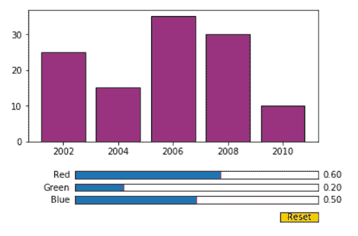
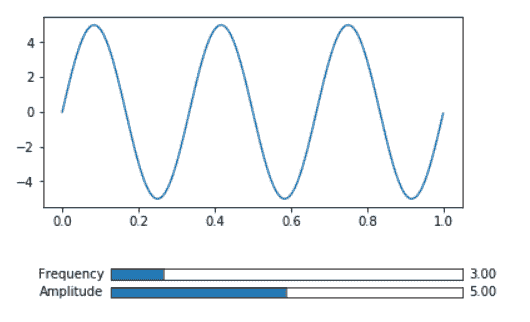

# matplotlib–slider widget

> 哎哎哎:# t0]https://www . geeksforgeeks . org/matplotlib-slider widget/

[Matplotlib](https://www.geeksforgeeks.org/python-introduction-matplotlib/) 提供了几个小部件来制作交互图。在这些小部件中，这里讨论了滑块小部件。滑块提供对绘图视觉属性的控制。*滑块()*用于将表示绘图中浮点范围的滑块放置在提供的轴上。

> **语法:**
> 
> *class matplotlib . widgets . slider(ax，label，valmin，valmax，valinit = 0.5，valfmt=None，closedmin=True，closedmax=True，slidermin=None，slidermax=None，拖动=True，valstep=None，方向= '水平'，**kwargs)*
> 
> **参数:**
> 
> 1.  **轴:**放置滑块的 matplotlib.axes.Axes 实例
> 2.  **标签:**滑块文本标签
> 3.  **valmin:** 滑块的最小值
> 4.  **最大值:**滑块的最大值
> 5.  **数值:**滑块的初始值。默认值为 0.5。
> 6.  **valfmt:** 滑块值格式字符串(%)-格式。默认值为无。如果没有，则使用 *ScalarFormatter* 。
> 7.  **closedmin:** 滑块间隔是否在底部关闭。
> 8.  **closedmax:** 滑块间隔是否在顶部关闭。
> 9.  **slidermin:** 禁止当前滑块的值小于给定滑块的当前值。默认值为无。
> 10.  **slidermax:** 禁止当前滑块的值大于给定滑块的当前值。默认值为无。
> 11.  **拖动:**滑块可以用鼠标拖动，也可以不用鼠标拖动。默认值为真(可以用鼠标拖动滑块)
> 12.  **valstep:** 滑块将以 *valstep* 值的倍数滑动。默认值为无。
> 13.  **方向:**滑块方向，垂直或水平。默认值为水平。
> 14.  **kwargs** 与绘制滑块旋钮的矩形相关。有效属性，如*面颜色、边缘颜色、alpha、*等。这里可以使用矩形。

**方法:**

*   **断开(自身，cid):** 移除连接 id 为 cid 的观察器
*   **on_changed(self，func):** 连接到滑块事件。当滑块值改变时，调用相应的功能*功能*。*函数*取一个新的滑块值作为参数，返回连接 id。
*   **复位(自):**滑块值设置为初始值
*   **set_val(self，val):** 将滑块值设置为*值*

**例 1:**

以下示例演示了使用 reg、绿色和蓝色值滑块改变条形图的颜色。

## 蟒蛇 3

```
# Import libraries
import numpy as np
import matplotlib.pyplot as plt
from matplotlib.widgets import Slider, Button

# Create a subplot
fig, ax = plt.subplots()
plt.subplots_adjust(bottom=0.35)
r = 0.6
g = 0.2
b = 0.5

# Create and plot a bar chart
year = ['2002', '2004', '2006', '2008', '2010']
production = [25, 15, 35, 30, 10]
plt.bar(year, production, color=(r, g, b),
        edgecolor="black")

# Create 3 axes for 3 sliders red,green and blue
axred = plt.axes([0.25, 0.2, 0.65, 0.03])
axgreen = plt.axes([0.25, 0.15, 0.65, 0.03])
axblue = plt.axes([0.25, 0.1, 0.65, 0.03])

# Create a slider from 0.0 to 1.0 in axes axred
# with 0.6 as initial value.
red = Slider(axred, 'Red', 0.0, 1.0, 0.6)

# Create a slider from 0.0 to 1.0 in axes axgreen
# with 0.2 as initial value.
green = Slider(axgreen, 'Green', 0.0, 1.0, 0.2)

# Create a slider from 0.0 to 1.0 in axes axblue
# with 0.5(default) as initial value
blue = Slider(axblue, 'Blue', 0.0, 1.0)

# Create fuction to be called when slider value is changed

def update(val):
    r = red.val
    g = green.val
    b = blue.val
    ax.bar(year, production, color=(r, g, b),
           edgecolor="black")

# Call update function when slider value is changed
red.on_changed(update)
green.on_changed(update)
blue.on_changed(update)

# Create axes for reset button and create button
resetax = plt.axes([0.8, 0.025, 0.1, 0.04])
button = Button(resetax, 'Reset', color='gold',
                hovercolor='skyblue')

# Create a function resetSlider to set slider to
# initial values when Reset button is clicked

def resetSlider(event):
    red.reset()
    green.reset()
    blue.reset()

# Call resetSlider function when clicked on reset button
button.on_clicked(resetSlider)

# Display graph
plt.show()
```

**输出:**



**例 2:**

在本例中，滑块用于改变正弦波的频率和振幅

## 蟒蛇 3

```
# Import libraries
import numpy as np
import matplotlib.pyplot as plt
from matplotlib.widgets import Slider, Button

# Create subplot
fig, ax = plt.subplots()
plt.subplots_adjust(bottom=0.35)

# Create and plot sine wave
t = np.arange(0.0, 1.0, 0.001)
s = 5 * np.sin(2 * np.pi * 3 * t)
l, = plt.plot(t, s)

# Create axes for frequency and amplitude sliders
axfreq = plt.axes([0.25, 0.15, 0.65, 0.03])
axamplitude = plt.axes([0.25, 0.1, 0.65, 0.03])

# Create a slider from 0.0 to 20.0 in axes axfreq
# with 3 as initial value
freq = Slider(axfreq, 'Frequency', 0.0, 20.0, 3)

# Create a slider from 0.0 to 10.0 in axes axfreq
# with 5 as initial value and valsteps of 1.0
amplitude = Slider(axamplitude, 'Amplitude', 0.0,
                   10.0, 5, valstep=1.0)

# Create fuction to be called when slider value is changed

def update(val):
    f = freq.val
    a = amplitude.val
    l.set_ydata(a*np.sin(2*np.pi*f*t))

# Call update function when slider value is changed
freq.on_changed(update)
amplitude.on_changed(update)

# display graph
plt.show()
```

**输出:**

