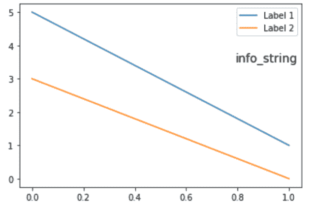
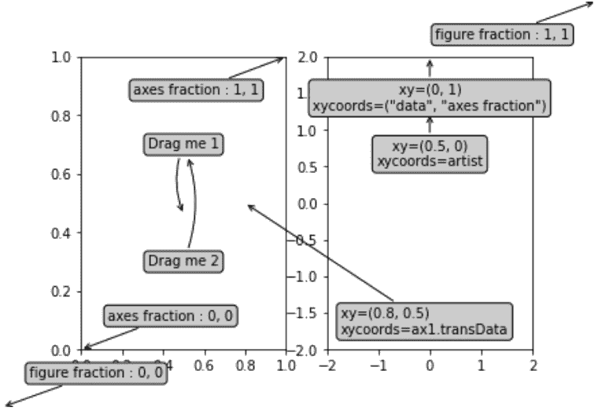

# python 中 Matplotlib.text.OffsetFrom 类

> 原文:[https://www . geeksforgeeks . org/matplotlib-text-offset from-class-in-python/](https://www.geeksforgeeks.org/matplotlib-text-offsetfrom-class-in-python/)

**[Matplotlib](https://www.geeksforgeeks.org/python-matplotlib-an-overview/)** 是 Python 中一个惊人的可视化库，用于数组的 2D 图。Matplotlib 是一个多平台数据可视化库，构建在 NumPy 数组上，旨在与更广泛的 SciPy 堆栈一起工作。

## matplotlib.text.OffsetFrom

`matplotlib.text.OffsetFrom` 类是一个可调用的助手类，用于处理注释。

> **语法:**class matplotlib . text . offset from(artist，ref_coord，unit='points ')
> 
> **参数:**
> 
> 1.  **艺术家:**此对象用于计算偏移量。它通常是一个艺术家，一个 BboxBase 或 Transform。
> 2.  **ref_coord:** 是长度 2 序列。如果艺术家边界框是艺术家边界框或边界框，则该值是偏移原点的位置，如果艺术家边界框是变换，则偏移原点是应用于该值的变换。
> 3.  **单位:**用于管理偏移输入要使用的屏幕单位(像素或点)。

**该类方法:**

*   **get_unit(self) :** 它是 __call__ 使用的转换的输入单位。
*   **set_unit(self，unit):** 它是 __call__ 使用的转换的输入单位，其中，unit 参数以“点”或“像素”为单位。

**例 1:**

```
import matplotlib.pyplot as plt
import matplotlib.text

fig, ax = plt.subplots()

ax.plot([5,1], label="Label 1")
ax.plot([3,0], label="Label 2")

legend = ax.legend(loc="upper right")

# Create offset from lower right
# corner of legend box, (1.0,0) is
# the coordinates of the offset point
# in the legend coordinate system
offset = matplotlib.text.OffsetFrom(legend, (1.0, 0.0))

# Create annotation. Top right corner 
# located -20 pixels below the offset
# point (lower right corner of legend).
ax.annotate("info_string",
            xy = (0,0), 
            size = 14,
            xycoords = 'figure fraction',
            xytext = (0,-20), 
            textcoords = offset, 
            horizontalalignment = 'right', 
            verticalalignment = 'top')

# Draw the canvas for offset to take effect
fig.canvas.draw()

plt.show()
```

**输出:**


**例 2:**

```
import matplotlib.pyplot as plt
from matplotlib.patches import Ellipse
import numpy as np
from matplotlib.text import OffsetFrom

fig, (ax1, ax2) = plt.subplots(1, 2)

bbox_args = dict(boxstyle ="round", fc ="0.8")
arrow_args = dict(arrowstyle ="->")

# Here we'll demonstrate the extents of the coordinate system and how
# we place annotating text.

ax1.annotate('figure fraction : 0, 0', 
             xy =(0, 0),
             xycoords ='figure fraction',
             xytext =(20, 20),
             textcoords ='offset points',
             ha = "left",
             va = "bottom",
             bbox = bbox_args,
             arrowprops = arrow_args)

ax1.annotate('figure fraction : 1, 1',
             xy =(1, 1),
             xycoords ='figure fraction',
             xytext = (-20, -20),
             textcoords ='offset points',
             ha = "right",
             va = "top",
             bbox = bbox_args,
             arrowprops = arrow_args)

ax1.annotate('axes fraction : 0, 0',
             xy = (0, 0),
             xycoords ='axes fraction',
             xytext = (20, 20),
             textcoords ='offset points',
             ha = "left",
             va = "bottom",
             bbox = bbox_args,
             arrowprops = arrow_args)

ax1.annotate('axes fraction : 1, 1', 
             xy =(1, 1),
             xycoords ='axes fraction',
             xytext = (-20, -20),
             textcoords ='offset points',
             ha = "right",
             va = "top",
             bbox = bbox_args,
             arrowprops = arrow_args)

# It is also possible to generate
# draggable annotations
an1 = ax1.annotate('Drag me 1', xy =(.5, .7), 
                   xycoords ='data',
                   ha ="center", va ="center",
                   bbox = bbox_args,
                   )

an2 = ax1.annotate('Drag me 2', xy =(.5, .5), 
                   xycoords = an1,
                   xytext =(.5, .3),
                   textcoords = 'axes fraction',
                   ha = "center", 
                   va = "center",
                   bbox = bbox_args,
                   arrowprops = dict(patchB = an1.get_bbox_patch(),
                                   connectionstyle = "arc3, rad = 0.2",
                                   **arrow_args))
an1.draggable()
an2.draggable()

an3 = ax1.annotate('', xy =(.5, .5), xycoords = an2,
                   xytext =(.5, .5), textcoords = an1,
                   ha ="center", va ="center",
                   bbox = bbox_args,
                   arrowprops = dict(patchA = an1.get_bbox_patch(),
                                   patchB = an2.get_bbox_patch(),
                                   connectionstyle ="arc3, rad = 0.2",
                                   **arrow_args))

# Finally we'll show off some more 
# complex annotation and placement
text = ax2.annotate('xy =(0, 1)\nxycoords = ("data", "axes fraction")',
                    xy =(0, 1),
                    xycoords = ("data", 'axes fraction'),
                    xytext = (0, -20),
                    textcoords ='offset points',
                    ha = "center",
                    va = "top",
                    bbox = bbox_args,
                    arrowprops = arrow_args)

ax2.annotate('xy =(0.5, 0)\nxycoords = artist',
             xy =(0.5, 0.),
             xycoords = text,
             xytext = (0, -20), 
             textcoords = 'offset points',
             ha = "center", 
             va = "top",
             bbox = bbox_args,
             arrowprops = arrow_args)

ax2.annotate('xy =(0.8, 0.5)\nxycoords = ax1.transData',
             xy =(0.8, 0.5), 
             xycoords = ax1.transData,
             xytext = (10, 10),
             textcoords = OffsetFrom(ax2.bbox, (0, 0), "points"),
             ha = "left", 
             va = "bottom",
             bbox = bbox_args,
             arrowprops = arrow_args)

ax2.set(xlim =[-2, 2], ylim =[-2, 2])
plt.show()
```

**输出:**
