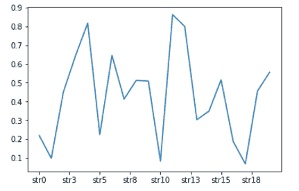
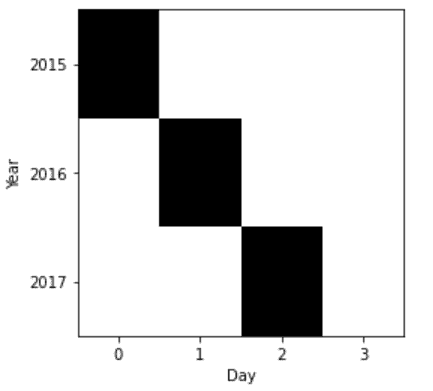

# Python 中的 matplotlib . ticker . indexformatter 类

> 原文:[https://www . geeksforgeeks . org/matplotlib-ticker-index formatter-python 中的类/](https://www.geeksforgeeks.org/matplotlib-ticker-indexformatter-class-in-python/)

**[Matplotlib](https://www.geeksforgeeks.org/python-introduction-matplotlib/)** 是 Python 中一个惊人的可视化库，用于数组的 2D 图。Matplotlib 是一个多平台数据可视化库，构建在 NumPy 数组上，旨在与更广泛的 SciPy 堆栈一起工作。

## matplotlib.ticker .索引格式化程序

`matplotlib.ticker.IndexFormatter`类是`matplotlib.ticker`类的子类，用于格式化位置 x，该位置是 i = int(x + 0.5)的最近的第 I 个标签。带有 i len(列表)的位置有 0 个刻度标签。

> **语法:**类 matplotlib . ticker . indexformatter(标签)
> 
> **参数:**
> 
> *   **标签:**是标签列表。

**例 1:**

```py
import numpy as np
import matplotlib.pyplot as plt
import matplotlib as mpl

# create dummy data    
x = ['str{}'.format(k) for k in range(20)]
y = np.random.rand(len(x))

# create an IndexFormatter 
# with labels x
x_fmt = mpl.ticker.IndexFormatter(x)

fig,ax = plt.subplots()

ax.plot(y)

# set our IndexFormatter to be
# responsible for major ticks
ax.xaxis.set_major_formatter(x_fmt)
```

**输出:**


**例 2:**

```py
from matplotlib.ticker import IndexFormatter, IndexLocator
import pandas as pd
import matplotlib.pyplot as plt

years = range(2015, 2018)
fields = range(4)
days = range(4)
bands = ['R', 'G', 'B']

index = pd.MultiIndex.from_product(
    [years, fields], names =['year', 'field'])

columns = pd.MultiIndex.from_product(
    [days, bands], names =['day', 'band'])

df = pd.DataFrame(0, index = index, columns = columns)

df.loc[(2015, ), (0, )] = 1
df.loc[(2016, ), (1, )] = 1
df.loc[(2017, ), (2, )] = 1
ax = plt.gca()
plt.spy(df)

xbase = len(bands)
xoffset = xbase / 2
xlabels = df.columns.get_level_values('day')

ax.xaxis.set_major_locator(IndexLocator(base = xbase,
                                        offset = xoffset))

ax.xaxis.set_major_formatter(IndexFormatter(xlabels))

plt.xlabel('Day')
ax.xaxis.tick_bottom()

ybase = len(fields)
yoffset = ybase / 2
ylabels = df.index.get_level_values('year')

ax.yaxis.set_major_locator(IndexLocator(base = ybase, 
                                        offset = yoffset))

ax.yaxis.set_major_formatter(IndexFormatter(ylabels))

plt.ylabel('Year')

plt.show()
```

**输出:**
