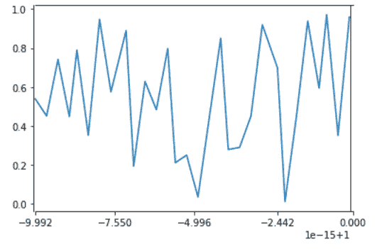
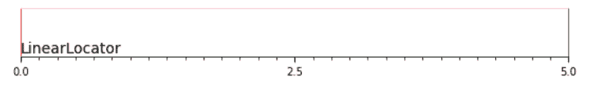

# Python 中的 matplotlib . ticker . linear locator 类

> 原文:[https://www . geeksforgeeks . org/matplotlib-ticker-linear locator-in-class-python/](https://www.geeksforgeeks.org/matplotlib-ticker-linearlocator-class-in-python/)

**[Matplotlib](https://www.geeksforgeeks.org/python-matplotlib-an-overview/)** 是 Python 中一个惊人的可视化库，用于数组的 2D 图。Matplotlib 是一个多平台数据可视化库，构建在 NumPy 数组上，旨在与更广泛的 SciPy 堆栈一起工作。

## matplotlib.ticker .线性定位器

`matplotlib.ticker.LinearLocator`类用于确定刻度位置。在第一次调用时，该函数试图设置刻度数，以进行良好的刻度分区。之后，互动导航会随着刻度数的固定而改进。*预置*参数用于基于`lom,`设置 `locs`，后者是 vmin、VMAX->locas 的字典映射。

> **语法:**class matplotlib . ticker . linear locator(numticks =无，预设=无)
> 
> **参数:**
> 
> *   **数量:**蜱的总数。
> *   **预置:**用于基于 *lom、*设置*locas*，这是 vmin、VMAX->locas 的字典映射。

**该类方法:**

*   **set_params(自身，数值=无，预设=无):**用于设置该定位器内的参数。
*   **tick_values(self，vmin，vmax):** 它返回位于 vmin 和 vmax 之间的 tick 的值。

*   **view_limits(self, vmin, vmax):** It is used to intelligently choose the view limits.

    **例 1:**

    ```
    import numpy as np
    import matplotlib.pyplot as plt
    import matplotlib.ticker

    xGrid = np.linspace(1-1e-14, 1-1e-16, 30,
                        dtype = np.longdouble)

    y = np.random.rand(len(xGrid))

    plt.plot(xGrid, y)
    plt.xlim(1-1e-14, 1)

    loc = matplotlib.ticker.LinearLocator(numticks = 5)
    plt.gca().xaxis.set_major_locator(loc)

    plt.show()
    ```

    **输出:**
    

    **例 2:**

    ```
    import numpy as np
    import matplotlib.pyplot as plt
    import matplotlib.ticker as ticker

    # Setup a plot such that only the bottom 
    # spine is shown
    def setup(ax):

        ax.spines['right'].set_color('green')
        ax.spines['left'].set_color('red')

        ax.yaxis.set_major_locator(ticker.NullLocator())
        ax.spines['top'].set_color('pink')
        ax.xaxis.set_ticks_position('bottom')

        ax.tick_params(which ='major', width = 1.00)
        ax.tick_params(which ='major', length = 5)
        ax.tick_params(which ='minor', width = 0.75)
        ax.tick_params(which ='minor', length = 2.5)

        ax.set_xlim(0, 5)
        ax.set_ylim(0, 1)
        ax.patch.set_alpha(0.0)

    plt.figure(figsize =(8, 6))
    n = 8
    ax = plt.subplot(n, 1, 4)
    setup(ax)
    ax.xaxis.set_major_locator(ticker.LinearLocator(3))
    ax.xaxis.set_minor_locator(ticker.LinearLocator(31))

    ax.text(0.0, 0.1, "LinearLocator",
            fontsize = 14,
            transform = ax.transAxes)

    plt.subplots_adjust(left = 0.05,
                        right = 0.95, 
                        bottom = 0.05,
                        top = 1.05)

    plt.show()
    ```

    **输出:**
    