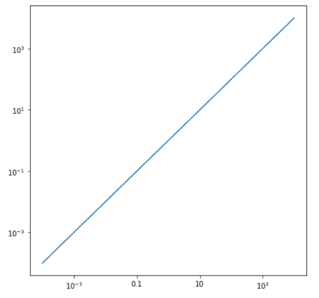
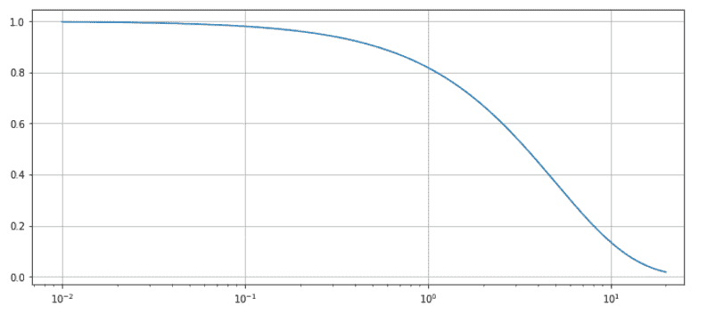
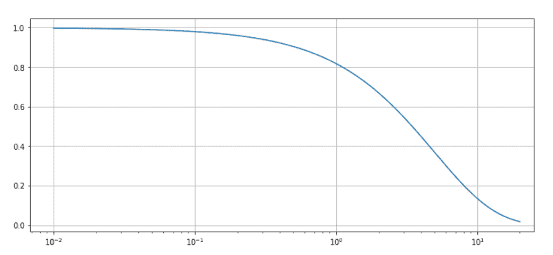
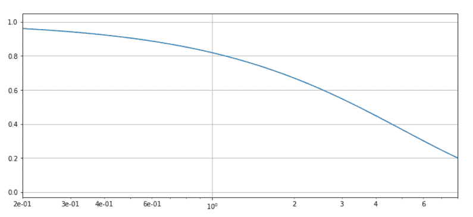
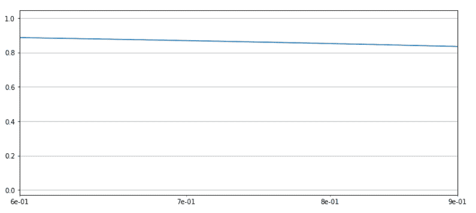

# Python 中的 Matplotlib.ticker.LogFormatter 类

> 原文:[https://www . geesforgeks . org/matplotlib-ticker-log formatter-python 中的类/](https://www.geeksforgeeks.org/matplotlib-ticker-logformatter-class-in-python/)

**[Matplotlib](https://www.geeksforgeeks.org/python-matplotlib-an-overview/)** 是 Python 中一个惊人的可视化库，用于数组的 2D 图。Matplotlib 是一个多平台数据可视化库，构建在 NumPy 数组上，旨在与更广泛的 SciPy 堆栈一起工作。

## matplotlib.ticker.LogFormatter

`matplotlib.ticker.LogFormatter`类用于格式化对数或符号对数刻度。它要么被直接实例化，要么被子类化。

> 语法:class matplotlib . ticker . logformatter(base = 10.0，labelOnlyBase=False，minor_thresholds=None，linthresh=None)
> 
> **参数:**
> 
> *   **基数:**是所有计算使用的对数基数的可选浮点值。默认情况下是 10。
> *   **标签基数:**它是一个可选的布尔值，如果设置为真，标签只在基数的整数次幂上打勾。一般来说，主要刻度为真，次要刻度为假。默认情况下，它为假。
> *   **minor_thresholds:** 它是两个值的可选元组(即子集，全部)。如果 labelOnlyBase 设置为 False，这两个数字决定了不是基数整数次幂的刻度的标记；一般来说，这些是次要的记号。轴数据范围的记录是控制参数。
> *   **linthresh:** 如果使用对称对数刻度，则必须提供该参数。

**该类方法:**

*   **format_data(self，value):** 它返回一个位置未指定的值的完整字符串表示。
*   **format_data_short(self，value):** 它返回一个数字的短格式字符串表示。
*   **label_minor(self，labelOnlyBase):** 用于开启或关闭 minor tick 标签。
*   **set _ locas(self，locas = None):**它使用轴视图控制记号的标记。

**例 1:**

```
import numpy as np
import matplotlib.pyplot as plt
from matplotlib.ticker import LogFormatterSciNotation

class CustomTicker(LogFormatterSciNotation):

    def __call__(self, x, pos = None):

        if x not in [0.1, 1, 10]:
            return LogFormatterSciNotation.__call__(self, x, pos = None)

        else:
            return "{x:g}".format(x = x)

fig = plt.figure(figsize =[7, 7])
ax = fig.add_subplot(111)

ax.set_yscale('log')
ax.set_xscale('log')

ax.plot(np.logspace(-4, 4), np.logspace(-4, 4))

ax.xaxis.set_major_formatter(CustomTicker())

plt.show()
```

**输出:**


**例 2:**

```
import matplotlib.pyplot as plt
from matplotlib.ticker import LogFormatter
import numpy as np

fig, axes = plt.subplots(4, figsize =(12, 24))

dt = 0.01
t = np.arange(dt, 20.0, dt)

# first plot doesn't use a formatter
axes[0].semilogx(t, np.exp(-t / 5.0))
axes[0].set_xlim([0, 25])
axes[0].grid()

xlims = [[0, 25], [0.2, 8], [0.6, 0.9]]

for ax, xlim in zip(axes[1:], xlims):

    ax.semilogx(t, np.exp(-t / 5.0))
    formatter = LogFormatter(labelOnlyBase = False, 
                             minor_thresholds = (2, 0.4))

    ax.get_xaxis().set_minor_formatter(formatter)
    ax.set_xlim(xlim)
    ax.grid()

plt.show()
```

**输出:**



