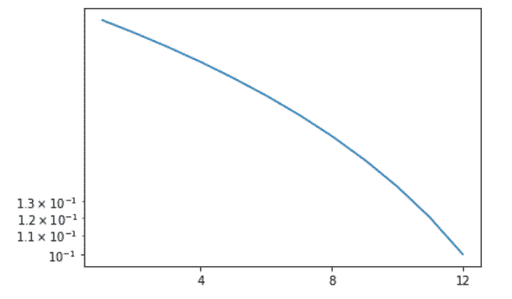
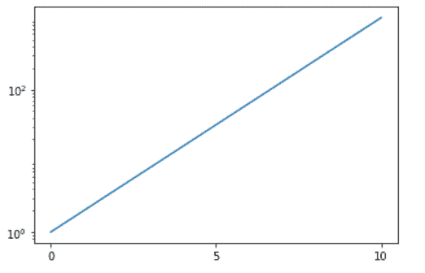

# Python 中的 Matplotlib.ticker.LogLocator 类

> 原文:[https://www . geesforgeks . org/matplotlib-ticker-log locator-in-class-python/](https://www.geeksforgeeks.org/matplotlib-ticker-loglocator-class-in-python/)

**[Matplotlib](https://www.geeksforgeeks.org/python-matplotlib-an-overview/)** 是 Python 中一个惊人的可视化库，用于数组的 2D 图。Matplotlib 是一个多平台数据可视化库，构建在 NumPy 数组上，旨在与更广泛的 SciPy 堆栈一起工作。

## matplotlib.ticker.LogLocator

`matplotlib.ticker.LogLocator`类用于确定对数轴的刻度位置。在这一类中，记号被放置在如下位置:subs[j]*base**i。

> **语法:**class matplotlib . ticker . loglocator(base = 10.0，subs=(1.0，)，numdecs=4，numticks=None)
> 
> **参数:**
> 
> *   **subs:** 它是一个可选参数，可以是无，也可以是字符串或一系列浮点数。默认为(1.0，)。它提供用于放置刻度的基数的整数次幂。默认情况下，只有在基数的整数次幂时才会放置刻度。*自动*和*都是这里唯一接受的字符串值。刻度正好位于整数次幂之间，带有“自动”，而带有“全部”的整数次幂被接受。这里无值相当于“自动”。*

**该类方法:**

*   **基数(自身，基数):**此方法用于设置对数刻度的基数。
*   **非奇异(self，vmin，vmax):** 用于根据需要扩大范围，避免奇异。
*   **set_params(self，base=None，subs=None，numdecs=None，num tics = None):**用于设置刻度内的参数。
*   **tick_values(self，vmin，vmax):** 此方法返回位于 vmin 和 vmax 范围之间的刻度值。
*   **subs(self，subs):** 它用于设置每个基**i*subs[j]的日志缩放的次要刻度。
*   **view_limit(self，vmin，vmax):** 这些方法在智能选择 vie 限制时非常有用。

**例 1:**

```py
import matplotlib.pyplot as plt
from matplotlib.ticker import MultipleLocator, LogLocator

x = [1, 2, 3, 4, 5, 6,
     7, 8, 9, 10, 11, 12]

y = [0.32, 0.30, 0.28, 0.26,
     0.24, 0.22, 0.20, 0.18,
     0.16, 0.14, 0.12, 0.10]

fig = plt.figure()
ax1 = fig.add_subplot(111)

x_major = MultipleLocator(4)
x_minor = MultipleLocator(1)

ax1.xaxis.set_major_locator(x_major)
ax1.xaxis.set_minor_locator(x_minor)
ax1.set_yscale("log")

y_major = LogLocator(base = 10)
y_minor = LogLocator(base = 10, subs =[1.1, 1.2, 1.3])

ax1.yaxis.set_major_locator(y_major)
ax1.yaxis.set_minor_locator(y_minor)

ax1.plot(x, y)

plt.show()
```

**输出:**


**例 2:**

```py
import numpy as np
import matplotlib.pyplot as plt
from matplotlib.ticker import LogLocator

x = np.linspace(0, 10, 10)
y = 2**x

f = plt.figure()
ax = f.add_subplot(111)
plt.yscale('log')

ax.yaxis.set_major_locator(LogLocator(base = 100))

ax.plot(x, y)

plt.show()
```

**输出:**
