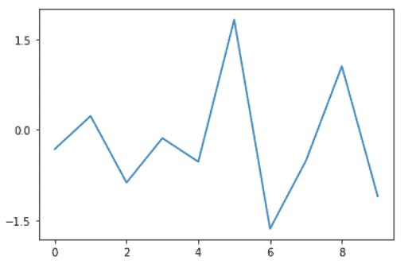
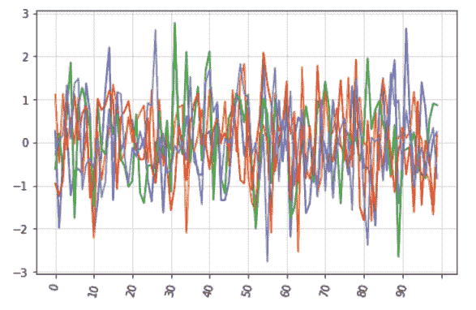

# Python 中的 Matplotlib.ticker.MaxNLocator 类

> 原文:[https://www . geeksforgeeks . org/matplotlib-ticker-maxnlocator-python 中的类/](https://www.geeksforgeeks.org/matplotlib-ticker-maxnlocator-class-in-python/)

**[Matplotlib](https://www.geeksforgeeks.org/python-matplotlib-an-overview/)** 是 Python 中一个惊人的可视化库，用于数组的 2D 图。Matplotlib 是一个多平台数据可视化库，构建在 NumPy 数组上，旨在与更广泛的 SciPy 堆栈一起工作。

## matplotlib.ticker.MaxNLocator

`matplotlib.ticker.MaxNLocator`类用于在合适的位置选择不超过 N 个间隔。它是`matplotlib.ticker.Locator`的一个子类。

> **语法:**class matplotlib . ticker . maxnlocator(* args，**kwargs)
> 
> **参数:**
> 
> *   **nbins:** 为整数或‘auto’，其中整数值代表最大间隔数；比最大刻度数少一个。根据轴的长度自动确定箱的数量。它是一个可选参数，默认值为 10。
> *   **步骤:**这是一个可选参数，表示从 1 开始到 10 结束的一个很好的数字序列。
> *   **整数:**可选布尔值。如果设置为真，刻度仅接受整数值，前提是至少 min_n_ticks 整数在视图限制内。
> *   **对称:**为可选值。如果设置为真，自动缩放将产生一个关于零对称的范围。
> *   **修剪:**它是一个可选参数，接受以下四个值中的任何一个:{ '下'，'上'，'两者'，无}。默认情况下，它是“无”。

**该类方法:**

*   **set_params(self，**kwargs):** 为定位器设置参数。
*   **tick_values(self，vmin，vmax):** 它返回给定 vmin 和 vmax 的定位 tick 的值。
*   **view_limits(self，dmin，dmax):** 用于为从 vmin 到 vmax 的范围选择比例。

**例 1:**

```py
import matplotlib.pyplot as plt
from matplotlib import ticker
import numpy as np

N = 10
x = np.arange(N)
y = np.random.randn(N)

fig = plt.figure()
ax = fig.add_subplot(111)
ax.plot(x, y)

# Create your ticker object with M ticks
M = 3
yticks = ticker.MaxNLocator(M)

# Set the yaxis major locator using
# your ticker object. 
ax.yaxis.set_major_locator(yticks)

plt.show()
```

**输出:**


**例 2:**

```py
import matplotlib.pyplot as plt
from matplotlib.ticker import MaxNLocator, IndexFormatter

ax = df.plot()

ax.xaxis.set_major_locator(MaxNLocator(11))
ax.xaxis.set_major_formatter(IndexFormatter(df.index)) 

ax.grid(which ='minor', alpha = 0.2)
ax.grid(which ='major', alpha = 0.5)

ax.legend().set_visible(False)
plt.xticks(rotation = 75)
plt.tight_layout()

plt.show()
```

**输出:**
