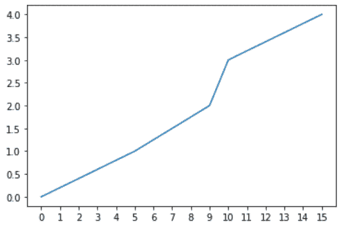
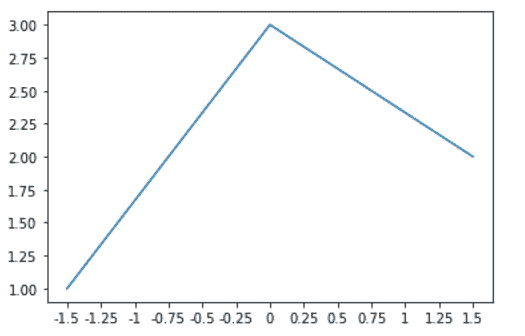

# Python 中的 matplotlib . ticker . multiple locator 类

> 原文:[https://www . geeksforgeeks . org/matplotlib-ticker-multiple locator-in-class-python/](https://www.geeksforgeeks.org/matplotlib-ticker-multiplelocator-class-in-python/)

**[Matplotlib](https://www.geeksforgeeks.org/python-matplotlib-an-overview/)** 是 Python 中一个惊人的可视化库，用于数组的 2D 图。Matplotlib 是一个多平台数据可视化库，构建在 NumPy 数组上，旨在与更广泛的 SciPy 堆栈一起工作。

## matplotlib.ticker .多重定位器

`matplotlib.ticker.MultipleLocator`类用于在视图间隔内为基数的每个整数倍设置一个刻度。

> **语法:**class matplotlib . ticker . multiplelocator(base = 1.0)

**该类方法:**

*   **set_params(self，base):** 用于设置定位器内的参数。
*   **tick_values(self，vmin，vmax):** 对于给定的 vmin 和 vmax，它返回找到的 tick 的值。
*   **view_limits(self，dmin，dmax):** 用于将视图限制设置为包含数据的基数的最近倍数。

**例 1:**

```
import matplotlib.pyplot as plt
import matplotlib.ticker as ticker

x = [0, 5, 9, 10, 15]
y = [0, 1, 2, 3, 4]

tick_spacing = 1

fig, ax = plt.subplots(1, 1)
ax.plot(x, y)
ax.xaxis.set_major_locator(ticker.MultipleLocator(tick_spacing))

plt.show()
```

**输出:**


**例 2:**

```
import matplotlib.pyplot as plt
import matplotlib.ticker

plt.plot([-1.5, 0, 1.5], [1, 3, 2])
ax = plt.gca()

func = lambda x, pos: str(x).rstrip('0').rstrip('.')

ax.xaxis.set_major_locator(matplotlib.ticker.MultipleLocator(0.25))
ax.xaxis.set_major_formatter(matplotlib.ticker.FuncFormatter(func))

plt.show()
```

**输出:**
