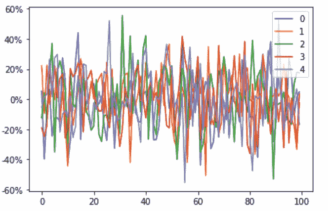
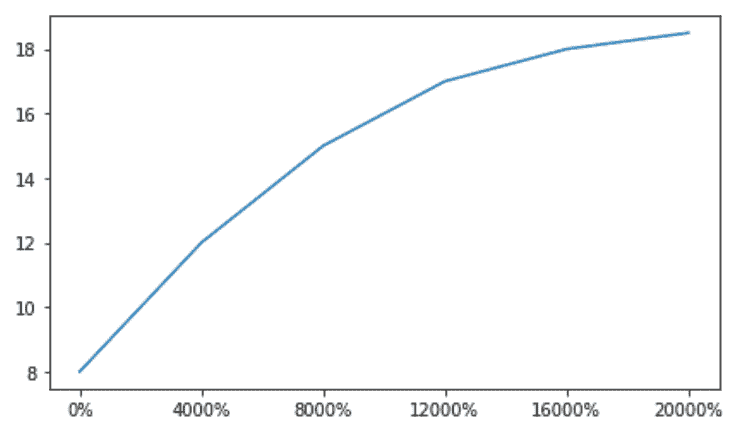

# Python 中的 matplotlib . ticker . percentformatter 类

> 原文:[https://www . geeksforgeeks . org/matplotlib-ticker-percent formatter-python 中的类/](https://www.geeksforgeeks.org/matplotlib-ticker-percentformatter-class-in-python/)

**[Matplotlib](https://www.geeksforgeeks.org/python-matplotlib-an-overview/)** 是 Python 中一个惊人的可视化库，用于数组的 2D 图。Matplotlib 是一个多平台数据可视化库，构建在 NumPy 数组上，旨在与更广泛的 SciPy 堆栈一起工作。

## matplotlib . ticker . percentformatter 程式

`matplotlib.ticker.PercentFormatter`类用于将数字格式化为百分比。

> **语法:**class matplotlib . ticker . percentformatter(xmax = 100，小数=无，符号='% '，is_latex=False)
> 
> **参数:**
> 
> *   **xmax:** 它是一个浮点值，决定了如何将数字转换为百分比。
> *   **小数:**不是整数值就是无。它决定了小数点后的小数位数。如果无(默认值)，该数字将自动计算。
> *   **符号:**它要么是字符串，要么是无，被附加到标签上。
> *   **是 _latex:** 是布尔值。如果为假，符号中保留的 LaTeX 字符将被删除。

**例 1:**

```
import pandas as pd
import numpy as np
import matplotlib.ticker as mtick
from matplotlib.ticker import PercentFormatter

df = pd.DataFrame(np.random.randn(100, 5))

ax = df.plot()
ax.yaxis.set_major_formatter(mtick.PercentFormatter(5.0)) 
```

**输出:**


**例 2:**

```
import matplotlib.pyplot as plt
import numpy as np
import matplotlib.ticker as mtick
from matplotlib.ticker import PercentFormatter

data = [8, 12, 15, 17, 18, 18.5]
perc = np.linspace(0, 100, len(data))

fig = plt.figure(1, (7, 4))
ax = fig.add_subplot(1, 1, 1)

ax.plot(perc, data)

xticks = mtick.PercentFormatter(0.5)
ax.xaxis.set_major_formatter(xticks)

plt.show()
```

**输出:**
