# Matplotlib 教程

> 哎哎哎:# t0]https://www . geeksforgeeks . org/matplot lib-tutorial/

**Matplotlib** 简单易用，是 Python 中一个令人惊叹的可视化库。它建立在 NumPy 阵列上，旨在与更广泛的 SciPy 堆栈一起工作，由线条、条形图、散点图、直方图等几个图组成。

在本文中，我们将借助包含不同类型地块及其自定义信息的庞大数据集，从基础到高级了解使用 Matplotlib 进行 Python 绘图。

**目录**

> *   [Introduction](#getting)
> *   [Pyplot](#pyplot)
> *   [Figure class](#figure)
> *   [Axes](#axes)
> *   [Set limit and scale label](#limits)
> *   [Multiple plots](#multiple)
> *   [What is legend?](#what)
> *   [Create different types of plots](#creating)
>     *   [Line diagram](#line)
>     *   [Bar chart](#bar)
>     
>     *   [Scatter chart](#scatter)
>     *   [Pie chart](#pie)
>     *   [3D plot](#3d)

[**Matplotlib 近期文章！！！**T3】](https://www.geeksforgeeks.org/tag/python-matplotlib/)

## 入门指南

在开始学习 Matplotlib 之前，我们首先要设置环境，并了解如何在 Jupyter Notebook 上使用 Matplotlib:

*   【Matplotlib 的环境设置
*   [使用 Matplotlib 搭配 Jupyter 笔记本](https://www.geeksforgeeks.org/using-matplotlib-with-jupyter-notebook/)

在了解了环境设置以及如何使用 Matplotlib 和 Jupyter 之后，让我们创建一个[简单的图](https://www.geeksforgeeks.org/simple-plot-in-python-using-matplotlib/)。我们将绘制两个包含绘图的 X，Y 坐标的列表。

**示例:**

## 蟒蛇 3

```
import matplotlib.pyplot as plt
   # initializing the data
   x = [10, 20, 30, 40]
   y = [20, 30, 40, 50]
   # plotting the data
   plt.plot(x, y)
   # Adding the title
   plt.title("Simple Plot")
   # Adding the labels
   plt.ylabel("y-axis")
   plt.xlabel("x-axis")
   plt.show()
```

**输出:**

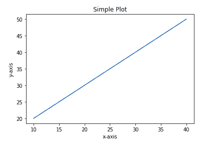

在上例中， **X** 和 **Y** 的元素提供了 **x 轴和 Y 轴**的坐标，并针对这些坐标绘制了一条直线。有关 Matplotlib 的详细介绍以及如何绘制基本图表，请参考下面的文章。

*   [Matplotlib 介绍](https://www.geeksforgeeks.org/python-introduction-matplotlib/)
*   [使用 Matplotlib 的 Python 简单绘图](https://www.geeksforgeeks.org/simple-plot-in-python-using-matplotlib/)

在上面的文章中，你可能已经看到了 **Pyplot** 是在代码中导入的，你一定很想知道什么是 Pyplot。别担心，我们将在下一节讨论 Pyplot。

## Pyplot

[**Pyplot**](https://www.geeksforgeeks.org/pyplot-in-matplotlib/) 是一个提供类似 MATLAB 界面的 Matplotlib 模块。Pyplot 提供与图形交互的功能，即创建图形，用标签装饰图形，在图形中创建绘图区域。

**语法:**

> matplotlib.pyplot.plot(*args，scalex=True，scaley=True，data=None，**kwargs)

**示例:**

## 蟒蛇 3

```
# Python program to show pyplot module
   import matplotlib.pyplot as plt 
   plt.plot([1, 2, 3, 4], [1, 4, 9, 16]) 
   plt.axis([0, 6, 0, 20]) 
   plt.show()
```

**输出:**


请参考下面的文章来获得关于 Pyplot 和与这个类相关的函数的详细信息。

*   [matplot lib](https://www.geeksforgeeks.org/pyplot-in-matplotlib/)中的 Pyplot
*   [Python 中的 Matplotlib.pyplot.plot()函数](https://www.geeksforgeeks.org/matplotlib-pyplot-plot-function-in-python/)
*   [Matplotlib.pyplot.title()用 Python](https://www.geeksforgeeks.org/matplotlib-pyplot-title-in-python/) 表示
*   [matplotlib.pyplot.imshow()在 Python](https://www.geeksforgeeks.org/matplotlib-pyplot-imshow-in-python/) 中
*   [Matplotlib.pyplot.legend()用 Python](https://www.geeksforgeeks.org/matplotlib-pyplot-legend-in-python/) 表示
*   [matplotlib . pyplot . subplot()用 Python](https://www.geeksforgeeks.org/matplotlib-pyplot-subplots-in-python/) 表示
*   [Matplotlib.pyplot.colors()中的 Python](https://www.geeksforgeeks.org/matplotlib-pyplot-colors-in-python/)
*   [Matplotlib.pyplot.grid()中的 Python](https://www.geeksforgeeks.org/matplotlib-pyplot-grid-in-python/)

[**> > >更多 Pyplot 类功能**](https://www.geeksforgeeks.org/tag/matplotlib-pyplot-class/)

Matplotlib 负责创建内置默认值，如**图形和轴。**不要担心这些术语，我们将在下一节详细研究它们，但让我们简单介绍一下这些术语。

*   **图:**这个类是所有图的顶层容器，意味着它是绘制所有内容的整体窗口或页面。图形对象可以被认为是一个可以容纳一个或多个轴的盒状容器。
*   **轴:**这个类是创建子地块最基本、最灵活的组件。你可能会混淆轴作为轴的复数，但它是一个单独的图表。给定的图形可能包含许多轴，但给定的轴只能在一个图形中。

## 图形类

图形类是包含一个或多个轴的顶级容器。它是绘制所有内容的整个窗口或页面。

**语法:**

> class matplotlib . fig . fig(fig size =无，dpi =无，facecolor =无，edgecolor =无，线宽=0.0，frameon =无，subplotpars =无，紧密 _ 布局=无，约束 _ 布局=无)

**例 1:**

## 蟒蛇 3

```
# Python program to show pyplot module
   import matplotlib.pyplot as plt 
   from matplotlib.figure import Figure 
   # Creating a new figure with width = 5 inches
   # and height = 4 inches
   fig = plt.figure(figsize =(5, 4)) 
   # Creating a new axes for the figure
   ax = fig.add_axes([1, 1, 1, 1]) 
   # Adding the data to be plotted
   ax.plot([2, 3, 4, 5, 5, 6, 6], [5, 7, 1, 3, 4, 6 ,8])
   plt.show()
```

**输出:**

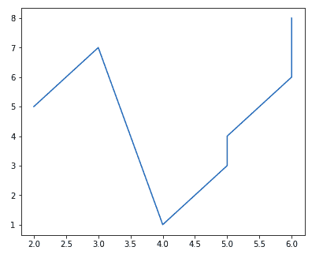

**示例 2:** 创建多个地块

## 蟒蛇 3

```
# Python program to show pyplot module
   import matplotlib.pyplot as plt 
   from matplotlib.figure import Figure 
   # Creating a new figure with width = 5 inches
   # and height = 4 inches
   fig = plt.figure(figsize =(5, 4)) 
   # Creating first axes for the figure
   ax1 = fig.add_axes([1, 1, 1, 1]) 
   # Creating second axes for the figure
   ax2 = fig.add_axes([1, 0.5, 0.5, 0.5])
   # Adding the data to be plotted
   ax1.plot([2, 3, 4, 5, 5, 6, 6], [5, 7, 1, 3, 4, 6 ,8])
   ax2.plot([1, 2, 3, 4, 5], [2, 3, 4, 5, 6])
   plt.show()
```

**输出:**

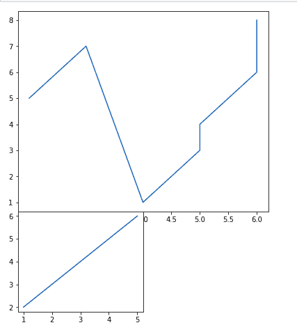

请参考下面的文章来获得关于 fig 类及其相关函数的详细信息。

*   [Python 中的 Matplotlib.figure.Figure()](https://www.geeksforgeeks.org/matplotlib-figure-figure-in-python/)
*   [Python 中的 matplotlib . figure . figure . add _ axes()](https://www.geeksforgeeks.org/matplotlib-figure-figure-add_axes-in-python/)
*   [Python 中的 Matplotlib.figure.Figure.clear()](https://www.geeksforgeeks.org/matplotlib-figure-figure-clear-in-python/)
*   [matplot lib . figure . figure . colorbar()中的 Python](https://www.geeksforgeeks.org/matplotlib-figure-figure-colorbar-in-python/)
*   [Python 中的 matplotlib . fig . fig . get _ fig width()](https://www.geeksforgeeks.org/matplotlib-figure-figure-get_figwidth-in-python/)
*   [Python 中的 matplotlib . fig . fig . get _ fig height()](https://www.geeksforgeeks.org/matplotlib-figure-figure-get_figheight-in-python/)
*   [Python 中的 matplotlib . figure . figure . subplots()](https://www.geeksforgeeks.org/matplotlib-figure-figure-subplots-in-python/)

[**> > >更多图类功能**](https://www.geeksforgeeks.org/tag/matplotlib-figure-class/)

## 轴类

[**斧类**](https://www.geeksforgeeks.org/matplotlib-axes-class/) 是创建子地块最基本、最灵活的单元。一个给定的图形可能包含许多轴，但是一个给定的轴只能出现在一个图形中。axes()函数创建 axes 对象。让我们看看下面的例子。

**语法:**

> matplotlib.pyplot.axis(*args，emit=true，**kwargs)

**例 1:**

## 蟒蛇 3

```
# Python program to show pyplot module
   import matplotlib.pyplot as plt 
   from matplotlib.figure import Figure 
   # Creating the axes object with argument as 
   # [left, bottom, width, height]
   ax = plt.axes([1, 1, 1, 1])
```

**输出:**


**例 2:**

## 蟒蛇 3

```
# Python program to show pyplot module
   import matplotlib.pyplot as plt 
   from matplotlib.figure import Figure 
   fig = plt.figure(figsize = (5, 4))
   # Adding the axes to the figure
   ax = fig.add_axes([1, 1, 1, 1])
   # plotting 1st dataset to the figure
   ax1 = ax.plot([1, 2, 3, 4], [1, 2, 3, 4])
   # plotting 2nd dataset to the figure
   ax2 = ax.plot([1, 2, 3, 4], [2, 3, 4, 5])
   plt.show()
```

**输出:**

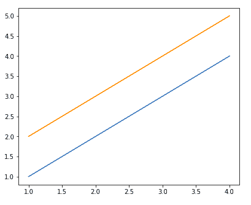

请参考下面的文章来获得 axes 类及其相关函数的详细信息。

*   [matplot lib–axis class](https://www.geeksforgeeks.org/matplotlib-axes-class/)
*   [Python 中的 Matplotlib.axes.Axes.update()](https://www.geeksforgeeks.org/matplotlib-axes-axes-update-in-python/)
*   [Python 中的 Matplotlib.axes.Axes.draw()](https://www.geeksforgeeks.org/matplotlib-axes-axes-draw-in-python/)
*   [Python 中的 matplotlib . axes . axes . get _ figure()](https://www.geeksforgeeks.org/matplotlib-axes-axes-get_figure-in-python/)
*   [Python 中的 matplotlib . axes . axes . set _ figure()](https://www.geeksforgeeks.org/matplotlib-axes-axes-set_figure-in-python/)
*   [Python 中的 matplotlib . axes . axes . properties()](https://www.geeksforgeeks.org/matplotlib-axes-axes-properties-in-python/)

[**> > >更多斧类功能**](https://www.geeksforgeeks.org/matplotlib-axes-class/)

## 设置限制和刻度标签

您可能已经看到 Matplotlib 自动设置 x 轴和 y 轴的值和标记(点)，但是，也可以手动设置限制和标记。 [**set_xlim()**](https://www.geeksforgeeks.org/matplotlib-axes-axes-set_xlim-in-python/) 和 [**set_ylim()**](https://www.geeksforgeeks.org/matplotlib-axes-axes-set_ylim-in-python/) 功能分别用于设置 x 轴和 y 轴的极限。同样的，[**set _ xticklabels()**](https://www.geeksforgeeks.org/matplotlib-axes-axes-set_xticklabels-in-python/)和[**set _ yticklabels()**](https://www.geeksforgeeks.org/matplotlib-axes-axes-set_yticklabels-in-python/)功能用于设置刻度标签。

**示例:**

## 蟒蛇 3

```
# Python program to show pyplot module
   import matplotlib.pyplot as plt 
   from matplotlib.figure import Figure 
   x = [3, 1, 3] 
   y = [3, 2, 1] 
   # Creating a new figure with width = 5 inches
   # and height = 4 inches
   fig = plt.figure(figsize =(5, 4)) 
   # Creating first axes for the figure
   ax = fig.add_axes([0.1, 0.1, 0.8, 0.8]) 
   # Adding the data to be plotted
   ax.plot(x, y)
   ax.set_xlim(1, 2)
   ax.set_xticklabels((
   "one", "two", "three", "four", "five", "six")) 
   plt.show()
```

**输出:**

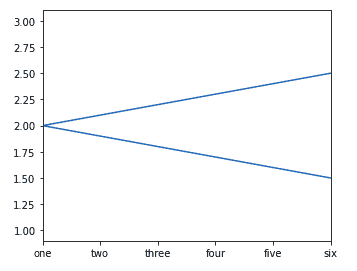

## 多个地块

到现在为止，你一定对 Matplotlib 和绘制一些简单的图有了基本的了解，现在如果你想在同一个图中绘制多个图呢？这可以通过多种方式实现。上面讨论的一种方法是使用图形类的 [add_axes()](https://www.geeksforgeeks.org/matplotlib-figure-figure-add_axes-in-python/) 方法。让我们借助示例来看看添加多个图的各种方法。

**方法 1:** 使用 [add_axes()](https://www.geeksforgeeks.org/matplotlib-figure-figure-add_axes-in-python/) 方法

matplotlib 库的 add_axes()方法图形模块用于给图形添加一个轴。

**语法:**

> add_axes(self，*args，**kwargs)

**示例:**

## 蟒蛇 3

```
# Python program to show pyplot module
   import matplotlib.pyplot as plt 
   from matplotlib.figure import Figure 
   # Creating a new figure with width = 5 inches
   # and height = 4 inches
   fig = plt.figure(figsize =(5, 4)) 
   # Creating first axes for the figure
   ax1 = fig.add_axes([0.1, 0.1, 0.8, 0.8]) 
   # Creating second axes for the figure
   ax2 = fig.add_axes([0.5, 0.5, 0.3, 0.3])
   # Adding the data to be plotted
   ax1.plot([5, 4, 3, 2, 1], [2, 3, 4, 5, 6])
   ax2.plot([1, 2, 3, 4, 5], [2, 3, 4, 5, 6])
   plt.show()
```

**输出:**

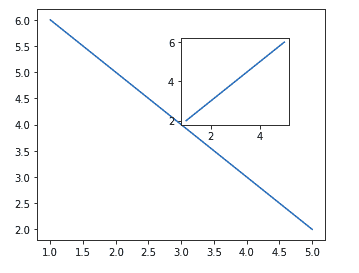

add_axes()方法通过创建另一个 axes 对象在同一图形中添加绘图。

**方法二:**使用[支线剧情()](https://www.geeksforgeeks.org/matplotlib-pyplot-subplot-function-in-python/)方法。

此方法将另一个图添加到当前图形的指定网格位置。

**语法:**

> 子图(nrows、ncols、index、**kwargs)
> 
> 子打印(pos、* . quartz)
> 
> 支线剧情(ax)

**示例:**

## 蟒蛇 3

```
import matplotlib.pyplot as plt 
   # data to display on plots 
   x = [3, 1, 3] 
   y = [3, 2, 1] 
   z = [1, 3, 1] 
   # Creating figure object 
   plt.figure() 
   # addind first subplot 
   plt.subplot(121) 
   plt.plot(x, y) 
   # addding second subplot 
   plt.subplot(122) 
   plt.plot(z, y)
```

**输出:**

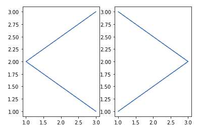

**注意:**子图()函数有以下缺点–

*   不允许同时添加多个支线剧情。
*   它删除了先前存在的图形。

**方法三:**使用[支线剧情()](https://www.geeksforgeeks.org/matplotlib-pyplot-subplots-in-python/)方法

该功能用于同时创建人物和多个支线剧情。

**语法:**

> matplotlib . pyplot . subplot(nrows = 1，ncols=1，sharex=False，sharey=False，挤压=True，subplot _ kw =无，gridspec _ kw =无，**fig_kw)

**示例:**

## 蟒蛇 3

```
import matplotlib.pyplot as plt 
   # Creating the figure and subplots
   # according the argument passed
   fig, axes = plt.subplots(1, 2)
   # plotting the data in the 1st subplot
   axes[0].plot([1, 2, 3, 4], [1, 2, 3, 4])
   # plotting the data in the 1st subplot only
   axes[0].plot([1, 2, 3, 4], [4, 3, 2, 1])
   # plotting the data in the 2nd subplot only
   axes[1].plot([1, 2, 3, 4], [1, 1, 1, 1])
```

**输出:**

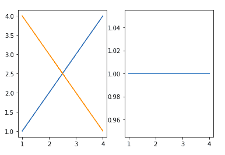

**方法 4:** 使用[亚批次 2grid()](https://www.geeksforgeeks.org/matplotlib-pyplot-subplot2grid-in-python/) 方法

这个函数为在网格内指定位置创建轴对象提供了额外的灵活性。它还有助于将 axes 对象跨多个行或列。更简单地说，这个函数用于在同一个图中创建多个图表。

**语法:**

> PLT . sub lot 2 grid(形状、位置、行跨度、列跨度)

**示例:**

## 蟒蛇 3

```
import matplotlib.pyplot as plt 
   # data to display on plots 
   x = [3, 1, 3] 
   y = [3, 2, 1] 
   z = [1, 3, 1] 
   # adding the subplots
   axes1 = plt.subplot2grid (
   (7, 1), (0, 0), rowspan = 2,  colspan = 1) 
   axes2 = plt.subplot2grid (
   (7, 1), (2, 0), rowspan = 2, colspan = 1) 
   axes3 = plt.subplot2grid (
   (7, 1), (4, 0), rowspan = 2, colspan = 1) 
   # plotting the data
   axes1.plot(x, y)
   axes2.plot(x, z)
   axes3.plot(z, y)
```

**输出:**

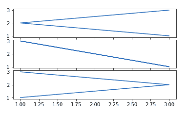

参考下面的文章来获得关于支线剧情的详细信息

*   [如何用 Python 在 Matplotlib 中创建多个支线剧情？](https://www.geeksforgeeks.org/how-to-create-multiple-subplots-in-matplotlib-in-python/)
*   [如何在 Matplotlib 中给支线剧情添加标题？](https://www.geeksforgeeks.org/how-to-add-title-to-subplots-in-matplotlib/)
*   [如何为 Matplotlib 中的所有支线剧情设置单一主标题？](https://www.geeksforgeeks.org/how-to-set-a-single-main-title-for-all-the-subplots-in-matplotlib/)
*   [如何在 Matplotlib 中关闭支线剧情的轴？](https://www.geeksforgeeks.org/how-to-turn-off-the-axes-for-subplots-in-matplotlib/)
*   [如何在 Matplotlib 中创建不同的子图大小？](https://www.geeksforgeeks.org/how-to-create-different-subplot-sizes-in-matplotlib/)
*   [如何在 Python 的 Matplotlib 中设置支线剧情之间的间距？](https://www.geeksforgeeks.org/how-to-set-the-spacing-between-subplots-in-matplotlib-in-python/)
*   [使用面向对象的应用编程接口进行 Matplotlib 子绘图](https://www.geeksforgeeks.org/python-matplotlib-sub-plotting-using-object-oriented-api/)
*   [在 Matplotlib](https://www.geeksforgeeks.org/make-subplots-span-multiple-grid-rows-and-columns-in-matplotlib/) 中让子剧情跨越多个网格行和列

## 什么是传奇？

图例是描述图形元素的区域。简单来说，它反映了图表 Y 轴上显示的数据。它通常显示为包含图表上每种颜色的小样本和该数据含义的小描述的方框。

### 创造传奇

可以使用 [**图例()**](https://www.geeksforgeeks.org/matplotlib-pyplot-legend-in-python/) 方法创建图例。图例()中的属性 **Loc** 用于指定图例的位置。loc 的默认值是 loc=“最佳”(左上角)。字符串“左上角”、“右上角”、“左下角”、“右下角”将图例放置在轴/图形的相应角落。

legend()函数的属性 **bbox_to_anchor=(x，y)** 用于指定图例的坐标，属性 ncol 表示图例的列数。它的默认值是 1。

**语法:**

> matplotlib.pyplot.legend([蓝色、绿色]、bbox_to_anchor=(0.75、1.15)、ncl = 2)

**示例:**

## 蟒蛇 3

```
import matplotlib.pyplot as plt 
   # data to display on plots 
   x = [3, 1, 3] 
   y = [3, 2, 1] 
   plt.plot(x, y)
   plt.plot(y, x)
   # Adding the legends
   plt.legend(["blue", "orange"])
   plt.show()
```

**输出:**

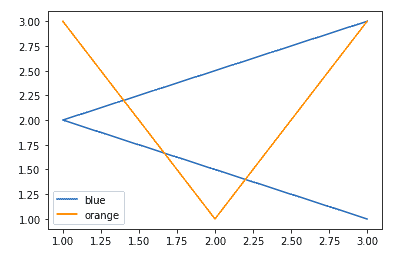

请参考以下文章，获取有关图例的详细信息–

*   [Matplotlib.pyplot.legend()用 Python](https://www.geeksforgeeks.org/matplotlib-pyplot-legend-in-python/) 表示
*   [Python 中的 Matplotlib.axes.Axes.legend()](https://www.geeksforgeeks.org/matplotlib-axes-axes-legend-in-python/)
*   [更改 Matplotlib 中的图例位置](https://www.geeksforgeeks.org/change-the-legend-position-in-matplotlib/)
*   [如何在 Matplotlib 中更改图例字号？](https://www.geeksforgeeks.org/how-to-change-legend-font-size-in-matplotlib/)
*   [如何改变 Matplotlib 中图例条目之间的垂直间距？](https://www.geeksforgeeks.org/how-change-the-vertical-spacing-between-legend-entries-in-matplotlib/)
*   [在 Matplotlib 图例中使用多列](https://www.geeksforgeeks.org/use-multiple-columns-in-a-matplotlib-legend/)
*   [如何在 Matplotlib 中为所有支线剧情创建一个单独的传说？](https://www.geeksforgeeks.org/how-to-create-a-single-legend-for-all-subplots-in-matplotlib/)
*   [如何在 Matplotlib 图上手动添加带有颜色框的图例？](https://www.geeksforgeeks.org/how-to-manually-add-a-legend-with-a-color-box-on-a-matplotlib-figure/)
*   [如何在 Matplotlib 中将传说放置在剧情之外？](https://www.geeksforgeeks.org/how-to-place-legend-outside-of-the-plot-in-matplotlib/)
*   [如何移除 Matplotlib 中的图例？](https://www.geeksforgeeks.org/how-to-remove-the-legend-in-matplotlib/)
*   [移除 Matplotlib 中的图例边框](https://www.geeksforgeeks.org/remove-the-legend-border-in-matplotlib/)

## 创建不同类型的地块

### 线图

到目前为止，你们一定都已经看到我们只使用**折线图**，因为它们很容易绘制和理解。折线图用于表示不同轴上两个数据 X 和 Y 之间的关系。它是使用 pot()函数绘制的。让我们看看下面的例子

**示例:**

## 蟒蛇 3

```
import matplotlib.pyplot as plt 
   # data to display on plots 
   x = [3, 1, 3] 
   y = [3, 2, 1] 
   # This will plot a simple line chart
   # with elements of x as x axis and y
   # as y axis
   plt.plot(x, y)
   plt.title("Line Chart")
   # Adding the legends
   plt.legend(["Line"])
   plt.show()
```

**输出:**

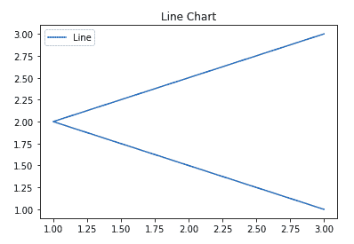

参考下面的文章来获得关于折线图的详细信息。

*   [Matplotlib 中的折线图](https://www.geeksforgeeks.org/line-chart-in-matplotlib-python/)
*   [Matplotlib 中的线图样式](https://www.geeksforgeeks.org/line-plot-styles-in-matplotlib/)
*   [在 Matplotlib 中绘制水平线](https://www.geeksforgeeks.org/plot-a-horizontal-line-in-matplotlib/)
*   [在 Matplotlib 中绘制垂直线](https://www.geeksforgeeks.org/plot-a-vertical-line-in-matplotlib/)
*   [在 Matplotlib 中绘制多条线](https://www.geeksforgeeks.org/plot-multiple-lines-in-matplotlib/)
*   [更改 Matplotlib 中的线条不透明度](https://www.geeksforgeeks.org/change-the-line-opacity-in-matplotlib/)
*   [用 Matplotlib](https://www.geeksforgeeks.org/increase-the-thickness-of-a-line-with-matplotlib/) 增加线条的粗细
*   [从 NumPy 阵列绘制线图](https://www.geeksforgeeks.org/plot-line-graph-from-numpy-array/)
*   [Matplotlib 中多行之间如何填充？](https://www.geeksforgeeks.org/how-to-fill-between-multiple-lines-in-matplotlib/)

### 条形图

**条形图**或条形图是一种用矩形条表示数据类别的图形，矩形条的长度和高度与它们所代表的值成比例。条形图可以水平或垂直绘制。条形图描述了离散类别之间的比较。可以使用**栏()**方法创建。

**语法:**

> plt.bar(x，高度，宽度，底部，对齐)

**示例:**

## 蟒蛇 3

```
import matplotlib.pyplot as plt 
   # data to display on plots 
   x = [3, 1, 3, 12, 2, 4, 4] 
   y = [3, 2, 1, 4, 5, 6, 7] 
   # This will plot a simple bar chart
   plt.bar(x, y)
   # Title to the plot
   plt.title("Bar Chart")
   # Adding the legends
   plt.legend(["bar"])
   plt.show()
```