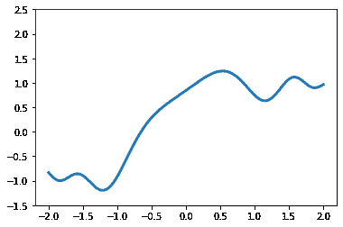
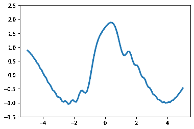

# 动画–使用 Matplotlib 创建动画

> 原文:[https://www . geesforgeks . org/moviepy-creating-animation-use-matplotlib/](https://www.geeksforgeeks.org/moviepy-creating-animation-using-matplotlib/)

在本文中，我们将看到如何使用 matplotlib 在 MoviePy 中创建动画。MoviePy 是一个用于视频编辑的 Python 模块，可用于视频和 GIF 的基本操作。视频是由帧组成的，帧的组合创建了一个视频，每一帧都是一个独立的图像。Matplotlib 是 Python 编程语言及其数值数学扩展 NumPy 的绘图库。它提供了一个面向对象的应用编程接口，用于使用通用图形用户界面工具包(如 Tkinter、wxPython、Qt 或 GTK+)将地块嵌入应用程序。

> 为了做到这一点，我们必须做以下
> 1。导入 matplotlib 模块
> 2。导入电影模块
> 3。创建 numpy 数组
> 4。使用 matplotlib
> 5 创建一个支线剧情。通过调用 make_frame 方法
> 6 创建视频剪辑文件。制作框架的方法
> 7。根据帧时间
> 8，使用三角学方法清除地块并创建新地块。将绘图转换为 numpy 图像后返回。

下面是实现

## 蟒蛇 3

```
# importing matplot lib
import matplotlib.pyplot as plt
import numpy as np

# importing movie py libraries
from moviepy.editor import VideoClip
from moviepy.video.io.bindings import mplfig_to_npimage

# numpy array
x = np.linspace(-2, 2, 200)

# duration of the video
duration = 2

# matplot subplot
fig, ax = plt.subplots()

# method to get frames
def make_frame(t):

    # clear
    ax.clear()

    # plotting line
    ax.plot(x, np.sinc(x**2) + np.sin(x + 2 * np.pi / duration * t), lw = 3)
    ax.set_ylim(-1.5, 2.5)

    # returning numpy image
    return mplfig_to_npimage(fig)

# creating animation
animation = VideoClip(make_frame, duration = duration)

# displaying animation with auto play and looping
animation.ipython_display(fps = 20, loop = True, autoplay = True)
```

**输出:**

```
Moviepy - Building video __temp__.mp4.
Moviepy - Writing video __temp__.mp4

Moviepy - Done !
Moviepy - video ready __temp__.mp4
```

<video class="wp-video-shortcode" id="video-465385-1" width="640" height="360" preload="metadata" controls=""><source type="video/mp4" src="https://media.geeksforgeeks.org/wp-content/uploads/20200806000001/138.mp4?_=1">[https://media.geeksforgeeks.org/wp-content/uploads/20200806000001/138.mp4](https://media.geeksforgeeks.org/wp-content/uploads/20200806000001/138.mp4)</video>



另一个例子

## 蟒蛇 3

```
# importing matplot lib
import matplotlib.pyplot as plt
import numpy as np

# importing movie py libraries
from moviepy.editor import VideoClip
from moviepy.video.io.bindings import mplfig_to_npimage

# numpy array
x = np.linspace(-5, 5, 100)

# duration of the video
duration = 2

# matplot subplot
fig, ax = plt.subplots()

# method to get frames
def make_frame(t):

    # clear
    ax.clear()

    # plotting line
    ax.plot(x, np.sinc(x**2) + np.cos(x + 10 * np.pi / duration * t), lw = 3)
    ax.set_ylim(-1.5, 2.5)

    # returning numpy image
    return mplfig_to_npimage(fig)

# creating animation
animation = VideoClip(make_frame, duration = duration)

# displaying animation with auto play and looping
animation.ipython_display(fps = 20, loop = True, autoplay = True)
```

**输出:**

```
Moviepy - Building video __temp__.mp4.
Moviepy - Writing video __temp__.mp4

Moviepy - Done !
Moviepy - video ready __temp__.mp4
```

<video class="wp-video-shortcode" id="video-465385-2" width="640" height="360" preload="metadata" controls=""><source type="video/mp4" src="https://media.geeksforgeeks.org/wp-content/uploads/20200805235930/232.mp4?_=2">[https://media.geeksforgeeks.org/wp-content/uploads/20200805235930/232.mp4](https://media.geeksforgeeks.org/wp-content/uploads/20200805235930/232.mp4)</video>

