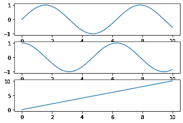
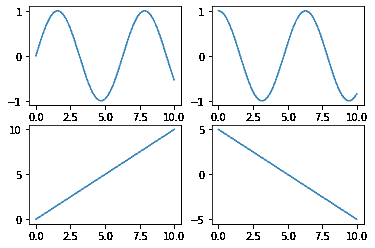
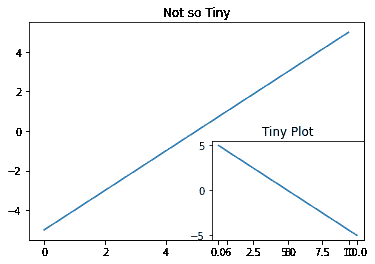

# 使用 Matplotlib 在 Python 中进行多点绘制

> 原文:[https://www . geesforgeks . org/multiplots-in-python-using-matplotlib/](https://www.geeksforgeeks.org/multiplots-in-python-using-matplotlib/)

**Matplotlib** 是一个 Python 库，可以用来绘制图形和图形。

为了比较两条曲线或显示多幅图中的一些渐变，通常需要绘制多幅图或多幅图，这可以使用子图来完成。支线剧情是最重要和最基本的概念之一，当试图在同一个剧情中绘制多个图形/图表/情节时，需要理解，本教程向您展示了如何做到这一点。

[matplotlib](http://geeksforgeeks.org/python-matplotlib-an-overview/) 的 [pyplot](https://www.geeksforgeeks.org/pyplot-in-matplotlib/) 模块中可以找到**子图()**功能，提供了一个类似于 MATLAB 的 Python 绘图框架。该函数的原型如下所示:

```
matplotlib.pyplot.subplot(nrows, ncols, index)
```

也有一些关键词参数可以给出。

#### 堆叠图

首先，让我们通过将一个图叠加在另一个图上来尝试绘制一系列图(这里是 3)。当我们堆叠它们时，改变的是行数，这意味着 ncols 保持不变，为 1。每个子情节都由索引参数标识。

```
import matplotlib.pyplot as plt
import numpy as np

x = np.arange(0, 10, 0.01)

# notice that nrows = number
# of images
plt.subplot(3, 1, 1)
plt.plot(x, np.sin(x))

# ncols stays as 1 
plt.subplot(3, 1, 2)
plt.plot(x, np.cos(x))

# each image has a unique 
# index
plt.subplot(3, 1, 3)
plt.plot(x, x)

plt.show()
```

**输出:**


#### 网格图

接下来，我们将尝试将一些图形绘制为网格，即多点多列。在这里，我们将创建一个具有 4 个图的多图，我们将使它成为 2×2 的网格，这意味着 nrows=2 和 ncols=2，每个图像再次由索引识别，以**行-主**的顺序。

```
import matplotlib.pyplot as plt
import numpy as np

x = np.arange(0, 10, 0.01)
plt.subplot(2, 2, 1)
plt.plot(x, np.sin(x))

plt.subplot(2, 2, 2)
plt.plot(x, np.cos(x))

plt.subplot(2, 2, 3)
plt.plot(x, x)

plt.subplot(2, 2, 4)
plt.plot(x, 5-x)

plt.show()
```

**输出:**


如果我们要创建一个多图，其中一个图**与另一个图**重叠，就像我们最小化 youtube 视频时看到的那样，但它仍然在底部角落的一个小窗口中运行，那么`add_suplplot()`功能在这方面有所帮助。

```
import matplotlib.pyplot as plt
import numpy as np

fig = plt.figure()
x = np.arange(0, 10, 0.01)
plt.plot(x, x-5)

plt.title("Not so Tiny")
fig.add_subplot(2, 2, 4)
plt.plot(x, 5-x)

plt.title("Tiny Plot")
plt.show()
```

**输出:**


哦，还有，对于我们已经实现的所有子图函数，如果 nrows、ncol 和 index 小于 10，而不是给出(nrows、ncol、index)格式的参数，它们可以作为格式`(nrows*100+ncols*10+index)`的三位数传递，输出将保持不变。我们为什么不试试网格图呢？

```
import matplotlib.pyplot as plt
import numpy as np

x = np.arange(0, 10, 0.01)
plt.subplot(221)
plt.plot(x, np.sin(x))

plt.subplot(222)
plt.plot(x, np.cos(x))

plt.subplot(223)
plt.plot(x, x)

plt.subplot(224)
plt.plot(x, 5-x)
plt.show()
```

**输出:**


即使我们使用传递参数的三位数格式，输出仍然保持不变。