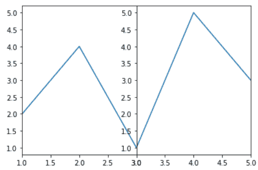
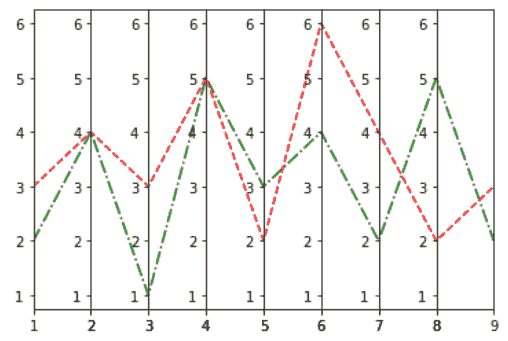
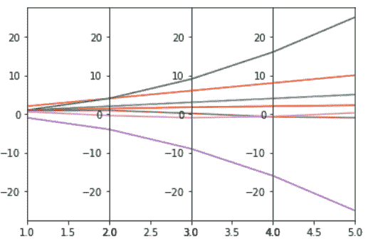

# Matplotlib 中的平行坐标

> 原文:[https://www . geesforgeks . org/parallel-coordinates-in-matplotlib/](https://www.geeksforgeeks.org/parallel-coordinates-in-matplotlib/)

在本文中，我们将学习如何在 Matplotlib 中绘制平行坐标。所以，先讨论一些概念:

*   Matplotlib 可能是 Python 中一个巨大的可视化库，用于数组的 2D 图。Matplotlib 也可以是一个多平台数据可视化库，构建在 NumPy 数组上，旨在与更广泛的 SciPy 堆栈一起工作。它是由约翰·亨特在 2002 年推出的。
*   可视化的一个最大好处是，它允许我们以容易理解的视觉形式可视化地获取大量知识。Matplotlib 由几个图组成，如直线、条形图、散点图、直方图等。
*   **平行坐标**可能是一种探索分类反应多维数据传播的方法，看看特征是否有任何趋势。
*   二维和三维数据通常使用传统的绘图类型相对直接地查看。即使有四维数据，我们也会经常发现如何显示信息。

### 所需步骤

1.  导入库(matplotlib)
2.  创建/加载数据
3.  使共享 y 轴的子剧情等于假
4.  画出所有的支线剧情
5.  为 x 轴标签设置 x 轴限制
6.  使宽度空间为零
7.  显示最终输出的图

### 例子

这里，我们将通过应用上述步骤来讨论一些示例。在这些例子中，我们将处理线性和多维度的虚拟数据。

**例 1:(简单平行坐标图)**

## 蟒蛇 3

```py
# import packages
import matplotlib.pyplot as plt

# create data
x=[1,2,3,4,5]
y=[2,4,1,5,3]

# make subplots
fig,(ax1,ax2) = plt.subplots(1, 2, sharey=False)

# plot the subplots
ax1.plot(x,y)
ax2.plot(x,y)

# set x limits
ax1.set_xlim([ x[0],x[2]])
ax2.set_xlim([ x[2],x[4]])

# set width space to zero
plt.subplots_adjust(wspace=0)

# show the plots
plt.show()
```

**输出:**



**例 2:(多线多轴平行坐标图)**

## 蟒蛇 3

```py
# import packages
import matplotlib.pyplot as plt

# create data
x=[1,2,3,4,5,6,7,8,9]
y1=[2,4,1,5,3,4,2,5,2]
y2=[3,4,3,5,2,6,4,2,3]

# make subplots
fig, (ax1,ax2,ax3,ax4,ax5,ax6,ax7,ax8) = plt.subplots(1, 8, sharey=False)
ax = (ax1,ax2,ax3,ax4,ax5,ax6,ax7,ax8)

# plot subplots and set xlimit
for i in range(8):
    ax[i].plot(x,y1,'g-.',x,y2,'r--')
    ax[i].set_xlim([ x[i],x[i+1]])

# set width space to zero
plt.subplots_adjust(wspace=0)

# show plot
plt.show()
```

**输出:**



**示例 3:(多维数据上的平行坐标图)**

## 蟒蛇 3

```py
# import packages
import numpy as np
import matplotlib.pyplot as plt

# create data
x = np.arange(1,6)
data = [x,x*2,x*x,np.sqrt(x),-x*x,np.sin(x),np.cos(x)]
print(data)

# make subplots
fig, (ax1,ax2,ax3,ax4) = plt.subplots(1, 4, sharey=False)
ax = (ax1,ax2,ax3,ax4)

# plot subplots and set xlimit
for i in range(4):
    for j in range(len(data)):
        ax[i].plot(data[0],data[j])
    ax[i].set_xlim([x[i],x[i+1]])

# set width space to zero
plt.subplots_adjust(wspace=0)

# show plot
plt.show()
```

**输出:**

