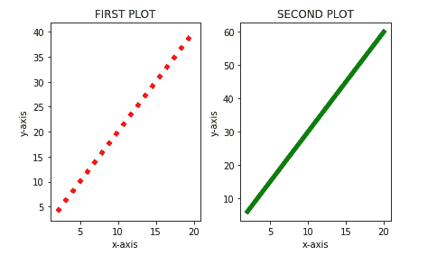

# 在 Matplotlib 中并排放置地块

> 原文:[https://www . geesforgeks . org/place-plots-并排-in-matplotlib/](https://www.geeksforgeeks.org/place-plots-side-by-side-in-matplotlib/)

[Matplotlib](https://www.geeksforgeeks.org/python-introduction-matplotlib/) 是最流行的绘制图形和可视化我们的数据的 Python 库。在 Matplotlib 中，我们可以通过调用一次来创建多个图。为了创建多个剧情，我们使用了 Matplotlib 中 [pyplot](https://www.geeksforgeeks.org/pyplot-in-matplotlib/) 模块的子剧情功能。

> **语法:** plt.subplot(nrows，。指数)
> 
> **参数:**
> 
> *   nrows 代表行数，意思是如果行数是 1，那么图是水平的。
> *   ncolumns 代表柱意味着如果柱为 1，则图垂直放置。
> *   索引是图的计数/索引。从 1 开始。

**进场:**

*   导入库和模块。
*   为绘图创建数据。
*   现在，使用上面的函数创建一个子图。
*   根据要求给出函数的参数。

**例 1:**

## 蟒蛇 3

```
# importing libraries
import numpy as np
import matplotlib.pyplot as plt

# creating an array of data for x-axis
x = np.array([2, 4, 6, 8, 10, 12, 14, 16, 18, 20])

# data for y-axis
y_1 = 2*x

# dat for y-axis for another plot
y_2 = 3*x

# using subplot function and creating plot one
plt.subplot(1, 2, 1)  # row 1, column 2, count 1
plt.plot(x, y_1, 'r', linewidth=5, linestyle=':')
plt.title('FIRST PLOT')
plt.xlabel('x-axis')
plt.ylabel('y-axis')

# using subplot function and creating plot two
# row 1, column 2, count 2
plt.subplot(1, 2, 2)

# g is gor green color
plt.plot(x, y_2, 'g', linewidth=5)
plt.title('SECOND PLOT')
plt.xlabel('x-axis')
plt.ylabel('y-axis')

# space between the plots
plt.tight_layout(4)

# show plot
plt.show()
```

**输出:**



**例 2:** 垂直形式。

## 蟒蛇 3

```
# importing libraries
import numpy as np
import matplotlib.pyplot as plt

# creating an array of data for x-axis
x = np.array([2, 4, 6, 8, 10, 12, 14, 16, 18, 20])

# data for y-axis
y_1 = 2*x

# dat for y-axis for another plot
y_2 = 3*x

# using subplot function and creating plot one
# row 2, column 1, count 1
plt.subplot(2, 1, 1)
plt.plot(x, y_1, 'r', linewidth=5, linestyle=':')
plt.title('FIRST PLOT')
plt.xlabel('x-axis')
plt.ylabel('y-axis')

# using subplot function and creating plot two
# row 2, column 1, count 2
plt.subplot(2, 1, 2)
plt.plot(x, y_2, 'g', linewidth=5)
plt.title('SECOND PLOT')
plt.xlabel('x-axis')
plt.ylabel('y-axis')

# space between the plots
plt.tight_layout()

# show plot
plt.show()
```