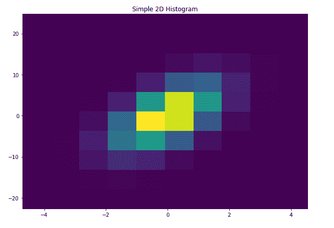
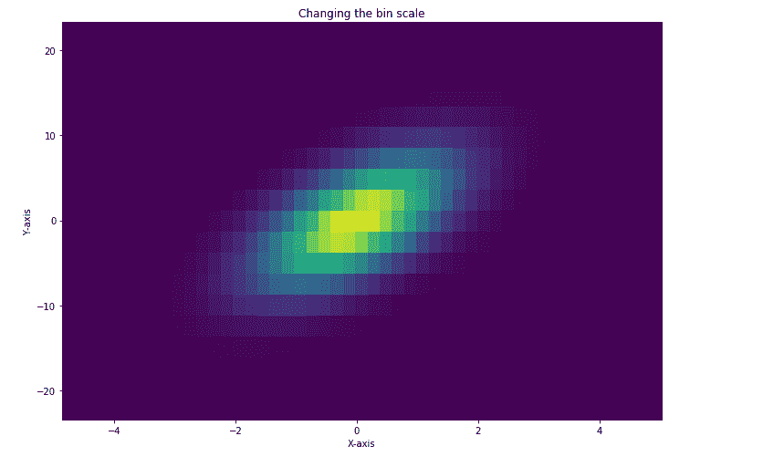
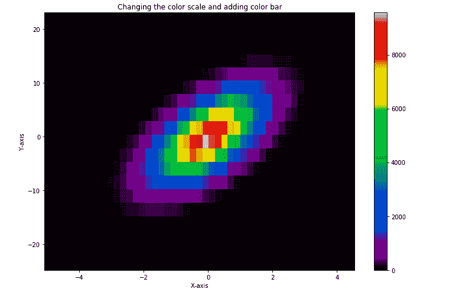
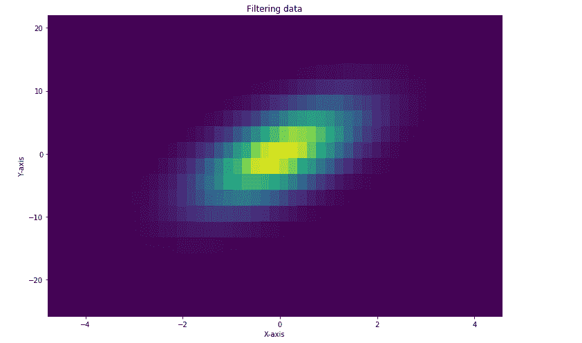
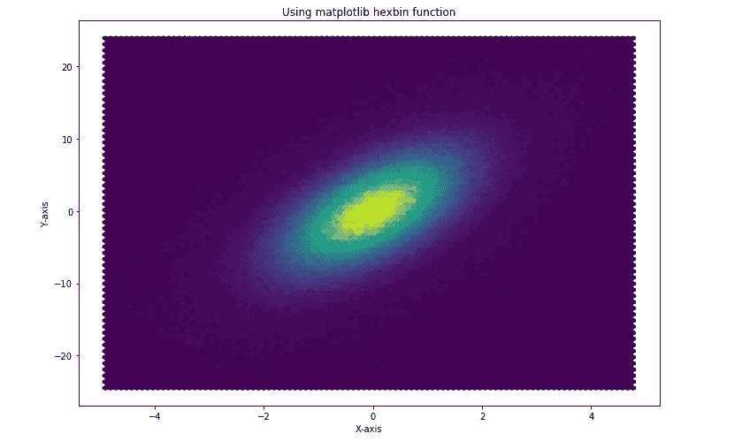

# 使用 Matplotlib 绘制 Python 中的二维直方图

> 原文:[https://www . geesforgeks . org/plot-2-d-直方图-in-python-using-matplotlib/](https://www.geeksforgeeks.org/plot-2-d-histogram-in-python-using-matplotlib/)

**2D 直方图**用于分析数值范围较广的两个数据变量之间的关系。2D 直方图与 1D 直方图非常相似。数据集的类间隔绘制在 x 轴和 y 轴上。与 1D 直方图不同，它是通过包含 x 和 y 间隔内出现的值的组合总数，并标记密度来绘制的。当离散分布中有大量数据时，它很有用，并且通过可视化变量密集的频率点来简化它。

## 创建 2D 直方图

Matplotlib 库提供了一个内置函数`matplotlib.pyplot.hist2d()`，用于创建 2D 直方图。下面是函数的语法:

> matplotlib.pyplot.hist2d(x，y，bin =(NX，ny)，范围=无，密度=假，权重=无，cmin =无，cmax =无，cmap =值)

这里`(x, y)`指定数据变量的坐标，X 数据和 Y 变量的长度应该相同。箱的数量可以通过属性`bins=(nx, ny)`来指定，其中`nx`和`ny`分别是要在水平和垂直方向上使用的箱的数量。`cmap=value`用于设置色标。`range=None`是一个可选参数，用于设置矩形区域，在该区域中数据值被计算用于绘图。`density=value`是可选参数，接受用于归一化直方图的布尔值。
下面的代码使用具有一些随机 x 和 y 值的`matplotlib.pyplot.hist2d()`函数创建了一个简单的 2D 直方图:

```py
# Import libraries
import numpy as np
import matplotlib.pyplot as plt
import random

# Creating dataset
n = 100
x = np.random.standard_normal(n)
y = 3.0 * x 

fig = plt.subplots(figsize =(10, 7))
# Creating plot
plot.hist2d(x, y)
plot.title("Simple 2D Histogram")

# show plot
plot.show()
```

**输出:**


## 自定义 2D 直方图

`matplotlib.pyplot.hist2d()`功能有多种方法，我们可以使用这些方法来定制和创建绘图，以便更好地查看和理解。

```py
# Import libraries
import numpy as np
import matplotlib.pyplot as plt
import random

# Creating dataset
x = np.random.normal(size = 500000)
y = x * 3 + 4 * np.random.normal(size = 500000)

fig = plt.subplots(figsize =(10, 7))
# Creating plot
plot.hist2d(x, y)
plot.title("Simple 2D Histogram")

# show plot
plot.show()
```

**输出:**


### 上图的一些定制如下:

#### 改变箱柜秤

```py
# Import libraries
import numpy as np
import matplotlib.pyplot as plt
import random

# Creating dataset
x = np.random.normal(size = 500000)
y = x * 3 + 4 * np.random.normal(size = 500000)

# Creating bins
x_min = np.min(x)
x_max = np.max(x)

y_min = np.min(y)
y_max = np.max(y)

x_bins = np.linspace(x_min, x_max, 50)
y_bins = np.linspace(y_min, y_max, 20)

fig, ax = plt.subplots(figsize =(10, 7))
# Creating plot
plt.hist2d(x, y, bins =[x_bins, y_bins])
plt.title("Changing the bin scale")

ax.set_xlabel('X-axis') 
ax.set_ylabel('X-axis') 

# show plot
plt.tight_layout() 
plot.show()
```

**输出:**


#### 更改色标并添加颜色条:-

```py
# Import libraries
import numpy as np
import matplotlib.pyplot as plt
import random

# Creating dataset
x = np.random.normal(size = 500000)
y = x * 3 + 4 * np.random.normal(size = 500000)

# Creating bins
x_min = np.min(x)
x_max = np.max(x)

y_min = np.min(y)
y_max = np.max(y)

x_bins = np.linspace(x_min, x_max, 50)
y_bins = np.linspace(y_min, y_max, 20)

fig, ax = plt.subplots(figsize =(10, 7))
# Creating plot
plt.hist2d(x, y, bins =[x_bins, y_bins], cmap = plt.cm.nipy_spectral)
plt.title("Changing the color scale and adding color bar")

# Adding color bar
plt.colorbar()

ax.set_xlabel('X-axis') 
ax.set_ylabel('X-axis') 

# show plot
plt.tight_layout() 
plot.show()
```

**输出:**


#### 过滤数据:-

```py
# Import libraries
import numpy as np
import matplotlib.pyplot as plt
import random

# Creating dataset
x = np.random.normal(size = 500000)
y = x * 3 + 4 * np.random.normal(size = 500000)

# Creating bins
x_min = np.min(x)
x_max = np.max(x)

y_min = np.min(y)
y_max = np.max(y)

x_bins = np.linspace(x_min, x_max, 50)
y_bins = np.linspace(y_min, y_max, 20)

# Creating data filter
data = np.c_[x, y]

for i in range(10000):
    x_idx = random.randint(0, 500000)
    data[x_idx, 0] = -9999

data = data[data[:, 0]!=-9999]

fig, ax = plt.subplots(figsize =(10, 7))
# Creating plot
plt.hist2d(data[:, 0], data[:, 1], bins =[x_bins, y_bins])
plt.title("Filtering data")

ax.set_xlabel('X-axis') 
ax.set_ylabel('X-axis') 

# show plot
plt.tight_layout() 
plot.show()
```

**输出:**


#### 使用 matplotlib hexbin 函数:-

```py
# Import libraries
import numpy as np
import matplotlib.pyplot as plt
import random

# Creating dataset
x = np.random.normal(size = 500000)
y = x * 3 + 4 * np.random.normal(size = 500000)

fig, ax = plt.subplots(figsize =(10, 7))
# Creating plot
plt.title("Using matplotlib hexbin function")
plt.hexbin(x, y, bins = 50)

ax.set_xlabel('X-axis') 
ax.set_ylabel('Y-axis') 

# show plot
plt.tight_layout() 
plot.show()
```

**输出:**
