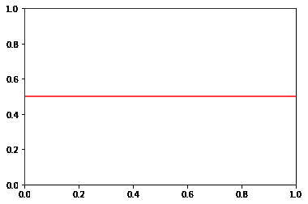
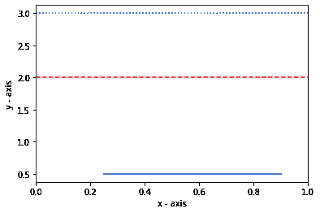
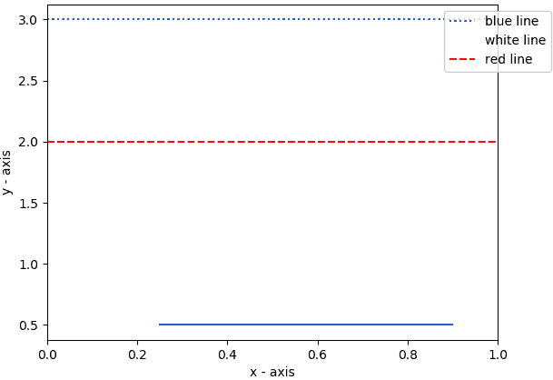

# 在 Matplotlib 中绘制水平线

> 原文:[https://www . geesforgeks . org/plot-a-横线 in-matplotlib/](https://www.geeksforgeeks.org/plot-a-horizontal-line-in-matplotlib/)

Matplotlib 是一个流行的用于绘图的 python 库，它提供了一个面向对象的 API 来渲染图形用户界面图

绘制水平线相当简单，使用 [**axhline()**](https://www.geeksforgeeks.org/matplotlib-pyplot-axhline-in-python/#:~:text=axhline()%20Function,horizontal%20line%20across%20the%20axis.&text=Parameters%3A%20This%20method%20accept%20the,coordinates%20of%20the%20horizontal%20line.)

matplotlib 库 pyplot 模块中的 axhline()函数用于添加一条横过轴的水平线。

> ***语法:***matplot lib . pyplot . axhline(y，color，xmin，xmax，linestyle)
> 
> **参数:**
> 
> *   **y:** 在 Y 轴上的位置绘制直线，它接受整数。
> *   **xmin 和 xmax:** 标量，可选，默认:0/1。它绘制给定范围内的直线
> *   **颜色:**线条的颜色，它接受一个字符串。例如“r”或“b”。
> *   **线型:**指定线型，它接受字符串。例如“-”、“–”、“-”、':'、'无'、' '、"、'实线'、'虚线'、'虚线'、'虚线'

### 绘制一条水平线

## 蟒蛇 3

```py
# importing library
import matplotlib.pyplot as plt

# specifying horizontal line type
plt.axhline(y = 0.5, color = 'r', linestyle = '-')

# rendering the plot
plt.show()
```

**输出:**



### 绘制多条水平线

若要绘制多条水平线，请多次使用 axhline()方法。

## 计算机编程语言

```py
# importing the module
import matplotlib.pyplot as plt

# plotting line within the given range
plt.axhline(y = .5, xmin = 0.25, xmax = 0.9)

# line colour is blue
plt.axhline(y = 3, color = 'b', linestyle = ':')

# line colour is white
plt.axhline(y = 1, color = 'w', linestyle = '--')

# line colour is red
plt.axhline(y = 2, color = 'r', linestyle = 'dashed')    

# adding axis labels    
plt.xlabel('x - axis')
plt.ylabel('y - axis')

# displaying the plot
plt.show()
```

**输出:**



### 添加图例

可以使用**图例()**功能添加图例。

## 蟒蛇 3

```py
# importing the module
import matplotlib.pyplot as plt

# plotting line within the given range
plt.axhline(y = .5, xmin = 0.25, xmax = 0.9)

# line colour is blue
plt.axhline(y = 3, color = 'b', linestyle = ':', label = "blue line")

# line colour is white
plt.axhline(y = 1, color = 'w', linestyle = '--', label = "white line")

# line colour is red
plt.axhline(y = 2, color = 'r', linestyle = 'dashed', label = "red line")    

# adding axis labels    
plt.xlabel('x - axis')
plt.ylabel('y - axis')

# plotting the legend
plt.legend(bbox_to_anchor = (1.0, 1), loc = 'upper center')

# displaying the plot
plt.show()
```

**输出:**

