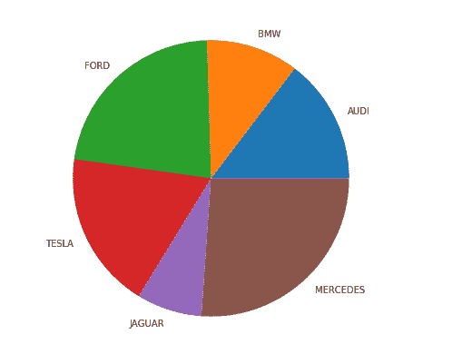
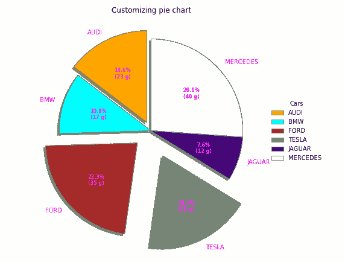
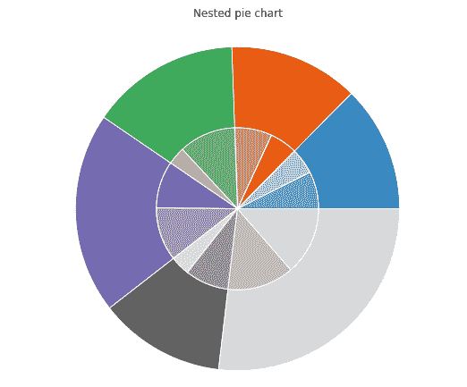

# 使用 Matplotlib

在 Python 中绘制饼图

> 原文:[https://www . geesforgeks . org/plot-a-pie-chart-in-python-using-matplotlib/](https://www.geeksforgeeks.org/plot-a-pie-chart-in-python-using-matplotlib/)

A **饼图**是只能显示一系列数据的圆形统计图。图表区域是给定数据的总百分比。饼图的切片面积代表数据部分的百分比。馅饼的切片叫做楔形。楔形的面积由楔形弧的长度决定。楔形区域代表该部分相对于整个数据的相对百分比。饼图通常用于商业演示，如销售、运营、调查结果、资源等，因为它们提供了快速摘要。

## 创建饼图

Matplotlib API 在其 pyplot 模块中有 pie()函数，该函数创建一个饼图来表示数组中的数据。

> **语法:** matplotlib.pyplot.pie(数据，分解=无，标签=无，颜色=无，autopct =无，阴影=假)
> **参数:**
> **数据**表示要绘制的数据值数组，每个切片的分数面积用 **data/sum(data)** 表示。如果 sum(data) < 1，则数据值直接返回分数区域，因此生成的饼图将具有大小为 1-sum(data)的空楔形。
> **标签**是设置每个楔形标签的字符串序列列表。
> **颜色**属性用于为楔形提供颜色。
> **autoct**是一个字符串，用于用它们的数值来标记楔子。
> **阴影**用于创建楔形阴影。

让我们使用 pie()函数创建一个简单的饼图:
**示例:**

## 蟒蛇 3

```
# Import libraries
from matplotlib import pyplot as plt
import numpy as np

# Creating dataset
cars = ['AUDI', 'BMW', 'FORD',
        'TESLA', 'JAGUAR', 'MERCEDES']

data = [23, 17, 35, 29, 12, 41]

# Creating plot
fig = plt.figure(figsize =(10, 7))
plt.pie(data, labels = cars)

# show plot
plt.show()
```

**输出:**



## 自定义饼图

饼图可以根据几个方面进行定制。startangle 属性在饼图的 x 轴上以逆时针方向将绘图旋转指定的度数。shadow 属性接受布尔值，如果它为 true，那么 shadow 将出现在饼图的边缘下方。可以使用 wedgeprop 定制饼图的楔形区，wedgeprop 将 Python 字典作为参数，名称值对表示楔形区的属性，如线宽、边缘颜色等。通过设置框架=真轴，框架围绕饼图绘制。自动计算控制百分比如何显示在楔形区上。让我们试着修改一下上面的剧情:
**例 1:**

## 蟒蛇 3

```
# Import libraries
import numpy as np
import matplotlib.pyplot as plt

# Creating dataset
cars = ['AUDI', 'BMW', 'FORD',
        'TESLA', 'JAGUAR', 'MERCEDES']

data = [23, 17, 35, 29, 12, 41]

# Creating explode data
explode = (0.1, 0.0, 0.2, 0.3, 0.0, 0.0)

# Creating color parameters
colors = ( "orange", "cyan", "brown",
          "grey", "indigo", "beige")

# Wedge properties
wp = { 'linewidth' : 1, 'edgecolor' : "green" }

# Creating autocpt arguments
def func(pct, allvalues):
    absolute = int(pct / 100.*np.sum(allvalues))
    return "{:.1f}%\n({:d} g)".format(pct, absolute)

# Creating plot
fig, ax = plt.subplots(figsize =(10, 7))
wedges, texts, autotexts = ax.pie(data,
                                  autopct = lambda pct: func(pct, data),
                                  explode = explode,
                                  labels = cars,
                                  shadow = True,
                                  colors = colors,
                                  startangle = 90,
                                  wedgeprops = wp,
                                  textprops = dict(color ="magenta"))

# Adding legend
ax.legend(wedges, cars,
          title ="Cars",
          loc ="center left",
          bbox_to_anchor =(1, 0, 0.5, 1))

plt.setp(autotexts, size = 8, weight ="bold")
ax.set_title("Customizing pie chart")

# show plot
plt.show()
```

**输出:**



**示例 2:** 创建嵌套饼图

## 蟒蛇 3

```
# Import libraries
from matplotlib import pyplot as plt
import numpy as np

# Creating dataset
size = 6
cars = ['AUDI', 'BMW', 'FORD',
        'TESLA', 'JAGUAR', 'MERCEDES']

data = np.array([[23, 16], [17, 23],
                 [35, 11], [29, 33],
                 [12, 27], [41, 42]])

# normalizing data to 2 pi
norm = data / np.sum(data)*2 * np.pi

# obtaining ordinates of bar edges
left = np.cumsum(np.append(0,
                           norm.flatten()[:-1])).reshape(data.shape)

# Creating color scale
cmap = plt.get_cmap("tab20c")
outer_colors = cmap(np.arange(6)*4)
inner_colors = cmap(np.array([1, 2, 5, 6, 9,
                              10, 12, 13, 15,
                              17, 18, 20 ]))

# Creating plot
fig, ax = plt.subplots(figsize =(10, 7),
                       subplot_kw = dict(polar = True))

ax.bar(x = left[:, 0],
       width = norm.sum(axis = 1),
       bottom = 1-size,
       height = size,
       color = outer_colors,
       edgecolor ='w',
       linewidth = 1,
       align ="edge")

ax.bar(x = left.flatten(),
       width = norm.flatten(),
       bottom = 1-2 * size,
       height = size,
       color = inner_colors,
       edgecolor ='w',
       linewidth = 1,
       align ="edge")

ax.set(title ="Nested pie chart")
ax.set_axis_off()

# show plot
plt.show()
```

**输出:**

