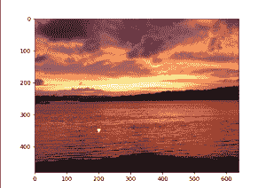
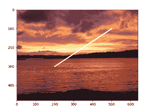

# 用 Matplotlib 在图像上绘制一个点或一条线

> 原文:[https://www . geesforgeks . org/plot-a-point-or-a-line-on-a-image-with-matplotlib/](https://www.geeksforgeeks.org/plot-a-point-or-a-line-on-an-image-with-matplotlib/)

**先决条件** : [马特洛特利](https://www.geeksforgeeks.org/python-introduction-matplotlib/)

Matplotlib 及其成员支持许多功能。其中一个功能是，我们可以使用 python 中的 Matplotlib 在图像上绘制一条线或一个点。

### 方法

*   导入模块
*   阅读图片
*   在图像上绘制线或点
*   显示绘图/图像。

**使用的图像:**


下面提供了在给定图像上使用上述方法的实现:

**示例 1 :** 在图像上绘制一个点。

**使用的属性:**标记

它用于定义点应该显示在什么标记类型中。

## 蟒蛇 3

```py
from matplotlib import image
from matplotlib import pyplot as plt

# to read the image stored in the working directory
data = image.imread('sunset-1404452-640x480.jpg')

# to draw a point on co-ordinate (200,300)
plt.plot(200, 350, marker='v', color="white")
plt.imshow(data)
plt.show()
```

**输出:**



**例 2 :** 在图像上画线

为了画线，我们将给出绘图函数中两点的坐标。

**使用的属性:**线宽

用于指定线条的宽度。

## 蟒蛇 3

```py
from matplotlib import image
from matplotlib import pyplot as plt

# to read the image stored in the working directory
data = image.imread('sunset-1404452-640x480.jpg')

# to draw a line from (200,300) to (500,100)
x = [200, 500]
y = [300, 100]
plt.plot(x, y, color="white", linewidth=3)
plt.imshow(data)
plt.show()
```

**输出:**



**例 3 :** 画两条互相交叉的相贯线，做成 x。

## 蟒蛇 3

```py
from matplotlib import image
from matplotlib import pyplot as plt

# to read the image stored in the working directory
data = image.imread('sunset-1404452-640x480.jpg')

# to draw first line from (100,400) to (500,100)
# to draw second line from (150,100) to (450,400)
x1 = [100, 500]
y1 = [400, 100]
x2 = [150, 450]
y2 = [100, 400]
plt.plot(x1, y1, x2, y2, color="white", linewidth=3)
plt.axis('off')
plt.imshow(data)
plt.show()
```

**输出:**

