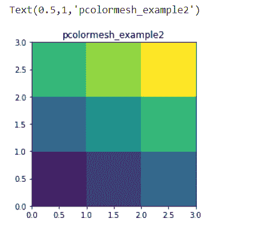

# 使用 Matplotlib

在 Python 中绘制四边形网格

> 原文:[https://www . geeksforgeeks . org/plot-a-四边形网格-in-python-using-matplotlib/](https://www.geeksforgeeks.org/plot-a-quadrilateral-mesh-in-python-using-matplotlib/)

**[【Matplotlib】](https://www.geeksforgeeks.org/python-matplotlib-an-overview/)**一个多平台数据可视化库，构建在 [NumPy](https://www.geeksforgeeks.org/python-numpy/) 数组上，旨在与更广泛的 SciPy 堆栈一起工作。Matplotlib 也能够在许多操作系统和图形后端上运行良好。**[matplotlib . py plot](https://www.geeksforgeeks.org/pyplot-in-matplotlib/)**也可以用于类似 MATLAB 的绘图框架。

## 绘制四边形网格

使用 pyplot 模块的 **pcolormesh()** 功能，类似于 **pcolor()** 功能，但是 pcolor 返回 **PolyCollection** ，而 pcolormesh 返回**matplotlib . collections . quad mesh**。pcolormesh 速度更快，因此可以处理更大的阵列。

> **语法:**pcolormesh(cmap =[None | color map]，alpha =[0<=标量< =1 | None】，edgecolors = [None | color | 'face']，shading = ['gouraud' | 'flat']，norm = [None | Normalize]，vimax =[标量| None]，vimin =[标量| None])
> 
> **参数:**
> 
> 1.  **cmap :** 可以是 None，也可以是 matplotlib，matplotlib 有很多内置的 colormaps 可以通过 matplotlib.cm.get_cmap 访问
> 2.  **α:**可以是无，也可以是 0 到 1 之间的α值。
> 3.  **边缘颜色 ：**
>     *   如果为“无”，则边缘将不可见。
>     *   “脸”代表与脸相同的颜色。
>     *   颜色序列将设置颜色。
> 4.  **底纹:**可以是“平”也可以是“古罗”
> 5.  **常态**:如果其无默认为常态()。
> 6.  **vimax :** 可以是无，也可以是标量值。
> 7.  **vimin :** 可以是无，也可以是标量值。( *vimax 和 vimin 与归一化数据*结合使用)

**例 1 :**

```
import matplotlib.pyplot as plt
import numpy as np

x1, y1 = 0.1, 0.05

# generate 2-D grids for the
# x & y bounds
y, x = np.mgrid[slice(-3, 3 + y1, y1), slice(-3, 4 + x1, x1)]
z = (1 - x / 2\. + x ** 5 + y ** 3) * np.exp(-x ** 2 - y ** 2)

# Remove the last value from the
# z array as z must be inside x
# and y bounds.
z = z[:-1, :-1]
z_min, z_max = -np.abs(z).max(), np.abs(z).max()

plt.subplot()

plt.pcolormesh(x, y, z, 
               cmap ='YlGn', 
               vmin = z_min, 
               vmax = z_max,
               edgecolors = 'face',
               shading ='flat')

plt.title('pcolormesh_example')

# set the limits of the plot
# to the limits of the data
plt.axis([x.min(), x.max(), y.min(), y.max()])

plt.colorbar()
plt.show()
```

**输出:**


**例 2 :**

```
import matplotlib.pyplot as plt
import numpy as np

x = np.array([[0, 1, 2, 3], 
              [0, 1, 2, 3],
              [0, 1, 2, 3],
              [0, 1, 2, 3]]) 

y = np.array([[0.0, 0.0, 0.0, 0],
              [1.0, 1.0, 1.0, 1], 
              [2.0, 2.0, 2.0, 2],
              [3, 3, 3, 3]]) 

values = np.array([[0, 0.5, 1], 
                   [1, 1.5, 2],
                   [2, 2.5, 3]])

fig, ax = plt.subplots()

ax.pcolormesh(x, y, values)
ax.set_aspect('equal')
ax.set_title("pcolormesh_example2")
```

**输出:**

