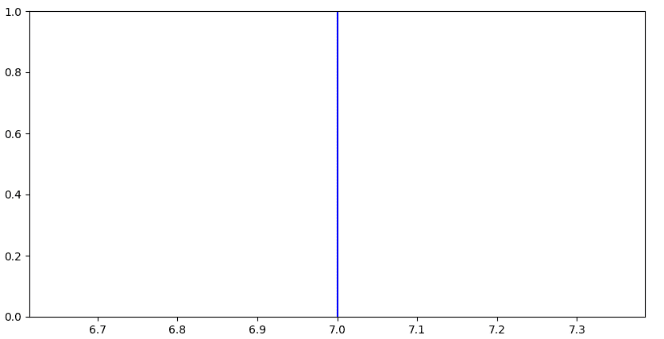
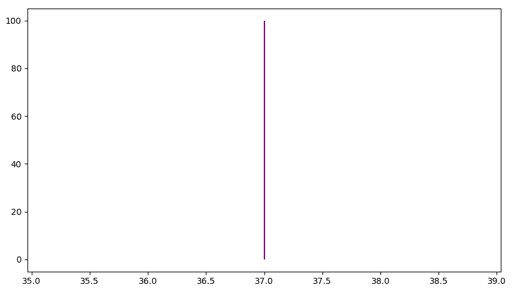
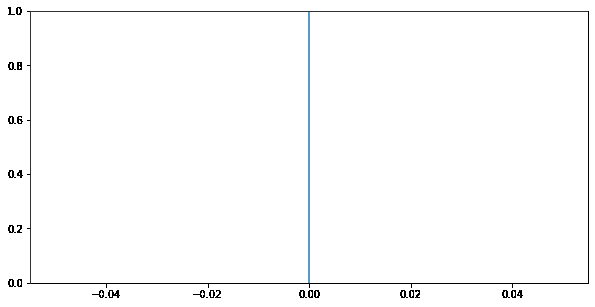
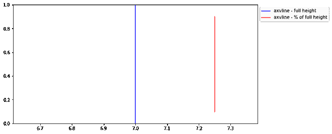
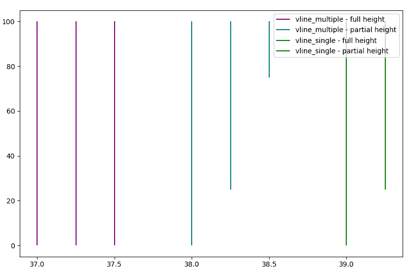

# 在 Matplotlib 中绘制垂直线

> 原文:[https://www . geesforgeks . org/plot-a-竖线 in-matplotlib/](https://www.geeksforgeeks.org/plot-a-vertical-line-in-matplotlib/)

Matplotlib 是一个流行的用于绘图的 python 库，它提供了一个面向对象的应用编程接口来渲染图形用户界面图。画一条水平线相当简单，下面的代码展示了如何做到这一点。

### 做一条垂直线

**方法#1:** 使用 [**轴**](https://www.geeksforgeeks.org/matplotlib-pyplot-axvline-in-python/#:~:text=axvline()%20in%20Python,-Last%20Updated%3A%2021&text=Matplotlib%20is%20a%20plotting%20library,like%20Tkinter%2C%20awxPython%2C%20etc.) **()**

此功能添加穿过绘图轴的垂直线

> **语法**:matplotlib . pyplot . axvline(x，color，xmin，xmax，linestyle)
> 
> **参数:**
> 
> *   **x:** 在 X 轴上的位置绘制直线，它接受整数。
> *   **xmin 和 xmax:** 标量，可选，默认:0/1。它绘制给定范围内的直线
> *   **颜色:**线条的颜色，它接受一个字符串。例如“r”或“b”。
> *   **线型:**指定线型，它接受字符串。例如“-”、“–”、“-”、':'、'无'、' '、"、'实线'、'虚线'、'虚线'、'虚线'

## 蟒蛇 3

```
# importing the modules
import matplotlib.pyplot as plt
import numpy as np

# specifying the plot size
plt.figure(figsize = (10, 5))

# only one line may be specified; full height
plt.axvline(x = 7, color = 'b', label = 'axvline - full height')

# rendering plot
plt.show()
```

**输出:**



**方法 2:** 使用 [**vlines()**](https://www.geeksforgeeks.org/matplotlib-pyplot-vlines-in-python/)

matplotlib.pyplot.vlines()是用于绘制数据集的函数。在 matplotlib . pyplot . vlines()中，vline 是垂直线的缩写。这个函数的作用从展开的形式中非常清楚，它表示这个函数处理的是穿过轴的垂直线的绘制。

> **语法**:vline(x，ymin，ymax，颜色，线型)
> 
> **参数:**
> 
> *   **x:** 在 X 轴上的位置绘制直线，它接受整数。
> *   **xmin 和 xmax:** 标量，可选，默认:0/1。它绘制给定范围内的直线
> *   **颜色:**线条的颜色，它接受一个字符串。例如“r”或“b”。
> *   **线型:**指定线型，它接受字符串。例如“-”、“–”、“-”、':'、'无'、' '、"、'实线'、'虚线'、'虚线'、'虚线'

## 蟒蛇 3

```
# importing necessary libraries
import matplotlib.pyplot as plt
import numpy as np

# defining an array
xs = [1, 100]

# defining plot size
plt.figure(figsize = (10, 7))

# single line
plt.vlines(x = 37, ymin = 0, ymax = max(xs),
           colors = 'purple',
           label = 'vline_multiple - full height')

plt.show()
```

**输出:**



**方法三:**使用 [**地块()**](https://www.geeksforgeeks.org/matplotlib-pyplot-plot-function-in-python/)

matplotlib 库 pyplot 模块中的 plot()函数用于绘制 x，y 点的 2D 六边形宁滨图。

> **语法:**绘图(x 点，y 点，比例=假)
> 
> **参数:**
> 
> *   **x_points/y_points:** 点绘图
> *   **scalex/scaley:** Bool，这些参数决定视图限制是否适应数据限制

## 蟒蛇 3

```
# importing library
import matplotlib.pyplot as plt

# defining plot size
plt.figure(figsize = (10, 5))

# specifying plot coordinates
plt.plot((0, 0), (0, 1), scaley = False)

# setting scaley = True will make the line fit
# withn the frame, i.e It will appear as a finite line
plt.show()
```

**输出:**



### 用图例绘制多条线

以下方法可用于在 Python 中绘制多条线。

**方法#1:** 使用 [**轴**](https://www.geeksforgeeks.org/matplotlib-pyplot-axvline-in-python/#:~:text=axvline()%20in%20Python,-Last%20Updated%3A%2021&text=Matplotlib%20is%20a%20plotting%20library,like%20Tkinter%2C%20awxPython%2C%20etc.) **()**

## 蟒蛇 3

```
# importing the modules
import matplotlib.pyplot as plt
import numpy as np

# specifying the plot size
plt.figure(figsize = (10, 5))

# only one line may be specified; full height
plt.axvline(x = 7, color = 'b', label = 'axvline - full height')

# only one line may be specified; ymin & ymax specified as
# a percentage of y-range
plt.axvline(x = 7.25, ymin = 0.1, ymax = 0.90, color = 'r',
            label = 'axvline - % of full height')

# place legend outside
plt.legend(bbox_to_anchor = (1.0, 1), loc = 'upper left')

# rendering plot
plt.show()
```

**输出:**



**方法 2:** 使用 [**vlines()**](https://www.geeksforgeeks.org/matplotlib-pyplot-vlines-in-python/)

## 蟒蛇 3

```
# importing necessary libraries
import matplotlib.pyplot as plt
import numpy as np

# defining an array
xs = [1, 100]

# defining plot size
plt.figure(figsize = (10, 7))

# multiple lines all full height
plt.vlines(x = [37, 37.25, 37.5], ymin = 0, ymax = max(xs),
           colors = 'purple',
           label = 'vline_multiple - full height')

# multiple lines with varying ymin and ymax
plt.vlines(x = [38, 38.25, 38.5], ymin = [0, 25, 75], ymax = max(xs),
           colors = 'teal',
           label = 'vline_multiple - partial height')

# single vline with full ymin and ymax
plt.vlines(x = 39, ymin = 0, ymax = max(xs), colors = 'green',
           label = 'vline_single - full height')

# single vline with specific ymin and ymax
plt.vlines(x = 39.25, ymin = 25, ymax = max(xs), colors = 'green',
           label = 'vline_single - partial height')

# place legend outside
plt.legend(bbox_to_anchor = (1.0, 1), loc = 'up')
plt.show()
```

**输出:**

