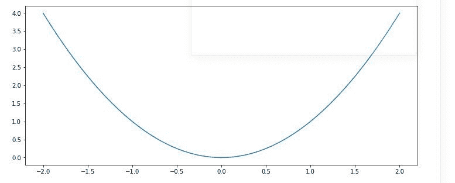
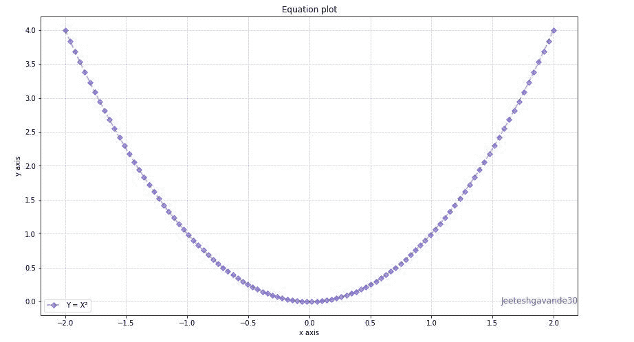
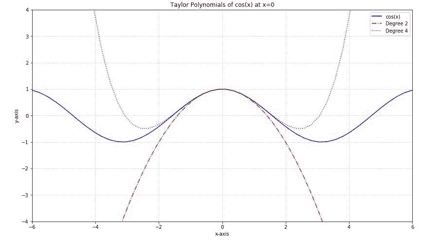
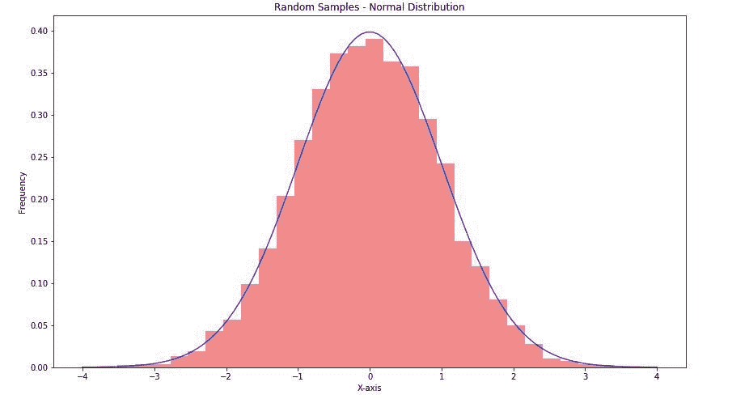

# 使用 Matplotlib 绘制 Python 中的数学表达式

> 原文:[https://www . geesforgeks . org/plot-数学表达式-python-use-matplotlib/](https://www.geeksforgeeks.org/plot-mathematical-expressions-in-python-using-matplotlib/)

为了绘制方程，我们将使用两个模块 *Matplotlib.pyplot* 和 *Numpy* 。本模块帮助您从逻辑上组织 Python 代码。

### 数字

Numpy 是 Python 中用于科学计算的核心库。这个 Python 库支持您处理大型多维数组对象、矩阵和掩码数组等各种派生对象，以及使数组运算更快的分类例程，包括数学、逻辑、基本线性代数、基本统计运算、形状操作、输入/输出、排序、选择、离散傅立叶变换、随机模拟和许多其他运算。
**注:**更多信息，请参考 Python 中的[NumPy](http://geeksforgeeks.org/numpy-in-python-set-1-introduction/)

### Matplotlib.pyplot

[Matplotlib](http://geeksforgeeks.org/python-matplotlib-an-overview/) 是 Python 的一个绘图库，它是命令风格函数的集合，使其工作起来像 MATLAB。它提供了一个面向对象的应用编程接口，用于使用通用图形用户界面工具包将图形嵌入应用程序。每个#pyplot#函数都会对图形进行一些更改，即创建一个图形，在图形中创建一个绘图区域，在绘图区域中绘制一些线条，用一些标签装饰绘图等。
**注:**更多信息，请参考 Matplotlib
中的 [Pyplot](http://geeksforgeeks.org/pyplot-in-matplotlib/)

## 绘制方程式

让我们从一个最简单、最常见的方程 **Y = X** 开始我们的工作。我们想在 X 轴上画出 100 个点。在这种情况下，Y 的每个值都是同一索引的 X 值的平方。

## 蟒蛇 3

```
# Import libraries
import matplotlib.pyplot as plt
import numpy as np

# Creating vectors X and Y
x = np.linspace(-2, 2, 100)
y = x ** 2

fig = plt.figure(figsize = (10, 5))
# Create the plot
plt.plot(x, y)

# Show the plot
plt.show()
```

**输出-**



请注意，我们在线图中使用的点数(本例中为 100)完全是任意的，但这里的目标是显示平滑曲线的平滑图，这就是为什么我们必须根据函数选择足够的数量。但是要注意不要生成太多的点，因为大量的点需要很长时间来绘制。

### 地块的定制

有许多 *pyplot* 功能可用于地块的定制，并且可以使用线条样式和标记样式来美化地块。以下是其中一些:

<figure class="table">

| 功能 | 描述 |
| --- | --- |
| plt.xlim() | 设置 X 轴的限制 |
| PLT·埃利亚姆() | 设置 Y 轴的限制 |
| plt.grid() | 在绘图中添加网格线 |
| plt.title() | 添加标题 |
| plt.xlabel() | 向水平轴添加标签 |
| plt.ylabel() | 向垂直轴添加标签 |
| plt.axis() | 设置轴属性(相等、关闭、缩放等。) |
| PLT . xts() | 设置水平轴上的刻度位置 |
| plt.yticks() | 设置垂直轴上的刻度位置 |
| plt.legend() | 用于显示同一图形中几行的图例 |
| PLT . save config() | 保存数字(作为。巴布亚新几内亚。pdf 等。)到工作目录 |
| plt.figure() | 用于设置新的图形属性 |

</figure>

**线条样式**

<figure class="table">

| 性格；角色；字母 | 线条样式 |
| --- | --- |
| – | 实线样式 |
| — | 虚线样式 |
| -. | 点划线样式 |
| ： | 虚线样式
 |

</figure>

**标记**

<figure class="table">

| 性格；角色；字母 | 标记 |
| --- | --- |
| 。 | 要点 |
| o | 圆 |
| v | 三角形向下 |
| ^ | 三角形向上 |
| s | 平方 |
| p | 五边形 |
| * | 星星 |
| + | 加 |
| x | 跨过 |
| D | 钻石 |

</figure>

下面是使用一些修改创建的图:

## 蟒蛇 3

```
# Import libraries
import matplotlib.pyplot as plt
import numpy as np

# Creating vectors X and Y
x = np.linspace(-2, 2, 100)
y = x ** 2

fig = plt.figure(figsize = (12, 7))
# Create the plot
plt.plot(x, y, alpha = 0.4, label ='Y = X²',
         color ='red', linestyle ='dashed',
         linewidth = 2, marker ='D',
         markersize = 5, markerfacecolor ='blue',
         markeredgecolor ='blue')

# Add a title
plt.title('Equation plot')

# Add X and y Label
plt.xlabel('x axis')
plt.ylabel('y axis')

# Add Text watermark
fig.text(0.9, 0.15, 'Jeeteshgavande30',
         fontsize = 12, color ='green',
         ha ='right', va ='bottom',
         alpha = 0.7)

# Add a grid
plt.grid(alpha =.6, linestyle ='--')

# Add a Legend
plt.legend()

# Show the plot
plt.show()
```

**输出-**



**示例 1-**
用 2 和 4 次泰勒多项式绘制函数 *y = Cos(x)* 的图形。

## 蟒蛇 3

```
# Import libraries
import matplotlib.pyplot as plt
import numpy as np

x = np.linspace(-6, 6, 50)

fig = plt.figure(figsize = (14, 8))

# Plot y = cos(x)
y = np.cos(x)
plt.plot(x, y, 'b', label ='cos(x)')

# Plot degree 2 Taylor polynomial
y2 = 1 - x**2 / 2
plt.plot(x, y2, 'r-.', label ='Degree 2')

# Plot degree 4 Taylor polynomial
y4 = 1 - x**2 / 2 + x**4 / 24
plt.plot(x, y4, 'g:', label ='Degree 4')

# Add features to our figure
plt.legend()
plt.grid(True, linestyle =':')
plt.xlim([-6, 6])
plt.ylim([-4, 4])

plt.title('Taylor Polynomials of cos(x) at x = 0')
plt.xlabel('x-axis')
plt.ylabel('y-axis')

# Show plot
plt.show()
```

**输出-**



**示例 2-**
生成从正态分布采样的 10000 个随机条目的数组，并创建直方图以及方程的正态分布:


## 蟒蛇 3

```
# Import libraries
import matplotlib.pyplot as plt
import numpy as np

fig = plt.figure(figsize = (14, 8))

# Creating histogram
samples = np.random.randn(10000)
plt.hist(samples, bins = 30, density = True,
         alpha = 0.5, color =(0.9, 0.1, 0.1))

# Add a title
plt.title('Random Samples - Normal Distribution')

# Add X and y Label
plt.ylabel('X-axis')
plt.ylabel('Frequency')

# Creating vectors X and Y
x = np.linspace(-4, 4, 100)
y = 1/(2 * np.pi)**0.5 * np.exp(-x**2 / 2)

# Creating plot
plt.plot(x, y, 'b', alpha = 0.8)

# Show plot
plt.show()
```

**输出-**

