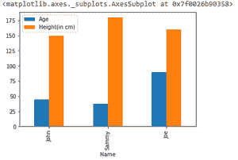
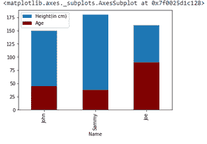
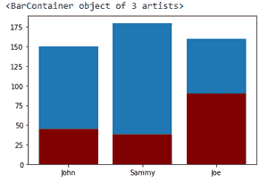

# 用 Matplotlib 在条形图上绘制多列熊猫数据框

> 原文:[https://www . geesforgeks . org/plot-多列熊猫-条形图数据框-带 matplotlib/](https://www.geeksforgeeks.org/plot-multiple-columns-of-pandas-dataframe-on-bar-chart-with-matplotlib/)

**先决条件:**

*   [熊猫](https://www.geeksforgeeks.org/pandas-tutorial/)
*   [Matplotlib](https://www.geeksforgeeks.org/python-introduction-matplotlib/)

在本文中，我们将学习如何使用 [Matplotlib](https://www.geeksforgeeks.org/python-introduction-matplotlib/) 在条形图上绘制多列。[条形图](https://www.geeksforgeeks.org/bar-plot-in-matplotlib/)用于使用矩形条表示数据类别。我们可以用重叠的边或在相同的轴上绘制这些条。在同一图表中绘制条形图的不同方法是使用 matplotlib，熊猫将在下面讨论。

### 方法 1: **在 y 参数**中提供多列

这里的技巧是将所有必须绘制在一起的数据作为一个值传递给绘图函数的“y”参数。

**语法:**

> *matplotlib . pyplot . plot(\ * args、scalex=True、scaley=True、data=None、\*\*kwargs)*

**进场:**

*   导入模块
*   创建或加载数据
*   将数据传递给绘图()
*   曲线图

**示例:**

## 蟒蛇 3

```py
# importing pandas library
import pandas as pd
# import matplotlib library
import matplotlib.pyplot as plt

# creating dataframe
df = pd.DataFrame({
    'Name': ['John', 'Sammy', 'Joe'],
    'Age': [45, 38, 90],
    'Height(in cm)': [150, 180, 160]
})

# plotting graph
df.plot(x="Name", y=["Age", "Height(in cm)"], kind="bar")
```

**输出:**



### **方法二:在同一轴上作图**

在同一轴上绘制所有单独的图形，用颜色区分是一种选择。这里再次使用了 plot()函数。

**进场:**

*   导入模块
*   创建或加载数据
*   绘制第一个图形
*   将所有其他图形绘制在相同的轴上

**示例:**

## 蟒蛇 3

```py
# importing pandas library
import pandas as pd
# import matplotlib library
import matplotlib.pyplot as plt

# creating dataframe
df = pd.DataFrame({
    'Name': ['John', 'Sammy', 'Joe'],
    'Age': [45, 38, 90],
    'Height(in cm)': [150, 180, 160]
})

# plotting Height
ax = df.plot(x="Name", y="Height(in cm)", kind="bar")
# plotting age on the same axis
df.plot(x="Name", y="Age", kind="bar", ax=ax, color="maroon")
```

**输出:**



### 方法 3: **通过创建子剧情**

创建这种功能的另一种方法是绘制多个子场景并将其显示为一个。这可以使用 subplot()函数来完成。

**语法:**

> *支线剧情(nrows，ncols，index，**kwargs)*

**进场:**

*   导入模块
*   创建或加载数据
*   创建多个子情节
*   单轴绘图

**示例:**

## 蟒蛇 3

```py
# importing pandas library
import pandas as pd
# import matplotlib library
import matplotlib.pyplot as plt

# creating dataframe
df = pd.DataFrame({
    'Name': ['John', 'Sammy', 'Joe'],
    'Age': [45, 38, 90],
    'Height(in cm)': [150, 180, 160]
})

# creating subplots and plotting them together
ax = plt.subplot()
ax.bar(df["Name"], df["Height(in cm)"])
ax.bar(df["Name"], df["Age"], color="maroon")
```

**输出:**

