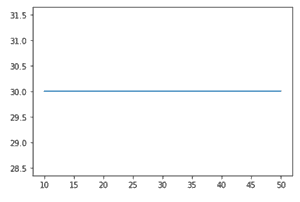
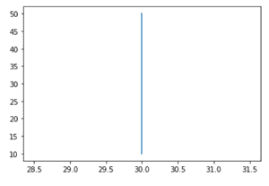
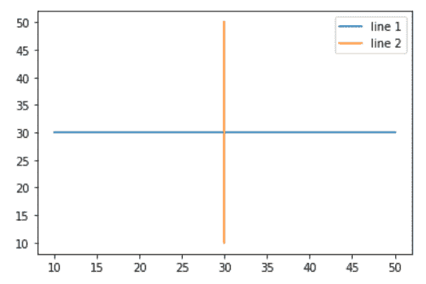
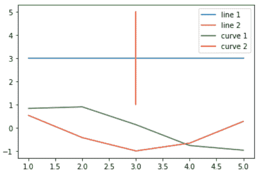
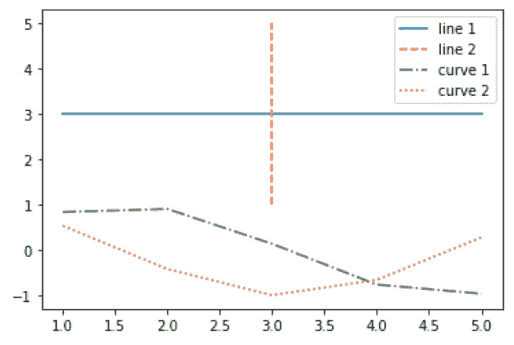

# 在 Matplotlib 中绘制多条线

> 原文:[https://www . geesforgeks . org/plot-multi-line-in-matplotlib/](https://www.geeksforgeeks.org/plot-multiple-lines-in-matplotlib/)

在本文中，我们将学习如何使用 Python 中的 matplotlib 绘制多条线。让我们讨论一些概念:

*   **Matplotlib:** Matplotlib 是 Python 中一个惊人的可视化库，用于数组的 2D 图。Matplotlib 是一个多平台数据可视化库，构建在 NumPy 数组上，旨在与更广泛的 SciPy 堆栈一起工作。它是由约翰·亨特在 2002 年推出的。
*   **线图:**可以使用 Matplotlib 的 pyplot 库在 Python 中创建线图。要构建线图，首先导入 Matplotlib。将 Matplotlib 的 pyplot 库作为 plt 导入是一个标准惯例。plt 别名对于其他 Python 程序员来说是很熟悉的。

这里我们将讨论一些例子来绘制一条线或多条具有不同特征的线。要完成这项工作，我们必须遵循以下步骤:

*   导入库。
*   创建数据。
*   在数据上绘制线条。

## 绘制一条水平线

在这个例子中，我们将学习如何借助 matplotlib 绘制水平线。在这里，我们将使用两个列表作为二维(x 和 y)的数据，最后绘制线条。为了画一条水平线，我们必须以 y 轴为常数连续改变 x 轴的值。

## 蟒蛇 3

```py
# importing package
import matplotlib.pyplot as plt

# create data
x = [10,20,30,40,50]
y = [30,30,30,30,30]

# plot line
plt.plot(x, y)
plt.show()
```

**输出:**



## 绘制一条垂直线

在这个例子中，我们将学习如何在 matplotlib 的帮助下画一条垂直线。这里，我们将使用两个列表作为二维(x 和 y)数据，最后绘制线条。为了画一条垂直线，我们必须以 x 轴为常数连续改变 y 轴的值。所以我们改变轴，得到一条垂直线。

## 蟒蛇 3

```py
# importing package
import matplotlib.pyplot as plt

# create data
x = [10,20,30,40,50]
y = [30,30,30,30,30]

# plot line
plt.plot(y,x)
plt.show()
```

**输出:**



## 绘制水平线和垂直线

在这个例子中，我们将学习如何在 matplotlib 的帮助下在一个图形中绘制一条水平线和一条垂直线。这里我们将使用两个列表作为两个维度(x 和 y)的数据，最后绘制与维度相关的线。因此，在这个例子中，我们合并了上面的两个图，使这两条线在一个图中。

## 蟒蛇 3

```py
# importing package
import matplotlib.pyplot as plt

# create data
x = [10,20,30,40,50]
y = [30,30,30,30,30]

# plot lines
plt.plot(x, y, label = "line 1")
plt.plot(y, x, label = "line 2")
plt.legend()
plt.show()
```

**输出:**



## 绘制多条线

在这个例子中，我们将学习如何在 matplotlib 的帮助下绘制多条线。在这里，我们将使用两个列表作为二维(x 和 y)数据，最后在同一数据上绘制不同维度和函数的线。

为了绘制多条线，我们将使用如下不同的函数:

*   y = x
*   x = y
*   y = sin(x)
*   y = cos(x)

## 蟒蛇 3

```py
# importing package
import matplotlib.pyplot as plt
import numpy as np

# create data
x = [1,2,3,4,5]
y = [3,3,3,3,3]

# plot lines
plt.plot(x, y, label = "line 1")
plt.plot(y, x, label = "line 2")
plt.plot(x, np.sin(x), label = "curve 1")
plt.plot(x, np.cos(x), label = "curve 2")
plt.legend()
plt.show()
```

**输出:**



## 用不同的线型绘制多条线

这个例子类似于上面的例子，增强的是不同的线条样式。这可以帮助修改更好的可视化。

这里我们将使用不同的线型，如下所示:

*   **–**:虚线
*   **—** :双虚线
*   **-。**:虚线
*   **:** :虚线

## 蟒蛇 3

```py
# importing package
import matplotlib.pyplot as plt
import numpy as np

# create data
x = [1,2,3,4,5]
y = [3,3,3,3,3]

# plot lines
plt.plot(x, y, label = "line 1", linestyle="-")
plt.plot(y, x, label = "line 2", linestyle="--")
plt.plot(x, np.sin(x), label = "curve 1", linestyle="-.")
plt.plot(x, np.cos(x), label = "curve 2", linestyle=":")
plt.legend()
plt.show()
```

**输出:**

