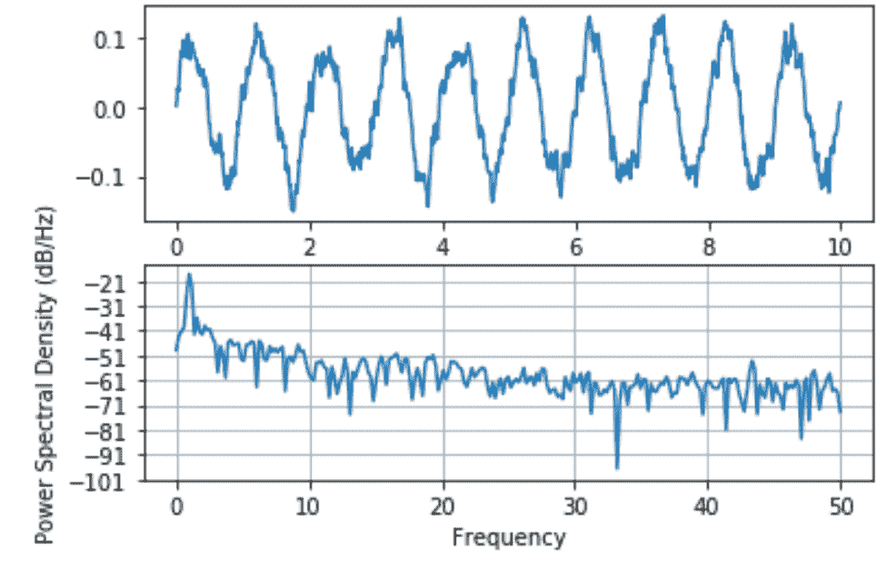
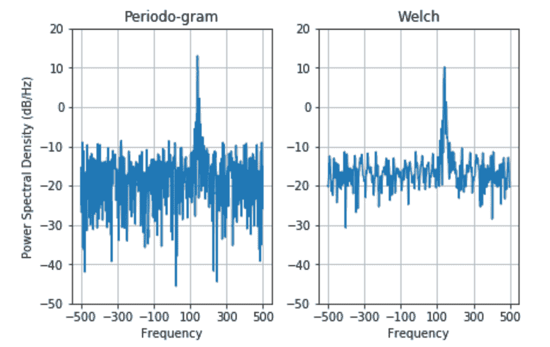

# 使用 Matplotlib–Python 绘制功率谱密度图

> 原文:[https://www . geeksforgeeks . org/plot-功率谱密度-使用-matplotlib-python/](https://www.geeksforgeeks.org/plot-the-power-spectral-density-using-matplotlib-python/)

**matplotlib.pyplot.psd()** 函数用于绘制功率谱密度。在用于评估功率谱密度的韦尔奇平均周期图方法中(例如，P <sub>xx</sub> ，向量‘x’被平均分成 NFFT 段。每个片段都由函数窗口加窗，并由函数去趋势化去趋势。线段之间的重叠由“noverlap”表示。每个段“I”的|fft(i)|*2 被一起平均以计算 P，并带有缓冲缩放以校正由于开窗导致的功率损失。

**注:**若 len(x) < NFFT，则 NFFT 填充为零。

> **语法:** matplotlib.pyplot.psd(x，NFFT =无，Fs =无，Fc =无，detrend =无，window =无，noverlap =无，pad _ to =无，sides =无，scale _ by _ freq =无，return _ line =无，* data =无，* * * kwargs)
> 
> **参数:**
> 
> 1.  **x:** 是 1D 阵列或含有数据的序列的必要参数
>     
> 2.  **Fs:** 这是一个必需参数，具有标量值，默认值为 2。它的值是采样频率(每时间单位的样本数)。该值用于计算单位时间内以周期为单位的傅里叶频率。
>     
> 3.  **窗口:**这是一个可调用的 N-D 数组，一般是 NFFT 长度的函数或向量。它的默认值是 window_hanning。当函数作为参数/自变量传递时，它将数据段作为自变量，并返回该段的窗口版本
>     
> 4.  **边:**该参数可以有三个值之一，即“默认”、“单侧”或“双侧”。这用于指定要返回光谱的哪一面。“default”给出了它的默认行为，对于真实数据和复杂数据都返回单侧。“单侧”值用于强制返回单侧光谱，而“双侧”值用于返回双侧光谱。
>     
> 5.  > **pad_to:** 此参数保存一个整数值 tat，表示执行 FFT 时数据段被填充的点数。需要注意的是，这与 NFFT 不同，后者设置使用的数据点数量。这可以在图上给出更多的点，而不会增加光谱的实际分辨率(可分辨峰之间的最小距离)，从而允许更多的细节。这也对应于 fft()调用中的‘n’参数。其默认值为“无”，将 pad _ 设置为等于 NFFT。
>     
> 6.  。 **NFFT:** 它保存一个整数值，代表每个块中用于 FFT 的数据点数。效率最高的是 2 的幂。它的默认值是 256。必须避免使用它来获得零填充，因为它可能导致结果的不正确缩放，相反，pad_to 将用于相同的目的。
>     
> 7.  **去趋势:**它可以接受三个值，即‘无’，‘均值’，‘线性’或可调用，默认值为‘无’。这个函数被设计成在对每个分段进行 fft 之前去除平均值或线性趋势。Matplotlib 中的去趋势是一个函数，不像 MATLAB 中的去趋势是一个向量。“detrend_none”、“detrend_mean”和“detrend_linear”是由 mlab 模块定义的，但是也可以使用自定义函数。字符串也可以选择一个函数。“none”调用“detrend_none”，“linear”调用“detrend_linear”，而“mean”调用“detrend_mean”。
>     
> 8.  **scale_by_freq:** 它是接受布尔值的可选参数。它用于指定是否应该通过缩放频率来缩放生成的密度。这将给出以 Hz^-1.为单位的密度这使得对返回的频率值进行积分。MATLAB 兼容性的默认值为真。
>     
> 9.  **noverlap:** 它是一个整数值，表示线段之间重叠的总点数。默认值为 0，表示没有重叠。
>     
> 10.  **Fc:** 它是一个整数值，表示曲线 x 范围的偏移，以反映获得信号并滤波后将其下采样到基带时使用的频率范围。‘x’代表 x 的中心频率(默认值为 0)
>     
> 11.  **return_line:** 是一个布尔值，它决定是否在返回值中包含绘制的对象线。默认情况下，该值为假
> 
> **返回:**
> 
> 1.  **P <sub>xx</sub> :** 它是一个一维数组，表示缩放前的功率谱 P_{xx}。
>     
> 2.  **freqs:** 是个！-D 数组表示对应于 P <sub>xx</sub> 元素
>     的频率
> 3.  **行:**是 Line@D 实例，是函数生成的一行。只有当 return_line 设置为真时，它才会返回。

**其他参数:**
****kwargs** 关键字参数用于控制 Line2D 属性

<figure class="table">

| 财产 | 描述 |
| --- | --- |
| agg _ 筛选器 | 接受(m，n，3)浮点数组和返回(m，n，3)数组的 dpi 值的筛选函数 |
| 希腊字母的第一个字母 | 漂浮物 |
| 愉快的 | 弯曲件 |
| 抗锯齿或 aa | 弯曲件 |
| 剪辑盒 | Bbox |
| 剪辑 _on | 弯曲件 |
| 剪辑路径 | [(路径，转换)&#124;补丁&#124;无] |
| 颜色或 c | 颜色 |
| 包含 | 请求即付的 |
| dash_capstyle | { '对接'，'圆形'，'突出' } |
| dash_joinstyle | { '斜接'，'圆形'，'斜角' } |
| 破折号 | 浮动顺序(以磅为单位的开/关油墨)或(无，无) |
| drawstyle 或 ds | {'default '，' steps '，' steps-pre '，' steps-mid '，' steps-post'}，默认值:' default ' |
| 数字 | 数字 |
| fillstyle(填充样式) | {“完整”、“左侧”、“右侧”、“底部”、“顶部”、“无”} |
| 眩倒病 | 潜艇用热中子反应堆（submarine thermal reactor 的缩写） |
| in _ 布局 | 弯曲件 |
| 标签 | 目标 |
| 生活方式或 lsl | {'-', '–', '-.'，':'，"，(偏移量，开-关-序列)，…} |
| 线宽或 lw | 漂浮物 |
| 标记 | 标记样式 |
| 标记颜色或 mec | 颜色 |
| cmarkeredgewidth 或 mew | 漂浮物 |
| 标记面颜色或 mfc | 颜色 |
| 标记面 coloralt 或 mfcalt | 颜色 |
| 标记或 ms | 漂浮物 |
| 标记每一个 | 无或整数或(整数，整数)或片或列表[整数]或浮点或(浮点，浮点) |
| 路径效果 | 抽象路径效应 |
| 采摘者 | 浮动或可调用[[艺术家，事件]，元组[布尔，字典]] |
| 拾取半径 | 漂浮物 |
| 光栅化 | 布尔或无 |
| 草图 _ 参数 | (刻度:浮动，长度:浮动，随机性:浮动)
 |
| 突然的 | 布尔或无 |
| solid_capstyle | { '对接'，'圆'，'突出' }
 |
| solid_joinstyle | { '斜接'，'圆形'，'斜角' } |
| 改变 | matplotlib . transforms . transform |
| 全球资源定位器(Uniform Resource Locator) | 潜艇用热中子反应堆（submarine thermal reactor 的缩写） |
| 看得见的 | 弯曲件 |
| xdata | 1D 阵列 |
| 伊妲 | 1D 阵列 |
| 更糟 | 漂浮物 |

</figure>

**例 1:**

## 蟒蛇 3

```
import matplotlib.pyplot as plt
import numpy as np
import matplotlib.mlab as mlab
import matplotlib.gridspec as gridspec

# set random state for reproducibility
np.random.seed(19695601)

diff = 0.01
ax = np.arange(0, 10, diff)
n = np.random.randn(len(ax))
by = np.exp(-ax / 0.05)

cn = np.convolve(n, by) * diff
cn = cn[:len(ax)]
s = 0.1 * np.sin(2 * np.pi * ax) + cn

plt.subplot(211)
plt.plot(ax, s)
plt.subplot(212)
plt.psd(s, 512, 1 / diff)

plt.show()
```

**输出:**



**例 2:**

## 蟒蛇 3

```
import matplotlib.pyplot as plt
import numpy as np
import matplotlib.mlab as mlab
import matplotlib.gridspec as gridspec

# set random valueto ensure reproducibility
random_rep = np.random.RandomState(19680801) 

frame_per_second = 1000
a = np.linspace(0, 0.3, 301)
b = np.array([2, 8]).reshape(-1, 1)
c = np.array([150, 140]).reshape(-1, 1)
d = (b * np.exp(2j * np.pi * c * a)).sum(axis = 0) + 5 * random_rep.randn(*a.shape)

figure, (a0, a1) = plt.subplots(ncols = 2,
                                constrained_layout = True)

e = np.arange(-50, 30, 10)
f = (e[0], e[-1])
g = np.arange(-500, 550, 200)

a0.psd(d, NFFT = 301,
       Fs = frame_per_second,
       window = mlab.window_none,
       pad_to = 1024,
       scale_by_freq = True)

a0.set_title('Periodo-gram')
a0.set_yticks(e)
a0.set_xticks(g)
a0.grid(True)
a0.set_ylim(f)

a1.psd(d, NFFT = 150,
       Fs = frame_per_second,
       window = mlab.window_none,
       pad_to = 512,
       noverlap = 75,
       scale_by_freq = True)

a1.set_title('Welch')
a1.set_xticks(g)
a1.set_yticks(e)

# overwriting the y-label added by `psd`
a1.set_ylabel('')
a1.grid(True)
a1.set_ylim(f)

plt.show()
```

**输出:**

