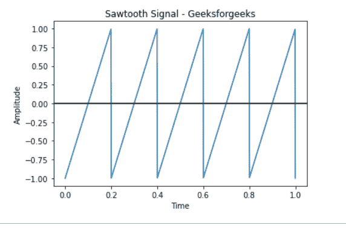

# 使用 Matplotlib 绘制锯齿波

> 原文:[https://www . geeksforgeeks . org/标绘-a-锯齿波-使用-matplotlib/](https://www.geeksforgeeks.org/plotting-a-sawtooth-wave-using-matplotlib/)

**先决条件:**

*   [Matplotlib](https://www.geeksforgeeks.org/python-introduction-matplotlib/)
*   [轨道](https://www.geeksforgeeks.org/data-analysis-with-scipy/)轨道

锯齿波形是一种非正弦波形，因为它的齿看起来像锯子。在反向锯齿波形中，波突然向下倾斜，然后急剧上升。使用 Matplotlib，我们可以绘制不同类型的图形数据。在本文中，我们将尝试理解，如何使用 Scipy python 模块绘制锯齿波。

### **进场:**

*   导入所需模块。
*   创建采样率。NumPy [linspace](https://www.geeksforgeeks.org/numpy-linspace-python/) 函数是 Python 中的一个工具，用于创建在指定间隔内返回均匀间隔数字的数字序列。

**语法:**

> numpy.linspace(开始，停止，num = 50，
> 端点=真，retstep =假，dtype =无)

*   画一个锯齿波。
*   给图表贴上标签。
*   显示图形。

### 功能

> **语法:**
> 
> scipy.signal .锯齿(t)
> 
> **参数:**
> 
> *   **t:** 输入时间数组。
> 
> **返回:**
> 
> 包含锯齿波形的输出阵列。

**程序:**

## 蟒蛇 3

```py
from scipy import signal
import matplotlib.pyplot as plot
import numpy as np

t = np.linspace(0, 1, 1000, endpoint=True)

# Plot the sawtooth wave
plot.plot(t, signal.sawtooth(2 * np.pi * 5 * t))

# Give x, y, title axis label
plot.xlabel('Time')
plot.ylabel('Amplitude')
plot.title('Sawtooth Signal - Geeksforgeeks')

plot.axhline(y=0, color='k')

# Display
plot.show()
```

**输出:**

