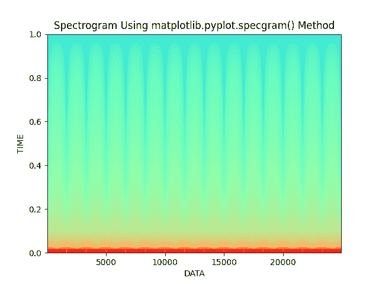

# 使用 Python 和 Matplotlib 绘制谱图

> 原文:[https://www . geeksforgeeks . org/标绘-a-谱图-使用-python-and-matplotlib/](https://www.geeksforgeeks.org/plotting-a-spectrogram-using-python-and-matplotlib/)

**先决条件:**T2【马特洛特利

一个**频谱图**可以被定义为频率相对于时间的视觉表示，它显示了特定时间的信号强度。简而言之，声谱图只不过是声音的图像。它也被称为声纹或声谱。使用多种颜色显示频谱图，表明信号强度。如果颜色很亮，则意味着信号的能量很高。换句话说，颜色的亮度与声谱图中信号的强度成正比。

光谱图实际上是使用短时傅里叶变换(STFT)创建的。它帮助我们对所提供的信号进行时变分析。反正不要求深入这个话题。主要概念是我们将音频信号分成小块，然后将音频信号绘制在时间图上。

对于该可视化 **specgram()** 功能与所需参数一起使用。

> **语法:**matplotlib . pyplot . specgram(Data，NFFT =无，Fs =无，Fc =无，detrend =无，window =无，noverlap =无，cmap =无，xextent =无，pad _ to =无，sides =无，scale _ by _ freq =无，mode =无，scale =无，vmin =无，vmax =无，* Data =无，* * * kwargs)
> 
> **参数:**
> 
> *   数据-这是需要绘制的实际数据序列。
> *   这是一个去故障值为 2 的定标器。
> *   窗口-该参数转换数据段并返回数据段的窗口版本。
> *   边-指定应该显示的光谱边。它可以有三个值，即“默认”、“单侧”和“双侧”。
> *   NFFT-该参数包含用于快速傅立叶变换的每个块中的数据点的数量。
> *   去趋势-此参数包含拟合前应用于每个线段的函数。
> *   该参数允许对返回的频率值进行积分。
> *   模式-这个参数是使用什么样的频谱{ '默认'，' psd '，'幅度'，'角度'，'相位' }。
> *   no overlap-此参数是块之间的重叠点数。
> *   比例-包含规格中值的比例，可以有三个值，即“默认值”、“线性”和“分贝”。
> *   Fc:这个参数是 x 的中心频率。
> *   camp:这个参数是一个 matplotlib.colors.Colormap 实例，它允许我们改变声谱图的颜色。

这些是声谱图的基础。现在，让我们继续使用 python 中的 [**matplotlib**](https://www.geeksforgeeks.org/python-introduction-matplotlib/) 库绘制摄谱仪。

### 方法

*   导入模块
*   设置时间差以拍摄生成的信号
*   生成一个值数组
*   使用参数正确的函数
*   向绘图添加附加自定义
*   显示图

**示例:**

## 蟒蛇 3

```
# Importing libraries using import keyword.
import math
import numpy as np
import matplotlib.pyplot as plt

# Set the time diffrence to take picture of
# the the generated signal.
Time_difference = 0.0001

# Generating an array of values
Time_Array = np.linspace(0, 5, math.ceil(5 / Time_difference))

# Actual data array which needs to be plot
Data = 20*(np.sin(3 * np.pi * Time_Array))

# Matplotlib.pyplot.specgram() function to
# generate spectrogram
plt.specgram(Data, Fs=6, cmap="rainbow")

# Set the title of the plot, xlabel and ylabel
# and display using show() function
plt.title('Spectrogram Using matplotlib.pyplot.specgram() Method')
plt.xlabel("DATA")
plt.ylabel("TIME")
plt.show()
```

**输出:**

