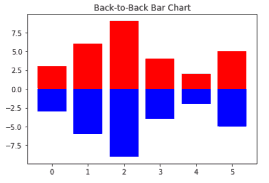

# 绘制背靠背条形图 Matplotlib

> 原文:[https://www . geesforgeks . org/标绘-背靠背-条形图-matplotlib/](https://www.geeksforgeeks.org/plotting-back-to-back-bar-charts-matplotlib/)

在本文中，我们将学习如何在 python 的 matplotlib 中绘制背靠背条形图。让我们讨论一些概念:

**Matplotlib:** Matplotlib 是 Python 中一个惊人的可视化库，用于数组的 2D 图。Matplotlib 是一个多平台数据可视化库，构建在 NumPy 数组上，旨在与更广泛的 SciPy 堆栈一起工作。它是由约翰·亨特在 2002 年推出的。

**条形图:**条形图是一种用矩形条表示数据类别的图形，矩形条的长度和高度与它们所代表的值成比例。条形图可以水平或垂直绘制。

**背靠背条形图:**背靠背条形图只是相对于一个轴绘制的两个条形图的组合。

### 所需步骤

1.  汇入资源库(matplotlib)
2.  导入/加载/创建数据
3.  在数据上绘制背靠背条形图。

在这里，我们一步一步地讨论一些例子，以便更好地理解这个概念。

**示例 1:** 简单的背靠背条形图

## 蟒蛇 3

```
# import packages
import numpy as np
import matplotlib.pyplot as plt

# create data
A = np.array([3,6,9,4,2,5])
X = np.arange(6)

# plot the bars
plt.bar(X, A, color = 'r')
plt.bar(X, -A, color = 'b')
plt.title("Back-to-Back Bar Chart")
plt.show()
```

**输出:**



**示例 2:** 水平背靠背条形图。

## 蟒蛇 3

```
# import packages
import numpy as np
import matplotlib.pyplot as plt

# create data
A = np.array([3,6,9,4,2,5])
B = np.array([2,8,1,9,7,3])
X = np.arange(6)

# plot the bars
plt.barh(X, A, color = 'r')
plt.barh(X, -B, color = 'b')
plt.title("Back-to-Back Bar Chart")
plt.show()
```